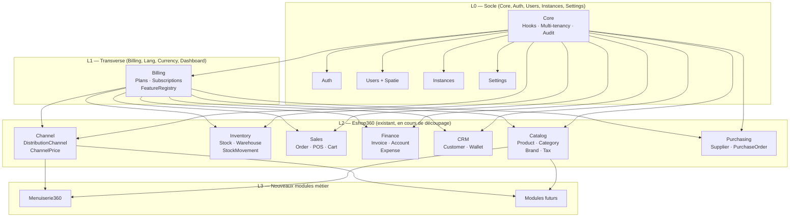

# B360 — Gouvernance & Évolution du Core SaaS

> Architecte Technique Senior | Laravel 12 | Multi-tenant | DDD  
> Version : 2.0 | Date : 2026-04-04  
> Intègre : Audit cartographie 2026-04-04 · Audit modules 2026-04-04 · Spec pricing_channels  
> **Convention** : `[D'APRÈS AUDIT]` = fait constaté dans le code · `[NOUVEAU]` = proposition

---

## TABLE DES MATIÈRES

1. [Architecture modulaire et isolation des modules](#1-architecture-modulaire-et-isolation-des-modules)
2. [Gestion des données et anti-duplication](#2-gestion-des-données-et-anti-duplication)
3. [Versioning et compatibilité](#3-versioning-et-compatibilité)
4. [Système d'activation des modules (multi-tenant)](#4-système-dactivation-des-modules-multi-tenant)
5. [Gestion des abonnements et fonctionnalités](#5-gestion-des-abonnements-et-fonctionnalités)
6. [Points de contrôle et risques](#6-points-de-contrôle-et-risques)

---

## 1. Architecture modulaire et isolation des modules

### 1.1 État des lieux [D'APRÈS AUDIT]

L'audit du 2026-04-04 dresse ce constat chiffré :

| Métrique Eshop360 | Valeur constatée | Seuil raisonnable | Delta |
|-------------------|-----------------|-------------------|-------|
| Modèles Eloquent | **83** | < 20 par module | +315% |
| Contrôleurs | **78** | < 15 par module | +420% |
| Migrations | **128** | < 30 par module | +327% |
| Services | **45+** | < 10 par module | +350% |
| Tables | **70+** | < 20 par module | +250% |

**Couplages identifiés** [D'APRÈS AUDIT] :
- `Eshop360` dépend directement de `Core`, `Auth`, `Users`, `Settings`, `Billing`, `app/User`, `app/Instance` — couplage très fort sur 6 modules
- Double système de feature flags : `FeatureGate` (Eshop360, deprecated) + `FeatureRegistry` (Billing, actif) — les constantes hardcodées dans `FeatureGate` persistent
- Double système de marge : `eshop_codifarm_margin_config` (legacy SAPHIR) + `eshop_distribution_channels` (actif) — double écriture de logs, source de vérité ambiguë
- Trait `BelongsToInstance` dupliqué : dans `app/Models/Concerns/` ET `Modules/Core/Database/Traits/`
- `InventoryX` : squelette vide visible dans l'arborescence, non chargé par le système de modules

**Tests** [D'APRÈS AUDIT] : `219 passed / 16 failed` sur `Modules/Eshop360/Tests` au 2026-04-04.

### 1.2 Architecture cible [NOUVEAU]

**Principe directeur** : ne pas réécrire, mais découper progressivement. Eshop360 reste le module racine, les sous-domaines en sont extraits par phases.



**Règles strictes de communication inter-modules** [NOUVEAU] :

1. **Pas d'import croisé de modèle Eloquent** : Menuiserie360 ne peut pas `use Modules\Eshop360\Models\Product`
2. **Pas d'accès DB direct aux tables d'un autre module** : interdit par PHPStan custom rule
3. **Communication via interfaces (Core/Contracts/) ou Events** : les sous-modules Eshop communiquent entre eux via events ou services injectés
4. **Le trait `BelongsToInstance` dupliqué doit être unifié** : supprimer `app/Models/Concerns/BelongsToInstance`, utiliser exclusivement `Modules/Core/Database/Traits/BelongsToInstance`

### 1.3 Règles anti-couplage enforced par tooling [NOUVEAU]

```yaml
# deptrac.yaml
layers:
  - name: Core
    collectors: [{ type: directory, value: Modules/Core }]
  - name: Billing
    collectors: [{ type: directory, value: Modules/Billing }]
  - name: EshopCatalog
    collectors: [{ type: directory, value: Modules/Eshop360/Domain/Catalog }]
  - name: EshopChannel
    collectors: [{ type: directory, value: Modules/Eshop360/Domain/Channel }]
  - name: Menuiserie360
    collectors: [{ type: directory, value: Modules/Menuiserie360 }]

ruleset:
  Core: []
  Billing: [Core]
  EshopCatalog: [Core, Billing]
  EshopChannel: [Core, Billing, EshopCatalog]
  Menuiserie360: [Core, Billing, EshopCatalog, EshopChannel]
```

```php
// [NOUVEAU] PHPStan rule : interdit DB::table('eshop_*') hors namespace Eshop360
// Bloquerait par exemple Menuiserie360 accédant directement à eshop_products
class NoDirectCrossModuleTableAccess implements \PHPStan\Rules\Rule { ... }
```

### 1.4 Plan de découpage Eshop360 (phases) [NOUVEAU]

Conformément à la recommandation de l'audit "Stabiliser puis découper" :

| Phase | Domaine | Tables extraites | Effort | Prérequis |
|-------|---------|-----------------|--------|-----------|
| **0 (urgent)** | Fix bloquants | — | 1 semaine | — |
| **1** | Nettoyage | — | 1 semaine | Phase 0 |
| **2** | Catalog | `eshop_products`, `eshop_categories`, `eshop_brands`, `eshop_product_taxes` | 5 jours | Phase 1 |
| **2** | Channel | `eshop_distribution_channels`, `eshop_channel_product_prices` (+ nouvelles tables spec) | 5 jours | Phase 1 |
| **3** | Inventory | `eshop_stocks`, `eshop_stock_movements`, `eshop_warehouses` | 5 jours | Phase 2 |
| **3** | Sales | `eshop_orders`, `eshop_order_items`, `eshop_cash_registers` | 5 jours | Phase 2 |
| **4** | Finance / CRM / HR | `eshop_invoices`, `eshop_customers`, `eshop_employees` | 3-4 semaines | Phase 3 |

---

## 2. Gestion des données et anti-duplication

### 2.1 Entités partagées identifiées [D'APRÈS AUDIT]

| Entité | Table actuelle | Module propriétaire | Consommateurs actuels |
|--------|---------------|--------------------|-----------------------|
| Produit | `eshop_products` | Eshop360 | Eshop360, (Menuiserie360 prévu) |
| Client | `eshop_customers` | Eshop360 | Eshop360 |
| Stock | `eshop_stocks` | Eshop360 | Eshop360 |
| Facture | `eshop_invoices` | Eshop360 | Eshop360 |
| Facture SaaS | `invoices` (Billing) | Billing | Billing uniquement |
| Paiement | `eshop_payments` (polymorphique) | Eshop360 | Eshop360 |

**Doublons actifs à résoudre** [D'APRÈS AUDIT] :

```
[DOUBLON CRITIQUE] eshop_codifarm_margin_config  ←→  eshop_distribution_channels
    → Les nouvelles fonctionnalités spec (wholesale_price, pharmacy_price, channel credits)
      doivent être intégrées UNIQUEMENT dans le système DistributionChannel
    → Plan de migration : §2.3

[DOUBLON MOYEN] audit_logs (Core)  ←→  eshop_audit_logs (Eshop360)
    → Unifier sur Core audit_logs avec colonne source_module
    
[DOUBLON MOYEN] FeatureGate (deprecated)  ←→  FeatureRegistry (actif)
    → Supprimer FeatureGate, migrer tous les appels
```

### 2.2 Stratégie de centralisation des nouvelles fonctionnalités [NOUVEAU]

Les **nouvelles fonctionnalités de pricing** (spec `spec_pricing_channels.md`) doivent s'intégrer dans les tables existantes sans créer de nouvelles duplications :

#### Champs `wholesale_price` et `pharmacy_price` [NOUVEAU]

Ces champs existent déjà dans `eshop_products` [D'APRÈS AUDIT]. La spec définit leur **logique de calcul**. Il faut ajouter les colonnes de configuration (mode de calcul, taux de marge), pas les prix eux-mêmes :

```sql
-- [NOUVEAU] Migration additive — JAMAIS d'ALTER TABLE destructif
ALTER TABLE eshop_products
    ADD COLUMN wholesale_price_mode  ENUM('percentage','fixed','manual') NOT NULL DEFAULT 'manual' AFTER wholesale_price,
    ADD COLUMN wholesale_price_rate  DECIMAL(10,4) NULL COMMENT '% ou montant fixe depuis pght' AFTER wholesale_price_mode,
    ADD COLUMN pharmacy_price_mode   ENUM('percentage','fixed','manual') NOT NULL DEFAULT 'manual' AFTER pharmacy_price,
    ADD COLUMN pharmacy_price_rate   DECIMAL(10,4) NULL COMMENT '% ou montant fixe depuis wholesale_price' AFTER pharmacy_price_mode,
    ADD COLUMN price_mode            ENUM('manual','wholesale_based') NOT NULL DEFAULT 'manual' AFTER price,
    ADD COLUMN price_rate            DECIMAL(10,4) NULL AFTER price_mode,
    ADD COLUMN min_order_quantity    INT UNSIGNED NOT NULL DEFAULT 1,
    ADD COLUMN max_order_quantity    INT UNSIGNED NULL COMMENT 'NULL = illimité';
```

#### Canal : nouveaux champs [NOUVEAU]

La spec introduit `purchase_price`, `margin_owner_pct`, `margin_channel_pct`, `debt_enabled` dans `eshop_channel_product_prices`. Ces colonnes sont **partiellement présentes** [À VÉRIFIER DANS LE CODE] selon la cartographie. Ajout des manquants :

```sql
ALTER TABLE eshop_channel_product_prices
    ADD COLUMN purchase_price      DECIMAL(15,4) NULL COMMENT 'Base achat canal (≈ wholesale_price)',
    ADD COLUMN margin_owner_pct    DECIMAL(5,2) NOT NULL DEFAULT 0,
    ADD COLUMN margin_channel_pct  DECIMAL(5,2) NOT NULL DEFAULT 0,
    ADD COLUMN debt_enabled        TINYINT(1) NOT NULL DEFAULT 0,
    ADD COLUMN min_order_quantity  INT UNSIGNED NULL COMMENT 'Override produit pour ce canal',
    ADD COLUMN max_order_quantity  INT UNSIGNED NULL;

-- Contrainte validation marges
ALTER TABLE eshop_channel_product_prices
    ADD CONSTRAINT chk_margins_sum CHECK (margin_owner_pct + margin_channel_pct <= 100);
```

### 2.3 Migration Codifarm → DistributionChannel [NOUVEAU]

Plan de migration sans perte de données :

```php
// [NOUVEAU] Migration de transformation (réversible)
public function up(): void
{
    // 1. Créer un canal "SAPHIR legacy" si n'existe pas
    DB::table('eshop_distribution_channels')->insertOrIgnore([
        'name'          => 'Canal SAPHIR (migré)',
        'slug'          => 'saphir-legacy',
        'instance_id'   => $config->instance_id,
        'margin_rate'   => $config->saphir_margin_rate,
        'buy_rate'      => $config->codifarm_buy_rate,
        'debt_share'    => $config->debt_share,
        'channel_share' => $config->codifarm_share,
        'owner_share'   => $config->saphir_share,
        'migrated_from' => 'codifarm', // colonne de traçabilité
    ]);

    // 2. Migrer les logs Codifarm vers channel_margin_logs
    DB::table('eshop_codifarm_margin_logs')
        ->orderBy('id')
        ->chunk(500, function ($logs) { /* ... mapping colonnes ... */ });
}

public function down(): void
{
    // Réversible : supprimer uniquement les entrées migrées
    DB::table('eshop_distribution_channels')
        ->where('migrated_from', 'codifarm')
        ->delete();
}
```

**Après migration** : `CodifarmMarginConfig` marqué `@deprecated`, `FeatureGate` idem, suppression lors du sprint de nettoyage Phase 1.

### 2.4 Table `channel_credits` [NOUVEAU]

Nouvelle entité issue de la spec :

```sql
CREATE TABLE eshop_channel_credits (
    id               BIGINT UNSIGNED AUTO_INCREMENT PRIMARY KEY,
    instance_id      BIGINT UNSIGNED NOT NULL,
    channel_id       BIGINT UNSIGNED NOT NULL,
    amount           DECIMAL(15,2) NOT NULL,
    used_amount      DECIMAL(15,2) NOT NULL DEFAULT 0,
    remaining_amount DECIMAL(15,2) GENERATED ALWAYS AS (amount - used_amount) STORED,
    type             ENUM('purchase','debt_coverage','gift','adjustment') NOT NULL,
    status           ENUM('active','exhausted','cancelled') NOT NULL DEFAULT 'active',
    notes            TEXT NULL,
    expires_at       DATE NULL,
    created_by       BIGINT UNSIGNED NULL,
    created_at       TIMESTAMP,
    updated_at       TIMESTAMP,
    FOREIGN KEY (channel_id) REFERENCES eshop_distribution_channels(id),
    INDEX idx_channel_credits_channel (instance_id, channel_id, status)
);

-- Journal d'utilisation (traçabilité obligatoire selon spec)
CREATE TABLE eshop_channel_credit_usages (
    id            BIGINT UNSIGNED AUTO_INCREMENT PRIMARY KEY,
    credit_id     BIGINT UNSIGNED NOT NULL,
    channel_id    BIGINT UNSIGNED NOT NULL,
    amount_used   DECIMAL(15,2) NOT NULL,
    purpose       ENUM('purchase','debt_payment','other') NOT NULL,
    reference     VARCHAR(100) NULL,  -- numéro de commande, OF, etc.
    created_at    TIMESTAMP,
    FOREIGN KEY (credit_id) REFERENCES eshop_channel_credits(id)
);
```

---

## 3. Versioning et compatibilité

### 3.1 Compatibilité ascendante — règles concrètes [NOUVEAU]

**Règle absolue** : toute migration sur table à volume élevé (orders, stocks, products) est **additive uniquement**.

```php
// ✅ AUTORISÉ — colonne nullable avec default
$table->enum('wholesale_price_mode', ['percentage','fixed','manual'])
      ->default('manual')
      ->nullable()
      ->after('wholesale_price');

// ✅ AUTORISÉ — nouvelle table
Schema::create('eshop_channel_credits', fn(Blueprint $t) => ...);

// ❌ INTERDIT sans procédure online
$table->dropColumn('sale_price_codifarm');  // → plan de dépréciation d'abord
$table->renameColumn('reference', 'invoice_number');  // → accessor d'abord
```

**Accessors transitoires** pour les champs mal nommés [D'APRÈS AUDIT — incohérence `invoice_number` vs `reference`] :

```php
// Dans Invoice model — compatibilité ascendante sans migration destructive
public function getReferenceAttribute(): string
{
    return $this->invoice_number ?? '';  // accessor pour les vues legacy
}
```

### 3.2 Migrations sans casse pour les nouvelles features [NOUVEAU]

Toutes les migrations des nouvelles fonctionnalités pricing :

```
Format : {YYYY}_{MM}_{DD}_{seq}_{domaine}_{action}_{table}.php

2026_04_10_000001_eshop_add_pricing_modes_to_products.php       → additive
2026_04_10_000002_eshop_add_margin_fields_to_channel_prices.php → additive
2026_04_10_000003_eshop_create_channel_credits_table.php        → création
2026_04_10_000004_eshop_create_channel_credit_usages_table.php  → création
2026_04_10_000005_eshop_add_order_quantity_limits_to_products.php → additive
2026_04_10_000006_eshop_create_margin_log_enriched.php          → création (nouveau log unifié)
```

Chaque migration a un `down()` complet :

```php
public function down(): void
{
    Schema::table('eshop_products', function (Blueprint $table) {
        $table->dropColumn([
            'wholesale_price_mode', 'wholesale_price_rate',
            'pharmacy_price_mode', 'pharmacy_price_rate',
            'price_mode', 'price_rate',
            'min_order_quantity', 'max_order_quantity',
        ]);
    });
}
```

### 3.3 Feature Flags pour activation progressive [NOUVEAU]

Chaque nouvelle fonctionnalité est protégée par un flag, activable sans redéploiement :

| Feature slug | Fonctionnalité | Plan minimum |
|-------------|----------------|-------------|
| `eshop.pricing.wholesale_auto` | Calcul automatique wholesale/pharmacy depuis pght | Standard |
| `eshop.pricing.channel_margins` | Marges tripartites canal (owner/channel/debt) | Standard |
| `eshop.channel.credits` | Système de crédit canal | Premium |
| `eshop.products.order_qty_limits` | Min/Max commande par produit | Standard |
| `eshop.pricing.price_auto` | Prix public calculé depuis wholesale | Premium |

```php
// Enregistrement via HookRegistry (système existant de B360) [D'APRÈS AUDIT]
// Dans Eshop360HooksProvider::boot()
app(HookRegistry::class)->register('features', new BillableFeature(
    slug: 'eshop.channel.credits',
    name: 'Crédit canal de distribution',
    description: 'Permet l\'attribution et l\'utilisation de crédits par canal revendeur',
    isFree: false,
    category: 'channels',
));
```

---

## 4. Système d'activation des modules (multi-tenant)

### 4.1 Système existant [D'APRÈS AUDIT]

Le `ModuleManager` et le `FeatureRegistry` (Billing) constituent le mécanisme d'activation existant :
- `EnsureFeature` middleware (alias `eshop.feature` + `billing.feature`) — le double middleware est identifié comme une incohérence [D'APRÈS AUDIT]
- `FeatureRegistry::can(feature_slug)` est la source de vérité actuelle

**Action requise** [NOUVEAU] : unifier sur `billing.feature` (supprimer `eshop.feature` + `EnsurePaidFeature` d'Eshop360).

### 4.2 Feature flags granulaires par tenant [NOUVEAU]

Les nouvelles fonctionnalités doivent être activables **par tenant** indépendamment du plan :

```sql
-- [NOUVEAU] Table d'override par tenant (complète FeatureRegistry)
CREATE TABLE tenant_feature_overrides (
    id          BIGINT UNSIGNED AUTO_INCREMENT PRIMARY KEY,
    instance_id BIGINT UNSIGNED NOT NULL,
    feature     VARCHAR(150) NOT NULL,
    enabled     TINYINT(1) NOT NULL DEFAULT 1,
    value       JSON NULL,           -- config optionnelle (ex: max_credit_amount)
    activated_by BIGINT UNSIGNED NULL,
    activated_at TIMESTAMP NULL,
    UNIQUE KEY uq_tenant_feature (instance_id, feature),
    INDEX idx_tenant_features (instance_id)
);
```

Résolution avec priorités :

```php
// [NOUVEAU] Modules/Billing/Services/FeatureResolver.php
// Ordre de résolution :
// 1. Override tenant (TenantFeatureOverride) — priorité maximale
// 2. Plan actif (PlanFeature)
// 3. Défaut (false)
public function can(int $instanceId, string $featureSlug): bool
{
    return (bool) Cache::remember(
        "feature.{$instanceId}.{$featureSlug}",
        300,
        function () use ($instanceId, $featureSlug) {
            $override = TenantFeatureOverride::where('instance_id', $instanceId)
                ->where('feature', $featureSlug)->first();
            if ($override !== null) return $override->enabled;

            $sub = Subscription::activeFor($instanceId)->first();
            if (! $sub) return false;
            return PlanFeature::where('plan_id', $sub->plan_id)
                ->where('feature_slug', $featureSlug)
                ->where('value', '1')
                ->exists();
        }
    );
}
```

### 4.3 Min/Max quantité commande — configuration multi-niveau [NOUVEAU]

Conformément à la spec (`§7 — Gestion des quantités de commande`) :

```
Priorité de résolution :
1. Niveau canal (eshop_channel_product_prices.min/max_order_quantity) — le plus précis
2. Niveau produit (eshop_products.min/max_order_quantity) — override produit
3. Niveau global (Settings: 'eshop.products.default_min_order_qty') — défaut système
```

```php
// [NOUVEAU] Modules/Eshop360/Services/OrderQuantityResolver.php
class OrderQuantityResolver
{
    public function resolve(int $productId, ?int $channelId = null): array
    {
        // 1. Canal (le plus précis)
        if ($channelId) {
            $channelPrice = ChannelProductPrice::where('product_id', $productId)
                ->where('channel_id', $channelId)->first();
            if ($channelPrice?->min_order_quantity !== null) {
                return [
                    'min' => $channelPrice->min_order_quantity,
                    'max' => $channelPrice->max_order_quantity,
                    'source' => 'channel',
                ];
            }
        }

        // 2. Produit
        $product = Product::find($productId);
        if ($product->min_order_quantity > 1 || $product->max_order_quantity !== null) {
            return ['min' => $product->min_order_quantity, 'max' => $product->max_order_quantity, 'source' => 'product'];
        }

        // 3. Global
        return [
            'min' => (int) Settings::get('eshop.products.default_min_order_qty', 1),
            'max' => null,
            'source' => 'global',
        ];
    }

    public function validate(int $quantity, int $productId, ?int $channelId = null): void
    {
        $limits = $this->resolve($productId, $channelId);
        if ($quantity < $limits['min']) {
            throw new InvalidOrderQuantityException("Quantité minimum : {$limits['min']}");
        }
        if ($limits['max'] !== null && $quantity > $limits['max']) {
            throw new InvalidOrderQuantityException("Quantité maximum : {$limits['max']}");
        }
    }
}
```

---

## 5. Gestion des abonnements et fonctionnalités

### 5.1 Mapping nouvelles fonctionnalités → plans [NOUVEAU]

| Fonctionnalité (spec) | Feature slug | Plan Free | Plan Standard | Plan Premium |
|-----------------------|-------------|-----------|--------------|-------------|
| Wholesale/pharmacy price auto | `eshop.pricing.wholesale_auto` | ❌ | ✅ | ✅ |
| Prix public calculé | `eshop.pricing.price_auto` | ❌ | ❌ | ✅ |
| Canal : marges tripartites | `eshop.pricing.channel_margins` | ❌ | ✅ | ✅ |
| Canal : dette activable | `eshop.pricing.channel_debt` | ❌ | ❌ | ✅ |
| Crédit canal | `eshop.channel.credits` | ❌ | ❌ | ✅ |
| Min/Max quantité globale | `eshop.products.order_qty_limits` | ✅ | ✅ | ✅ |
| Min/Max quantité par canal | `eshop.channel.order_qty_limits` | ❌ | ✅ | ✅ |
| Bulk update quantités | `eshop.products.bulk_qty_update` | ❌ | ✅ | ✅ |

### 5.2 Enregistrement dynamique sans redéploiement [D'APRÈS AUDIT + NOUVEAU]

Le `HookRegistry` existant gère déjà l'enregistrement des `BillableFeature`. Les nouvelles features s'enregistrent via ce mécanisme, modifiable en DB sans toucher au code :

```php
// [NOUVEAU] Enregistrement dans Eshop360HooksProvider
public function registerFeatures(HookRegistry $registry): void
{
    // Features existantes (ne pas modifier)
    // ...

    // [NOUVEAU] Features pricing channels
    foreach ($this->newPricingFeatures() as $feature) {
        $registry->register('features', $feature);
    }
}

private function newPricingFeatures(): array
{
    return [
        new BillableFeature('eshop.pricing.wholesale_auto', 'Calcul auto wholesale/pharmacy'),
        new BillableFeature('eshop.channel.credits', 'Crédit canal revendeur', isFree: false),
        new BillableFeature('eshop.products.order_qty_limits', 'Min/Max quantité commande', isFree: true),
    ];
}
```

---

## 6. Points de contrôle et risques

### 6.1 Risques existants (audit) à corriger AVANT les nouvelles features

| Priorité | Issue [D'APRÈS AUDIT] | Risque si non corrigé | Correctif |
|----------|----------------------|-----------------------|-----------|
| **P0** | Race condition stock (`StockService` sans `lockForUpdate`) | Stock négatif sous charge | `lockForUpdate()` + `CHECK quantity >= 0` |
| **P0** | TOCTOU `generateOrderNumber()` et `generateInvoiceNumber()` | Doublons de numéros (illégal) | UNIQUE constraint + retry avec `Str::random()` |
| **P0** | `Project`/`Task` sans trait `BelongsToInstance` | Crash runtime visible | Ajouter trait, 5 min |
| **P1** | `tax_rate` absent de `eshop_invoice_items` | Taxes historiques non recalculables | Migration additive |
| **P1** | Double commande `recurring-invoices` | Double facturation clients | Supprimer un des deux schedules |
| **P1** | `reserved_quantity` non utilisée (jamais incrémentée) | Stock disponible faux | Câbler dans checkout + POS |

### 6.2 Risques spécifiques aux nouvelles fonctionnalités [NOUVEAU]

| # | Risque | Probabilité | Impact | Atténuation |
|---|--------|------------|--------|-------------|
| R1 | **Conflit calcul prix canal** : nouvelle logique `purchase_price` en conflit avec `CostCalculatorService::updateProductPricing()` existant | HAUTE | HAUT | Feature flag `eshop.pricing.channel_margins` désactivé par défaut. Tests de non-régression sur les prix canal existants avant activation |
| R2 | **Double écriture marge** : si `CodifarmMarginConfig` n'est pas migré avant l'activation de la spec, double logs | HAUTE | MOYEN | Migration Codifarm→Channel **obligatoire** en Phase 1, avant toute nouvelle feature pricing |
| R3 | **Credit canal épuisé au moment du paiement** : race condition si deux commandes canal simultanées | MOYENNE | HAUT | `lockForUpdate()` sur `eshop_channel_credits` + contrainte `remaining_amount >= 0` |
| R4 | **Validation Min/Max ignorée au checkout** : `OrderQuantityResolver` non appelé dans tous les points d'entrée (POS, online, API) | HAUTE | MOYEN | Injecter `OrderQuantityResolver` dans `OrderService::createFromCart()` (point d'entrée unique) plutôt que dans chaque contrôleur |
| R5 | **Prix wholesale recalculé casse l'historique** : si `wholesale_price` est recalculé automatiquement, les commandes passées semblent avoir un prix différent | FAIBLE | MOYEN | Les commandes stockent `unit_price` au moment de la vente (invariant) — le recalcul n'affecte que les nouveaux devis/commandes |
| R6 | **`pharmacy_price` dépend de `wholesale_price`** : recalcul en cascade si `pght` change | MOYENNE | FAIBLE | Recalcul atomique en transaction. Observer ou Job asynchrone selon volume |
| R7 | **Bulk update quantités** : UPDATE sur des centaines de milliers de produits → timeout DB | FAIBLE | HAUT | Job `BulkUpdateOrderQuantitiesJob` en queue, chunk(500), pas de requête unique |

### 6.3 Plan de non-régression [NOUVEAU]

```
Tests à créer AVANT activation des nouvelles features :

[Pricing]
  - test_wholesale_price_calculated_from_pght_with_percentage
  - test_wholesale_price_calculated_from_pght_with_fixed_amount
  - test_wholesale_price_manual_overrides_calculation
  - test_pharmacy_price_calculated_from_wholesale
  - test_price_auto_calculated_from_wholesale
  - test_channel_price_unchanged_if_manual_override_set
  - test_existing_channel_prices_not_affected_by_new_fields

[Canaux]
  - test_margin_owner_plus_channel_cannot_exceed_100
  - test_debt_calculated_correctly_when_enabled
  - test_debt_zero_when_disabled
  - test_channel_credit_deducted_on_purchase
  - test_channel_credit_race_condition_prevented

[Quantités]
  - test_channel_level_overrides_product_level
  - test_product_level_overrides_global_level
  - test_order_rejected_below_min_quantity
  - test_order_rejected_above_max_quantity
  - test_bulk_update_applies_to_all_selected_products
  - test_existing_orders_not_affected_by_qty_limit_change
```

---

*Document v2.0 — Intègre les audits 2026-04-04 et la spec pricing_channels. Révision suivante après Phase 1.*
