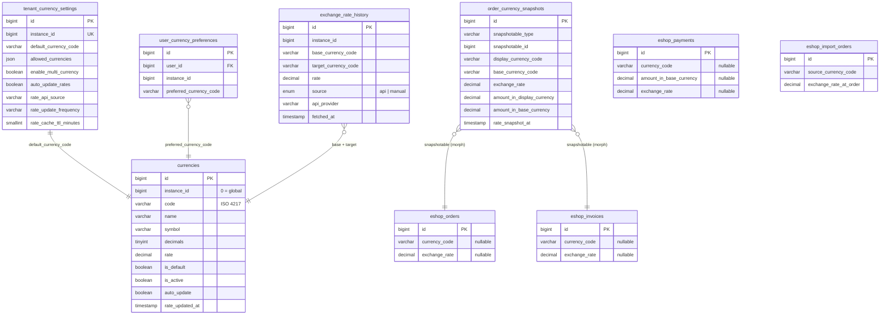
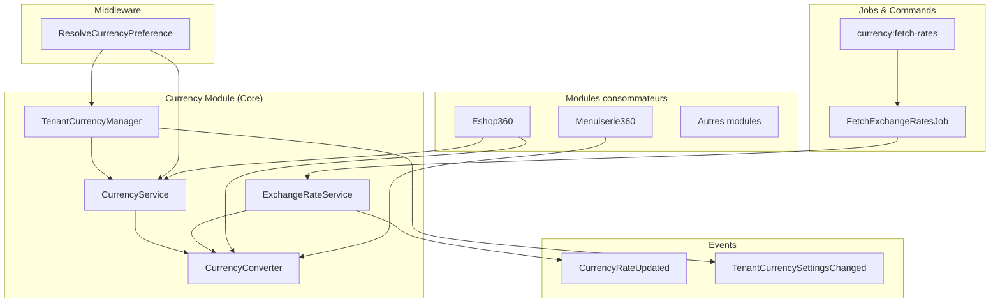
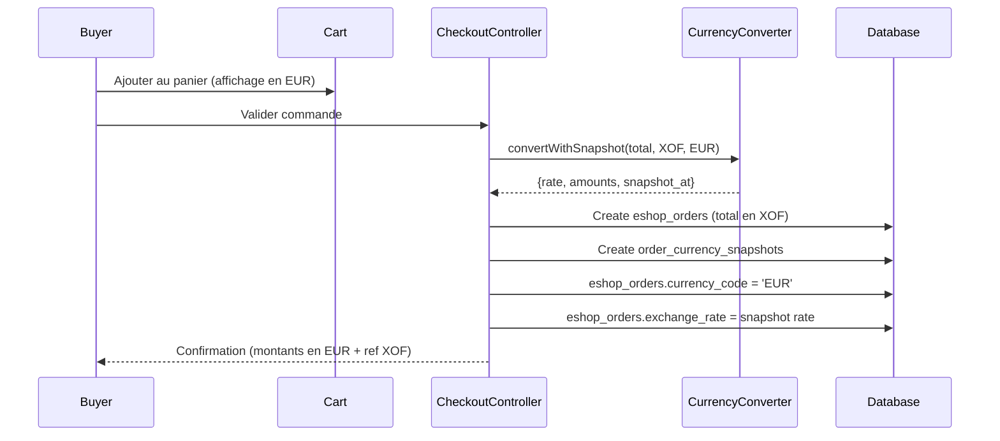

# Currency Multi-Devises -- Specification technique d'evolution

> **Version** : 1.1 (mise à jour post-implémentation 2026-04-06) · v1.0 initiale : 2026-04-04
> **Branche cible** : `eshop360`  
> **Statut** : Phases 1 et 2 IMPLÉMENTÉES (avec bug latent à corriger) · Phase 3 partielle · Phases 4-5 non démarrées
> **Auteur** : Architecture B360

> ## ✅ STATUT D'IMPLÉMENTATION (vérifié 2026-04-06)
>
> **Phases 1 et 2 implémentées en code** :
>
> - ✅ `Modules/Currency/Models/Currency.php` (existant)
> - ✅ `Modules/Currency/Models/ExchangeRateHistory.php` (Phase 1)
> - ✅ `Modules/Currency/Models/TenantCurrencySetting.php` (Phase 1)
> - ✅ `Modules/Currency/Models/UserCurrencyPreference.php` (Phase 2)
> - ✅ `Modules/Currency/Models/OrderCurrencySnapshot.php` (Phase 2 — polymorphique)
> - ✅ `Modules/Currency/Services/ExchangeRateService.php` (cache + fallback historique)
> - ✅ `Modules/Currency/Services/SnapshotService.php`
> - ✅ `Modules/Currency/Services/TenantCurrencyManager.php`
> - ✅ Migrations DB : `2026_04_04_300001_multi_currency_phase1.php`, `300002_multi_currency_phase2.php` — appliquées
> - ✅ Test passant : `Modules/Currency/Tests/Unit/MultiCurrencyTest.php`
>
> **🔴 BUG LATENT CRITIQUE — à corriger en priorité** (Phase 3 incomplète) :
>
> La migration `2026_04_04_300002` ajoute bien les colonnes `currency_code`, `exchange_rate` sur `eshop_orders`, `eshop_invoices`, `eshop_payments` (et `amount_in_base_currency` sur `eshop_payments`). **MAIS** les modèles Eshop360 n'ont **PAS** ces champs dans leur `$fillable` :
>
> - `Modules/Eshop360/Models/Order.php` lignes 30-58 : `$fillable` sans `currency_code`/`exchange_rate`
> - `Modules/Eshop360/Models/Invoice.php` lignes 22-44 : idem
> - `Modules/Eshop360/Models/Payment.php` lignes 20-34 : idem
>
> Conséquence : Laravel **silently drop** ces attributs lors d'un `update()` ou `create()`. `OrderService::snapshotCurrencyIfEnabled()` (ligne 434-465) tente d'écrire ces colonnes mais elles **restent NULL en DB**. Le test `MultiCurrencyTest` passe en unitaire (via `setAttribute()` direct ou Order::create avec mass-assignment forcé), mais le flux end-to-end est **cassé silencieusement**.
>
> **Activable à distance** : il suffit qu'un admin coche `multi_currency_enabled = true` dans `tenant_currency_settings` pour déclencher des warnings logs sans aucune correction effective.
>
> **Fix** : ajouter `currency_code`, `exchange_rate` (et `amount_in_base_currency` pour Payment) aux `$fillable` + casts decimal — **15 minutes**.
>
> **Reste à faire après le fix** :
>
> - ⚠️ **Symétriser** : créer `snapshotCurrencyIfEnabled()` dans `InvoiceService` et `PaymentService` (copier la logique d'`OrderService`)
> - ⚠️ **Asymétrie `amount_in_base_currency`** : présent uniquement sur `eshop_payments`, à ajouter sur `eshop_orders` et `eshop_invoices` pour cohérence reporting
> - ⚠️ **`CostCalculatorService`** : reste mono-devise. Décision recommandée : convertir à la frontière (au moment du `purchase_order` import) plutôt que rendre le CUMP multi-currency natif (effort L vs S)
> - ⚠️ **`PricingContext` / `PricingResult`** : ne contiennent pas de devise. Risque de cache pollution si activation multi-currency. Décision : MVP n'a pas besoin de toucher au Pricing Engine v2 si on convertit à la frontière
> - ❌ **Money objects vs floats** : décision recommandée → **rester en floats** pour MVP, isolation dans `ExchangeRateService::convert()`. Brick/Money est un sprint XL avec risque élevé pour gain marginal
> - ❌ **Phases 4-5** (extension autres modules + automatisation API) : non démarrées
> - ❌ **Vérifier l'ordre d'exécution des migrations** : la migration `300002` utilise `Schema::hasTable('eshop_orders')` comme guard. Si Currency tourne avant Eshop360 lors d'une install fraîche, les colonnes ne sont jamais ajoutées. **À auditer en priorité**.
>
> **Pour les détails de validation, voir [STATUS.md](../STATUS.md) et [audit_comparatif_final.md](../audit_comparatif_final.md) v1.3.**

---

## Table des matieres

1. [Analyse de l'existant](#1-analyse-de-lexistant)
2. [Specification des nouvelles fonctionnalites](#2-specification-des-nouvelles-fonctionnalites)
3. [Modele de donnees (evolution)](#3-modele-de-donnees-evolution)
4. [Architecture technique cible](#4-architecture-technique-cible)
5. [Integration avec Eshop360](#5-integration-avec-eshop360)
6. [Strategie de migration](#6-strategie-de-migration)
7. [Points techniques sensibles](#7-points-techniques-sensibles)
8. [Recommandations techniques Laravel](#8-recommandations-techniques-laravel)
9. [Plan d'implementation par phases](#9-plan-dimplementation-par-phases)
10. [Risques et attenuation](#10-risques-et-attenuation)
11. [Criteres de validation (Definition of Done)](#11-criteres-de-validation-definition-of-done)

---

## 1. Analyse de l'existant

### 1.1 Module Currency actuel

Le module `Modules/Currency` est un module nwidart/laravel-modules v12 standard enregistre dans `module.json` avec un seul provider (`CurrencyServiceProvider`).

**Fichiers cles :**

| Fichier | Role |
|---|---|
| `Models/Currency.php` | Model Eloquent (table `currencies`) |
| `Services/CurrencyManager.php` | Singleton -- resolution de devise active, conversion, formatage |
| `Http/Controllers/CurrencyController.php` | CRUD devises + set default + update rates |
| `Console/Commands/UpdateExchangeRates.php` | Commande artisan `currency:update-rates` |
| `Config/config.php` | Devises supportees (hardcoded) + taux par defaut |
| `Providers/CurrencyServiceProvider.php` | Register singleton, schedule daily at 06:00 |
| `Providers/CurrencyHooksProvider.php` | Hook settings dans le panneau admin |
| `Routes/web.php` | Routes CRUD sous `/i/{slug}/currencies` |
| `Resources/views/index.blade.php` | UI gestion des devises |
| `Resources/views/partials/settings.blade.php` | Partial dans les settings globales |

### 1.2 Table `currencies` existante

```sql
CREATE TABLE currencies (
    id           BIGINT UNSIGNED AUTO_INCREMENT PRIMARY KEY,
    code         VARCHAR(10) UNIQUE,          -- 'XOF', 'EUR', 'USD'
    name         VARCHAR(255),                -- 'Franc CFA (BCEAO)'
    symbol       VARCHAR(10),                 -- 'CFA'
    decimals     TINYINT UNSIGNED DEFAULT 2,
    rate         DECIMAL(16,6) DEFAULT 1.000000,  -- taux vs devise de base
    is_default   BOOLEAN DEFAULT FALSE,
    is_active    BOOLEAN DEFAULT TRUE,
    auto_update  BOOLEAN DEFAULT TRUE,
    rate_updated_at TIMESTAMP NULL,
    created_at   TIMESTAMP,
    updated_at   TIMESTAMP
);
```

**Remarque critique** : la table `currencies` est **globale** (pas de colonne `instance_id`). Elle est partagee entre tous les tenants. Les taux sont relatifs a la devise marquee `is_default = true`.

### 1.3 Service `CurrencyManager` -- comportement actuel

```
resolve(?instanceId) --> string (code devise)
  1. setting('currency.active', instanceId) -- override module Currency
  2. setting('billing.currency', instanceId) -- fallback billing
  3. config('billing.currency', 'EUR')       -- fallback config

convert(amount, from, to) --> float
  Conversion via les taux en config : amount / fromRate * toRate
  Arrondi selon decimals de la devise cible

format(amount, ?code) --> string
  Formatte avec number_format + symbol

rates() --> array
  config('currency.rates') fusionne avec setting('currency.rates')
```

### 1.4 Integration actuelle dans Eshop360

L'analyse du code Eshop360 revele :

| Point d'integration | Mecanisme | Fichier |
|---|---|---|
| Affichage devise dans les vues | Variable `$eshopCurrency` partagee via middleware | `Http/Middleware/ResolveUserAssignments.php` |
| Source de la devise | `EshopSettingsService::get('invoice')['currency_symbol']` | Defaut: `'FCFA'` |
| Comptes financiers | Colonne `currency` sur `eshop_accounts` (VARCHAR, defaut `'XAF'`) | `Models/Account.php` |
| PDF/Factures | `PdfService::settingsData()` lit `$settings['currency']` | Defaut: `'FCFA'` |
| Impression tickets | `EscposPrinter` lit `$config['currency']` | Defaut: `'FCFA'` |
| QR codes / Barcodes | Input `#qr-opt-currency` / `#opt-currency` | Defaut: `'FCFA'` |
| Channel branding | Setting `currency_symbol` par channel | `EshopSettingsService` defaults |
| Import orders (achats usine) | **Aucune colonne devise** sur `eshop_import_orders` / `eshop_import_order_items` | Prix en devise locale implicite |
| Commandes (`eshop_orders`) | **Aucune colonne devise** | Tout est en devise tenant implicite |
| Factures (`eshop_invoices`) | **Aucune colonne devise** | Idem |
| Paiements (`eshop_payments`) | **Aucune colonne devise** | Idem |

### 1.5 Limites identifiees

1. **Pas de multi-tenant sur `currencies`** -- la table est globale, un seul jeu de devises/taux pour toute la plateforme.
2. **Pas de choix utilisateur** -- la devise est determinee par le tenant (setting admin), pas par l'acheteur.
3. **Pas de snapshot devise sur les commandes** -- si le taux change, les montants historiques deviennent incoherents.
4. **Confusion `currency_symbol` vs `currency_code`** -- Eshop360 stocke un symbole d'affichage (`'FCFA'`) et non un code ISO (`'XOF'`).
5. **Import orders sans devise** -- les achats fournisseurs n'ont pas de colonne devise ni taux de conversion.
6. **Taux en config hardcoded** -- le `Config/config.php` contient des taux statiques en fallback, base EUR.
7. **Pas d'historique des taux** -- seule la derniere valeur est conservee dans `currencies.rate`.
8. **Conversion naïve** -- `CurrencyManager::convert()` utilise des `float` au lieu de `Money` objects (risque d'erreurs d'arrondi).
9. **API de taux unique** -- `open.er-api.com` sans fallback sur un autre provider.

---

## 2. Specification des nouvelles fonctionnalites

### 2.1 Devise par defaut par tenant

- Chaque tenant (instance) definit **une devise par defaut** (ex: `XOF` pour les tenants africains).
- La devise par defaut est celle dans laquelle les prix catalogue, les stocks et la comptabilite sont tenus.
- Pour les tenants existants : migration automatique vers `XOF` (comportement inchange).

### 2.2 Devises acceptees par le tenant (seller side)

Le tenant configure les devises dans lesquelles il accepte les paiements :

- Liste de devises autorisees (ex: `['XOF', 'EUR', 'USD']`)
- Possibilite de n'accepter qu'une seule devise (mode mono-devise, comportement actuel)
- Flag `enable_multi_currency` pour activer/desactiver la fonctionnalite

### 2.3 Choix de la devise par l'acheteur (buyer side)

L'acheteur peut choisir sa devise de deux manieres :

1. **Preference persistante** : dans son profil, il choisit une devise par defaut (sauvegardee en base).
2. **Choix ponctuel** : sur le panier ou au checkout, il peut changer la devise pour cette commande.

**Priorite de resolution :**

```
1. Devise choisie pour la commande en cours (session/cookie)
2. Preference utilisateur (user_currency_preferences)
3. Devise par defaut du tenant (tenant_currency_settings)
```

### 2.4 Achats fournisseurs en devises etrangeres

- Les import orders (`eshop_import_orders`) doivent pouvoir specifier une devise source (ex: `USD`, `CNY`).
- Le taux de conversion au moment de la commande fournisseur est sauvegarde (snapshot).
- Le cout reel en devise locale (XOF) est calcule automatiquement.

### 2.5 Taux de conversion -- API automatique + fallback manuel

- Recuperation automatique via job planifie (cron quotidien, configurable).
- Support de plusieurs providers API (primary + fallback) :
  - `open.er-api.com` (gratuit, actuel)
  - `exchangerate-api.com` (fallback)
- Si l'API echoue : le dernier taux connu reste en vigueur + alerte admin.
- L'admin peut saisir/corriger un taux manuellement a tout moment.
- Historique des taux conserve (table `exchange_rate_history`).

---

## 3. Modele de donnees (evolution)

### 3.1 Tables existantes -- modifications

#### Table `currencies` (existante -- ajout `instance_id`)

```php
// Migration: add_instance_id_to_currencies_table.php
Schema::table('currencies', function (Blueprint $table) {
    $table->unsignedBigInteger('instance_id')->default(0)->after('id');
    
    // Un meme code devise peut exister pour differents tenants
    // (taux personnalises par tenant)
    $table->dropUnique('currencies_code_unique');
    $table->unique(['instance_id', 'code']);
    
    $table->index('instance_id');
});
```

**Logique** : `instance_id = 0` = devises globales (referentiel plateforme). `instance_id = N` = override de taux/config par le tenant N.

### 3.2 Nouvelles tables

#### Table `tenant_currency_settings`

```php
Schema::create('tenant_currency_settings', function (Blueprint $table) {
    $table->id();
    $table->unsignedBigInteger('instance_id')->unique();
    $table->string('default_currency_code', 10)->default('XOF');
    $table->json('allowed_currencies');       // ['XOF', 'EUR', 'USD']
    $table->boolean('enable_multi_currency')->default(false);
    $table->boolean('auto_update_rates')->default(true);
    $table->string('rate_api_source')->default('open.er-api.com');
    $table->string('rate_update_frequency')->default('daily'); // daily, hourly, manual
    $table->unsignedSmallInteger('rate_cache_ttl_minutes')->default(60);
    $table->timestamps();
});
```

#### Table `exchange_rate_history`

```php
Schema::create('exchange_rate_history', function (Blueprint $table) {
    $table->id();
    $table->unsignedBigInteger('instance_id')->default(0); // 0 = global
    $table->string('base_currency_code', 10);     // ex: 'XOF'
    $table->string('target_currency_code', 10);    // ex: 'EUR'
    $table->decimal('rate', 20, 8);                 // ex: 0.00152449
    $table->enum('source', ['api', 'manual'])->default('api');
    $table->string('api_provider')->nullable();     // ex: 'open.er-api.com'
    $table->timestamp('fetched_at');
    $table->timestamps();

    $table->index(['instance_id', 'base_currency_code', 'target_currency_code', 'fetched_at'],
        'erh_lookup_idx');
});
```

#### Table `user_currency_preferences`

```php
Schema::create('user_currency_preferences', function (Blueprint $table) {
    $table->id();
    $table->foreignId('user_id')->constrained()->cascadeOnDelete();
    $table->unsignedBigInteger('instance_id');
    $table->string('preferred_currency_code', 10);
    $table->timestamps();

    $table->unique(['user_id', 'instance_id']);
});
```

#### Table `order_currency_snapshots`

```php
Schema::create('order_currency_snapshots', function (Blueprint $table) {
    $table->id();
    $table->morphs('snapshotable');  // order, invoice, purchase_order, import_order
    $table->string('display_currency_code', 10);   // devise choisie par l'acheteur
    $table->string('base_currency_code', 10);       // devise tenant (ex: XOF)
    $table->decimal('exchange_rate', 20, 8);         // taux display -> base
    $table->decimal('amount_in_display_currency', 15, 2);  // montant dans la devise d'affichage
    $table->decimal('amount_in_base_currency', 15, 2);     // montant dans la devise de base
    $table->timestamp('rate_snapshot_at');
    $table->timestamps();

    $table->index(['snapshotable_type', 'snapshotable_id'], 'ocs_morph_idx');
});
```

### 3.3 Modifications sur les tables Eshop360

#### Table `eshop_orders` -- ajout colonnes devise

```php
Schema::table('eshop_orders', function (Blueprint $table) {
    $table->string('currency_code', 10)->nullable()->after('source');
    $table->decimal('exchange_rate', 20, 8)->nullable()->after('currency_code');
});
```

#### Table `eshop_invoices` -- ajout colonnes devise

```php
Schema::table('eshop_invoices', function (Blueprint $table) {
    $table->string('currency_code', 10)->nullable()->after('template');
    $table->decimal('exchange_rate', 20, 8)->nullable()->after('currency_code');
});
```

#### Table `eshop_payments` -- ajout colonnes devise

```php
Schema::table('eshop_payments', function (Blueprint $table) {
    $table->string('currency_code', 10)->nullable()->after('amount');
    $table->decimal('amount_in_base_currency', 15, 2)->nullable()->after('currency_code');
    $table->decimal('exchange_rate', 20, 8)->nullable()->after('amount_in_base_currency');
});
```

#### Table `eshop_import_orders` -- ajout colonnes devise

```php
Schema::table('eshop_import_orders', function (Blueprint $table) {
    $table->string('source_currency_code', 10)->default('XOF')->after('warehouse_id');
    $table->decimal('exchange_rate_at_order', 20, 8)->default(1.0)->after('source_currency_code');
});
```

#### Table `eshop_purchase_orders` -- ajout colonnes devise

```php
Schema::table('eshop_purchase_orders', function (Blueprint $table) {
    $table->string('currency_code', 10)->nullable()->after('notes');
    $table->decimal('exchange_rate', 20, 8)->nullable()->after('currency_code');
});
```

### 3.4 Diagramme ERD (Mermaid)



---

## 4. Architecture technique cible

### 4.1 Vue d'ensemble des services



### 4.2 Service `CurrencyService` (evolution de `CurrencyManager`)

Le service existant `CurrencyManager` est renomme en `CurrencyService` (avec alias de compatibilite) et enrichi.

```php
<?php

namespace Modules\Currency\Services;

use Modules\Core\Support\CurrentInstance;
use Modules\Currency\Models\Currency;

final class CurrencyService
{
    /**
     * Resolve the active currency for the current context.
     * EVOLUTION: prend en compte TenantCurrencySettings.
     */
    public function resolveForTenant(?int $instanceId = null): string
    {
        $instanceId ??= CurrentInstance::get()?->id;

        // 1. Tenant currency settings (new)
        $tenantSettings = $this->tenantSettings($instanceId);
        if ($tenantSettings) {
            return $tenantSettings->default_currency_code;
        }

        // 2. Fallback legacy : setting('currency.active')
        if (function_exists('setting')) {
            $override = setting('currency.active', null, $instanceId);
            if ($override && $this->isSupported($override)) {
                return $override;
            }
        }

        return config('billing.currency', 'XOF');
    }

    /**
     * Resolve the display currency for a user (buyer) in the current context.
     */
    public function resolveForUser(?int $userId = null, ?int $instanceId = null): string
    {
        $instanceId ??= CurrentInstance::get()?->id;

        // 1. Session override (ponctuel)
        $sessionCurrency = session('currency_override');
        if ($sessionCurrency && $this->isAllowedForTenant($sessionCurrency, $instanceId)) {
            return $sessionCurrency;
        }

        // 2. User preference (persistent)
        if ($userId) {
            $pref = UserCurrencyPreference::where('user_id', $userId)
                ->where('instance_id', $instanceId)
                ->first();
            if ($pref && $this->isAllowedForTenant($pref->preferred_currency_code, $instanceId)) {
                return $pref->preferred_currency_code;
            }
        }

        // 3. Tenant default
        return $this->resolveForTenant($instanceId);
    }

    /**
     * Get allowed currencies for a tenant.
     */
    public function allowedCurrencies(?int $instanceId = null): array
    {
        $settings = $this->tenantSettings($instanceId);
        if ($settings && $settings->enable_multi_currency) {
            return $settings->allowed_currencies;
        }
        return [$this->resolveForTenant($instanceId)];
    }

    /**
     * Check if a currency is allowed for a tenant.
     */
    public function isAllowedForTenant(string $code, ?int $instanceId = null): bool
    {
        return in_array($code, $this->allowedCurrencies($instanceId), true);
    }

    /**
     * Get tenant currency settings (cached).
     */
    public function tenantSettings(?int $instanceId = null): ?TenantCurrencySetting
    {
        $instanceId ??= CurrentInstance::get()?->id;
        if (!$instanceId) return null;

        return Cache::remember(
            "tenant_currency_settings_{$instanceId}",
            3600,
            fn () => TenantCurrencySetting::where('instance_id', $instanceId)->first()
        );
    }

    // --- Methodes existantes conservees (compatibilite) ---

    public function resolve(?int $instanceId = null): string
    {
        return $this->resolveForTenant($instanceId);
    }

    public function supported(): array { /* ... inchange ... */ }
    public function isSupported(string $code): bool { /* ... inchange ... */ }
    public function info(string $code): array { /* ... inchange ... */ }
    public function decimals(string $code): int { /* ... inchange ... */ }
    public function symbol(string $code): string { /* ... inchange ... */ }
}
```

### 4.3 Service `ExchangeRateService`

```php
<?php

namespace Modules\Currency\Services;

use Illuminate\Support\Facades\Cache;
use Illuminate\Support\Facades\Http;
use Modules\Currency\Events\CurrencyRateUpdated;
use Modules\Currency\Models\Currency;
use Modules\Currency\Models\ExchangeRateHistory;

final class ExchangeRateService
{
    private const PROVIDERS = [
        'open.er-api.com' => 'https://open.er-api.com/v6/latest/{base}',
        'exchangerate-api.com' => 'https://v6.exchangerate-api.com/v6/{api_key}/latest/{base}',
    ];

    /**
     * Get the current rate between two currencies.
     * Uses cache, then DB, then API fallback.
     */
    public function getRate(string $from, string $to, ?int $instanceId = null): float
    {
        if ($from === $to) return 1.0;

        $cacheKey = "exchange_rate_{$instanceId}_{$from}_{$to}";
        $ttl = $this->getCacheTtl($instanceId);

        return Cache::remember($cacheKey, $ttl * 60, function () use ($from, $to, $instanceId) {
            // 1. Check tenant-specific rate override
            $tenantRate = Currency::where('instance_id', $instanceId)
                ->where('code', $to)
                ->where('is_active', true)
                ->first();

            if ($tenantRate) {
                $baseRate = Currency::where('instance_id', $instanceId)
                    ->where('code', $from)->first();
                if ($baseRate && $baseRate->rate > 0) {
                    return $tenantRate->rate / $baseRate->rate;
                }
            }

            // 2. Check global rates
            $globalFrom = Currency::where('instance_id', 0)->where('code', $from)->first();
            $globalTo = Currency::where('instance_id', 0)->where('code', $to)->first();

            if ($globalFrom && $globalTo && $globalFrom->rate > 0) {
                return $globalTo->rate / $globalFrom->rate;
            }

            // 3. Last known rate from history
            $lastRate = ExchangeRateHistory::where('base_currency_code', $from)
                ->where('target_currency_code', $to)
                ->orderByDesc('fetched_at')
                ->first();

            return $lastRate?->rate ?? 1.0;
        });
    }

    /**
     * Fetch rates from external API and store in DB + cache.
     */
    public function fetchFromApi(
        string $baseCurrency,
        ?int $instanceId = null,
        ?string $provider = null
    ): array {
        $provider ??= $this->getPreferredProvider($instanceId);
        $url = $this->buildProviderUrl($provider, $baseCurrency);

        $response = Http::timeout(15)->get($url);

        if (!$response->successful()) {
            // Try fallback provider
            $fallback = $this->getFallbackProvider($provider);
            if ($fallback) {
                return $this->fetchFromApi($baseCurrency, $instanceId, $fallback);
            }
            throw new \RuntimeException("All exchange rate providers failed.");
        }

        $rates = $response->json()['rates'] ?? [];

        // Store each rate in history
        foreach ($rates as $targetCode => $rate) {
            ExchangeRateHistory::create([
                'instance_id' => $instanceId ?? 0,
                'base_currency_code' => $baseCurrency,
                'target_currency_code' => $targetCode,
                'rate' => $rate,
                'source' => 'api',
                'api_provider' => $provider,
                'fetched_at' => now(),
            ]);
        }

        // Update currencies table
        $this->updateCurrencyRates($rates, $baseCurrency, $instanceId ?? 0);

        // Dispatch event
        CurrencyRateUpdated::dispatch($baseCurrency, $rates, $instanceId);

        return $rates;
    }

    /**
     * Set a manual rate (admin override).
     */
    public function setManualRate(
        string $from,
        string $to,
        float $rate,
        ?int $instanceId = null
    ): void {
        $instanceId ??= 0;

        ExchangeRateHistory::create([
            'instance_id' => $instanceId,
            'base_currency_code' => $from,
            'target_currency_code' => $to,
            'rate' => $rate,
            'source' => 'manual',
            'fetched_at' => now(),
        ]);

        // Invalidate cache
        Cache::forget("exchange_rate_{$instanceId}_{$from}_{$to}");

        CurrencyRateUpdated::dispatch($from, [$to => $rate], $instanceId);
    }

    // --- Private helpers ---

    private function getCacheTtl(?int $instanceId): int
    {
        if ($instanceId) {
            $settings = app(CurrencyService::class)->tenantSettings($instanceId);
            return $settings?->rate_cache_ttl_minutes ?? 60;
        }
        return 60;
    }

    private function getPreferredProvider(?int $instanceId): string
    {
        if ($instanceId) {
            $settings = app(CurrencyService::class)->tenantSettings($instanceId);
            return $settings?->rate_api_source ?? 'open.er-api.com';
        }
        return 'open.er-api.com';
    }

    private function getFallbackProvider(string $current): ?string
    {
        $providers = array_keys(self::PROVIDERS);
        $others = array_diff($providers, [$current]);
        return !empty($others) ? reset($others) : null;
    }

    private function buildProviderUrl(string $provider, string $base): string
    {
        $template = self::PROVIDERS[$provider] ?? self::PROVIDERS['open.er-api.com'];
        return str_replace(
            ['{base}', '{api_key}'],
            [$base, config('currency.api_keys.' . $provider, '')],
            $template
        );
    }

    private function updateCurrencyRates(array $rates, string $base, int $instanceId): void
    {
        foreach ($rates as $code => $rate) {
            Currency::where('instance_id', $instanceId)
                ->where('code', $code)
                ->where('auto_update', true)
                ->update([
                    'rate' => $rate,
                    'rate_updated_at' => now(),
                ]);
        }
    }
}
```

### 4.4 Service `CurrencyConverter`

```php
<?php

namespace Modules\Currency\Services;

final class CurrencyConverter
{
    public function __construct(
        private ExchangeRateService $rateService,
        private CurrencyService $currencyService,
    ) {}

    /**
     * Convert an amount between currencies.
     */
    public function convert(
        float|int $amount,
        string $from,
        string $to,
        ?int $instanceId = null,
        ?float $fixedRate = null
    ): float {
        if ($from === $to) return (float) $amount;

        $rate = $fixedRate ?? $this->rateService->getRate($from, $to, $instanceId);
        $decimals = $this->currencyService->decimals($to);

        return round($amount * $rate, $decimals);
    }

    /**
     * Convert and return a snapshot array for persistence.
     */
    public function convertWithSnapshot(
        float|int $amount,
        string $from,
        string $to,
        ?int $instanceId = null
    ): array {
        $rate = $this->rateService->getRate($from, $to, $instanceId);
        $converted = round($amount * $rate, $this->currencyService->decimals($to));

        return [
            'display_currency_code' => $to,
            'base_currency_code' => $from,
            'exchange_rate' => $rate,
            'amount_in_display_currency' => $converted,
            'amount_in_base_currency' => (float) $amount,
            'rate_snapshot_at' => now(),
        ];
    }

    /**
     * Format an amount in a given currency.
     */
    public function format(float $amount, string $currencyCode): string
    {
        $info = $this->currencyService->info($currencyCode);
        $formatted = number_format($amount, $info['decimals'], '.', ' ');
        return "{$formatted} {$info['symbol']}";
    }

    /**
     * Bulk-convert a collection of amounts (optimized: single rate fetch).
     */
    public function convertMany(
        array $amounts,
        string $from,
        string $to,
        ?int $instanceId = null
    ): array {
        if ($from === $to) return $amounts;

        $rate = $this->rateService->getRate($from, $to, $instanceId);
        $decimals = $this->currencyService->decimals($to);

        return array_map(
            fn (float|int $amount) => round($amount * $rate, $decimals),
            $amounts
        );
    }
}
```

### 4.5 Service `TenantCurrencyManager`

```php
<?php

namespace Modules\Currency\Services;

use Illuminate\Support\Facades\Cache;
use Modules\Currency\Events\TenantCurrencySettingsChanged;
use Modules\Currency\Models\TenantCurrencySetting;

final class TenantCurrencyManager
{
    /**
     * Get or create settings for a tenant.
     */
    public function getSettings(int $instanceId): TenantCurrencySetting
    {
        return TenantCurrencySetting::firstOrCreate(
            ['instance_id' => $instanceId],
            [
                'default_currency_code' => 'XOF',
                'allowed_currencies' => ['XOF'],
                'enable_multi_currency' => false,
                'auto_update_rates' => true,
                'rate_api_source' => 'open.er-api.com',
                'rate_update_frequency' => 'daily',
                'rate_cache_ttl_minutes' => 60,
            ]
        );
    }

    /**
     * Update tenant currency settings.
     */
    public function updateSettings(int $instanceId, array $data): TenantCurrencySetting
    {
        $settings = $this->getSettings($instanceId);

        // Ensure default currency is in allowed list
        if (isset($data['allowed_currencies']) && isset($data['default_currency_code'])) {
            if (!in_array($data['default_currency_code'], $data['allowed_currencies'])) {
                $data['allowed_currencies'][] = $data['default_currency_code'];
            }
        }

        $settings->update($data);

        // Clear cache
        Cache::forget("tenant_currency_settings_{$instanceId}");

        TenantCurrencySettingsChanged::dispatch($instanceId, $settings);

        return $settings->fresh();
    }

    /**
     * Enable multi-currency for a tenant.
     */
    public function enableMultiCurrency(
        int $instanceId,
        array $allowedCurrencies = ['XOF', 'EUR', 'USD']
    ): TenantCurrencySetting {
        return $this->updateSettings($instanceId, [
            'enable_multi_currency' => true,
            'allowed_currencies' => $allowedCurrencies,
        ]);
    }

    /**
     * Disable multi-currency (revert to mono-devise).
     */
    public function disableMultiCurrency(int $instanceId): TenantCurrencySetting
    {
        $settings = $this->getSettings($instanceId);

        return $this->updateSettings($instanceId, [
            'enable_multi_currency' => false,
            'allowed_currencies' => [$settings->default_currency_code],
        ]);
    }
}
```

### 4.6 Events

#### `CurrencyRateUpdated`

```php
<?php

namespace Modules\Currency\Events;

use Illuminate\Foundation\Events\Dispatchable;
use Illuminate\Queue\SerializesModels;

class CurrencyRateUpdated
{
    use Dispatchable, SerializesModels;

    public function __construct(
        public readonly string $baseCurrency,
        public readonly array $rates,
        public readonly ?int $instanceId = null,
    ) {}
}
```

#### `TenantCurrencySettingsChanged`

```php
<?php

namespace Modules\Currency\Events;

use Illuminate\Foundation\Events\Dispatchable;
use Illuminate\Queue\SerializesModels;
use Modules\Currency\Models\TenantCurrencySetting;

class TenantCurrencySettingsChanged
{
    use Dispatchable, SerializesModels;

    public function __construct(
        public readonly int $instanceId,
        public readonly TenantCurrencySetting $settings,
    ) {}
}
```

### 4.7 Job `FetchExchangeRatesJob`

```php
<?php

namespace Modules\Currency\Jobs;

use Illuminate\Bus\Queueable;
use Illuminate\Contracts\Queue\ShouldQueue;
use Illuminate\Foundation\Bus\Dispatchable;
use Illuminate\Queue\InteractsWithQueue;
use Illuminate\Queue\SerializesModels;
use Modules\Currency\Models\TenantCurrencySetting;
use Modules\Currency\Services\ExchangeRateService;

class FetchExchangeRatesJob implements ShouldQueue
{
    use Dispatchable, InteractsWithQueue, Queueable, SerializesModels;

    public int $tries = 3;
    public int $backoff = 60; // 60 seconds between retries

    public function __construct(
        public readonly ?int $instanceId = null,
        public readonly ?string $baseCurrency = null,
    ) {}

    public function handle(ExchangeRateService $service): void
    {
        if ($this->instanceId) {
            // Fetch for a specific tenant
            $settings = TenantCurrencySetting::where('instance_id', $this->instanceId)->first();
            $base = $this->baseCurrency ?? $settings?->default_currency_code ?? 'XOF';
            $service->fetchFromApi($base, $this->instanceId);
        } else {
            // Fetch global rates
            $service->fetchFromApi($this->baseCurrency ?? 'EUR');

            // Then fetch for each tenant with auto_update enabled
            TenantCurrencySetting::where('auto_update_rates', true)
                ->each(function (TenantCurrencySetting $settings) {
                    FetchExchangeRatesJob::dispatch(
                        $settings->instance_id,
                        $settings->default_currency_code
                    )->delay(now()->addSeconds(rand(1, 30))); // stagger
                });
        }
    }

    public function failed(\Throwable $exception): void
    {
        \Log::error('FetchExchangeRatesJob failed', [
            'instance_id' => $this->instanceId,
            'base_currency' => $this->baseCurrency,
            'error' => $exception->getMessage(),
        ]);
    }
}
```

### 4.8 Middleware `ResolveCurrencyPreference`

```php
<?php

namespace Modules\Currency\Http\Middleware;

use Closure;
use Illuminate\Http\Request;
use Illuminate\Support\Facades\View;
use Modules\Core\Support\CurrentInstance;
use Modules\Currency\Services\CurrencyService;

final class ResolveCurrencyPreference
{
    public function __construct(private CurrencyService $currencyService) {}

    public function handle(Request $request, Closure $next)
    {
        $instanceId = CurrentInstance::get()?->id;
        $userId = $request->user()?->id;

        // Resolve the display currency for the current user
        $displayCurrency = $this->currencyService->resolveForUser($userId, $instanceId);
        $baseCurrency = $this->currencyService->resolveForTenant($instanceId);
        $allowedCurrencies = $this->currencyService->allowedCurrencies($instanceId);

        // Share with all views
        View::share('displayCurrency', $displayCurrency);
        View::share('baseCurrency', $baseCurrency);
        View::share('allowedCurrencies', $allowedCurrencies);

        // Store in request for services
        $request->attributes->set('display_currency', $displayCurrency);
        $request->attributes->set('base_currency', $baseCurrency);

        return $next($request);
    }
}
```

### 4.9 Console Command (evolution)

```php
// Renomme en : b360:currency:fetch-rates
// L'existant currency:update-rates reste comme alias

protected $signature = 'b360:currency:fetch-rates
    {--instance= : Fetch rates for a specific instance}
    {--base= : Base currency code (default: from settings)}
    {--provider= : Force a specific API provider}
    {--all : Fetch for all tenants with auto_update enabled}';
```

### 4.10 Models nouveaux

#### `TenantCurrencySetting`

```php
<?php

namespace Modules\Currency\Models;

use Illuminate\Database\Eloquent\Model;

class TenantCurrencySetting extends Model
{
    protected $table = 'tenant_currency_settings';

    protected $fillable = [
        'instance_id',
        'default_currency_code',
        'allowed_currencies',
        'enable_multi_currency',
        'auto_update_rates',
        'rate_api_source',
        'rate_update_frequency',
        'rate_cache_ttl_minutes',
    ];

    protected $casts = [
        'allowed_currencies' => 'array',
        'enable_multi_currency' => 'boolean',
        'auto_update_rates' => 'boolean',
        'rate_cache_ttl_minutes' => 'integer',
    ];
}
```

#### `ExchangeRateHistory`

```php
<?php

namespace Modules\Currency\Models;

use Illuminate\Database\Eloquent\Model;

class ExchangeRateHistory extends Model
{
    protected $table = 'exchange_rate_history';

    protected $fillable = [
        'instance_id',
        'base_currency_code',
        'target_currency_code',
        'rate',
        'source',
        'api_provider',
        'fetched_at',
    ];

    protected $casts = [
        'rate' => 'float',
        'fetched_at' => 'datetime',
    ];

    public function scopeLatest($query, string $from, string $to)
    {
        return $query->where('base_currency_code', $from)
            ->where('target_currency_code', $to)
            ->orderByDesc('fetched_at');
    }
}
```

#### `UserCurrencyPreference`

```php
<?php

namespace Modules\Currency\Models;

use Illuminate\Database\Eloquent\Model;
use Illuminate\Database\Eloquent\Relations\BelongsTo;

class UserCurrencyPreference extends Model
{
    protected $table = 'user_currency_preferences';

    protected $fillable = [
        'user_id',
        'instance_id',
        'preferred_currency_code',
    ];

    public function user(): BelongsTo
    {
        return $this->belongsTo(\App\Models\User::class);
    }
}
```

#### `OrderCurrencySnapshot`

```php
<?php

namespace Modules\Currency\Models;

use Illuminate\Database\Eloquent\Model;
use Illuminate\Database\Eloquent\Relations\MorphTo;

class OrderCurrencySnapshot extends Model
{
    protected $table = 'order_currency_snapshots';

    protected $fillable = [
        'snapshotable_type',
        'snapshotable_id',
        'display_currency_code',
        'base_currency_code',
        'exchange_rate',
        'amount_in_display_currency',
        'amount_in_base_currency',
        'rate_snapshot_at',
    ];

    protected $casts = [
        'exchange_rate' => 'float',
        'amount_in_display_currency' => 'float',
        'amount_in_base_currency' => 'float',
        'rate_snapshot_at' => 'datetime',
    ];

    public function snapshotable(): MorphTo
    {
        return $this->morphTo();
    }
}
```

### 4.11 Trait `HasCurrencySnapshot`

Trait a ajouter sur les models Eshop360 qui necessitent un snapshot devise.

```php
<?php

namespace Modules\Currency\Database\Traits;

use Illuminate\Database\Eloquent\Relations\MorphOne;
use Modules\Currency\Models\OrderCurrencySnapshot;

trait HasCurrencySnapshot
{
    public function currencySnapshot(): MorphOne
    {
        return $this->morphOne(OrderCurrencySnapshot::class, 'snapshotable');
    }

    /**
     * Get the display currency code, fallback to base.
     */
    public function getDisplayCurrencyAttribute(): string
    {
        return $this->currency_code
            ?? $this->currencySnapshot?->display_currency_code
            ?? app(\Modules\Currency\Services\CurrencyService::class)->resolveForTenant();
    }
}
```

### 4.12 Helper global (evolution)

```php
// app/Helpers/currency.php (existant a completer)

if (!function_exists('currency_convert')) {
    function currency_convert(float $amount, string $from, string $to, ?int $instanceId = null): float
    {
        return app(\Modules\Currency\Services\CurrencyConverter::class)
            ->convert($amount, $from, $to, $instanceId);
    }
}

if (!function_exists('currency_format')) {
    function currency_format(float $amount, ?string $code = null): string
    {
        $code ??= app(\Modules\Currency\Services\CurrencyService::class)->resolveForTenant();
        return app(\Modules\Currency\Services\CurrencyConverter::class)
            ->format($amount, $code);
    }
}
```

---

## 5. Integration avec Eshop360

### 5.1 Affichage des prix (panier, catalogue, POS)

**Situation actuelle** : les vues utilisent `$eshopCurrency ?? 'FCFA'` en dur dans chaque template.

**Evolution** :

1. Le middleware `ResolveCurrencyPreference` partage `$displayCurrency`, `$baseCurrency`, et `$allowedCurrencies` a toutes les vues.
2. Un composant Blade `<x-currency::price>` remplace les `number_format()` en dur.
3. Les prix sont stockes en devise de base (tenant) et convertis a l'affichage.

```blade
{{-- Remplacement de --}}
{{ number_format($order->total, 0, ',', ' ') }} {{ $eshopCurrency ?? 'FCFA' }}

{{-- Par --}}
<x-currency::price :amount="$order->total" :from="$baseCurrency" :to="$displayCurrency" />
```

**Composant Blade `Price` :**

```php
<?php
// Modules/Currency/View/Components/Price.php

namespace Modules\Currency\View\Components;

use Illuminate\View\Component;
use Modules\Currency\Services\CurrencyConverter;

class Price extends Component
{
    public string $formatted;

    public function __construct(
        public float|int $amount,
        public ?string $from = null,
        public ?string $to = null,
    ) {
        $converter = app(CurrencyConverter::class);
        $from ??= app(\Modules\Currency\Services\CurrencyService::class)->resolveForTenant();
        $to ??= $from;

        if ($from !== $to) {
            $converted = $converter->convert($amount, $from, $to);
            $this->formatted = $converter->format($converted, $to);
        } else {
            $this->formatted = $converter->format((float) $amount, $from);
        }
    }

    public function render()
    {
        return <<<'BLADE'
<span class="currency-amount" data-amount="{{ $amount }}" data-currency="{{ $to }}">{{ $formatted }}</span>
BLADE;
    }
}
```

### 5.2 Selecteur de devise (buyer side)

Un composant Blade `<x-currency::selector>` permet a l'acheteur de choisir sa devise.

```blade
{{-- Dans le header ou le panier --}}
<x-currency::selector :current="$displayCurrency" :allowed="$allowedCurrencies" />
```

L'action POST met a jour soit la session (choix ponctuel) soit la preference user (choix persistant).

### 5.3 Validation de commande -- snapshot

Au moment du checkout, le snapshot est cree automatiquement.



**Code dans le `CheckoutController` ou `OrderService` :**

```php
// Au moment de la creation de la commande
$baseCurrency = $currencyService->resolveForTenant($instanceId);
$displayCurrency = $request->input('currency', $currencyService->resolveForUser($userId, $instanceId));

$order = Order::create([
    // ... champs existants ...
    'currency_code' => $displayCurrency,
    'exchange_rate' => null, // sera rempli via snapshot
]);

if ($baseCurrency !== $displayCurrency) {
    $snapshot = $converter->convertWithSnapshot(
        $order->total, $baseCurrency, $displayCurrency, $instanceId
    );

    $order->update([
        'exchange_rate' => $snapshot['exchange_rate'],
    ]);

    $order->currencySnapshot()->create($snapshot);
}
```

### 5.4 Paiement -- conversion

Deux strategies selon la passerelle :

1. **Passerelle locale (Cash, Mobile Money)** : paiement en devise tenant (XOF). Le montant est toujours en base currency.
2. **Passerelle internationale (Stripe, PayPal)** : le montant est envoye dans la devise choisie par l'acheteur (`display_currency_code`). Le taux utilise est celui du snapshot.

```php
// Dans PaymentService
$payment = Payment::create([
    'amount' => $displayAmount,
    'currency_code' => $displayCurrency,
    'amount_in_base_currency' => $baseAmount,
    'exchange_rate' => $snapshotRate,
    // ...
]);
```

### 5.5 Facturation -- double devise

Les factures PDF affichent les deux devises quand elles different :

```
Total : 150.00 EUR
(Equivalent : 98 394 CFA au taux de 655.957 du 04/04/2026)
```

**Modification dans `PdfService` :**

```php
private function settingsData(mixed $instance): array
{
    $s = $instance?->settings ?? [];
    $currencyService = app(CurrencyService::class);

    return [
        'currency' => $currencyService->symbol(
            $currencyService->resolveForTenant($instance?->id)
        ),
        'base_currency_code' => $currencyService->resolveForTenant($instance?->id),
        // ... reste inchange ...
    ];
}
```

### 5.6 Achats fournisseurs (import orders)

Les commandes d'import peuvent etre saisies dans la devise du fournisseur :

```php
// Dans ImportOrderController@store
$importOrder = ImportOrder::create([
    // ... champs existants ...
    'source_currency_code' => $request->input('currency', 'XOF'),
    'exchange_rate_at_order' => $converter->rateService->getRate(
        $request->input('currency', 'XOF'),
        $baseCurrency,
        $instanceId
    ),
]);

// Le cout reel en devise locale est calcule :
// cost_price_real = unit_price_factory * exchange_rate_at_order + allocated_cost
```

### 5.7 Middleware Eshop360 -- evolution de `ResolveUserAssignments`

```php
// Evolution du middleware existant
public function handle(Request $request, Closure $next): Response
{
    $this->scopeService->init($request->user());
    View::share('canSeePricing', $this->scopeService->canSeePricing());

    // EVOLUTION: utiliser le CurrencyService au lieu de l'EshopSettingsService
    $currencyService = app(CurrencyService::class);
    $baseCurrency = $currencyService->resolveForTenant();

    // Legacy compatibility: eshopCurrency continue de fonctionner
    View::share('eshopCurrency', $currencyService->symbol($baseCurrency));

    // Nouvelles variables
    View::share('displayCurrency', $currencyService->resolveForUser(
        $request->user()?->id
    ));
    View::share('baseCurrency', $baseCurrency);
    View::share('allowedCurrencies', $currencyService->allowedCurrencies());

    return $next($request);
}
```

---

## 6. Strategie de migration

### 6.1 Principes

1. **Zero breaking change** : toutes les nouvelles colonnes sont `nullable` ou ont des valeurs par defaut.
2. **Feature flag** : `tenant_currency_settings.enable_multi_currency` desactive par defaut.
3. **Donnees historiques intactes** : les commandes existantes n'ont pas de `currency_code` = elles sont implicitement en devise tenant.
4. **Compatibilite legacy** : `$eshopCurrency` et `CurrencyManager::resolve()` continuent de fonctionner.

### 6.2 Ordre des migrations

```
Phase 1:
  2026_04_xx_000001_add_instance_id_to_currencies_table.php
  2026_04_xx_000002_create_tenant_currency_settings_table.php
  2026_04_xx_000003_create_exchange_rate_history_table.php

Phase 2:
  2026_04_xx_000004_create_user_currency_preferences_table.php
  2026_04_xx_000005_create_order_currency_snapshots_table.php
  2026_04_xx_000006_add_currency_columns_to_eshop_orders_table.php
  2026_04_xx_000007_add_currency_columns_to_eshop_invoices_table.php
  2026_04_xx_000008_add_currency_columns_to_eshop_payments_table.php

Phase 3:
  2026_04_xx_000009_add_currency_columns_to_eshop_import_orders_table.php
  2026_04_xx_000010_add_currency_columns_to_eshop_purchase_orders_table.php
```

### 6.3 Seeder de migration

```php
// Apres les migrations Phase 1, un seeder cree les settings par defaut
// pour chaque instance existante

$instances = DB::table('instances')->get();
foreach ($instances as $instance) {
    TenantCurrencySetting::firstOrCreate(
        ['instance_id' => $instance->id],
        [
            'default_currency_code' => 'XOF', // ou lire depuis billing.currency
            'allowed_currencies' => ['XOF'],
            'enable_multi_currency' => false,
        ]
    );
}
```

### 6.4 Compatibilite du CurrencyManager existant

```php
// Dans CurrencyServiceProvider::register()
$this->app->singleton(CurrencyManager::class, fn ($app) => $app->make(CurrencyService::class));
$this->app->singleton(CurrencyService::class);
$this->app->singleton(ExchangeRateService::class);
$this->app->singleton(CurrencyConverter::class);
$this->app->singleton(TenantCurrencyManager::class);
```

L'ancien `CurrencyManager` devient un alias vers `CurrencyService`. Tout le code qui fait `app(CurrencyManager::class)` continue de fonctionner.

---

## 7. Points techniques sensibles

### 7.1 Arrondis et precision

| Devise | Decimales | Particularite |
|---|---|---|
| XOF / XAF | 0 | Pas de sous-unite (arrondi a l'entier) |
| EUR / USD / CAD | 2 | Standard |
| TND | 3 | Millimes tunisiens |
| BHD / KWD | 3 | Dinars (si ajout futur) |
| JPY | 0 | Pas de sous-unite |

**Recommandation** : utiliser `bcmul()` / `bcround()` ou `moneyphp/money` pour les calculs intermediaires. Ne jamais utiliser `float` pour les montants stockes (toujours `decimal` en DB).

```php
// Exemple de conversion safe
$rate = '655.957';
$amount = '100.00';
$result = bcmul($amount, $rate, 8); // '65595.70000000'
$rounded = round((float) $result, 0); // 65596
```

### 7.2 Cache des taux

| Strategie | TTL | Invalidation |
|---|---|---|
| Taux par paire (Redis) | 60 min (configurable par tenant) | Apres fetch API ou saisie manuelle |
| Settings tenant (Redis) | 60 min | Apres modification settings |
| Devises supportees (config) | Permanent (config cache) | Apres `config:cache` |

**Cle de cache** : `exchange_rate_{instanceId}_{from}_{to}`

### 7.3 Concurrence (taux affichage vs checkout)

**Probleme** : le taux peut changer entre le moment ou l'acheteur voit le prix et le moment ou il valide.

**Strategie retenue** : **taux verrouille au checkout**.

1. Quand l'acheteur ajoute au panier, les prix sont indicatifs (convertis a la volee).
2. Au checkout, le taux est fige dans le snapshot. C'est ce taux qui fait foi.
3. Si le taux a varie de plus de X% (configurable, defaut 2%) entre l'affichage et le checkout, un avertissement est affiche.

```php
// Dans CheckoutController
$currentRate = $rateService->getRate($base, $display, $instanceId);
$cartRate = session('cart_exchange_rate');

$variance = abs($currentRate - $cartRate) / $cartRate * 100;

if ($variance > config('currency.max_rate_variance_percent', 2.0)) {
    return back()->with('warning', __('Le taux de change a varie. Veuillez verifier le montant.'));
}
```

### 7.4 Performance -- conversions en masse

Pour les pages catalogue (listing de produits) :

1. **Un seul appel `getRate()`** par paire devise (cache Redis).
2. Le taux est charge une fois et applique a tous les produits de la page.
3. **Pas de N+1** : le composant `<x-currency::price>` utilise un taux pre-charge dans le middleware.

```php
// Dans le middleware, on pre-charge le taux une seule fois
$preloadedRate = $rateService->getRate($baseCurrency, $displayCurrency, $instanceId);
View::share('preloadedExchangeRate', $preloadedRate);
```

### 7.5 Precision des montants de facture

La comptabilite du tenant est toujours en devise de base. Le montant en devise d'affichage est informatif.

```
eshop_orders.total           = 98 394 XOF (montant comptable, fait foi)
order_currency_snapshots     = 150.00 EUR (montant affiche a l'acheteur)
```

En cas de litige, c'est le montant en devise de base qui prevaut.

---

## 8. Recommandations techniques Laravel

### 8.1 Packages recommandes

| Package | Usage | Priorite |
|---|---|---|
| `moneyphp/money` | Manipulation precise des montants monetaires | Haute (Phase 2) |
| `spatie/laravel-data` | DTOs pour les snapshots et settings | Optionnelle |
| `illuminate/cache` (Redis) | Cache des taux | Deja en place |

**Note** : `moneyphp/money` permet d'eviter les erreurs d'arrondi `float`. Son integration se fait progressivement en wrappant les montants dans des `Money` objects dans les services.

```php
use Money\Money;
use Money\Currency as MoneyCurrency;
use Money\Converter;
use Money\Exchange\FixedExchange;

// Exemple avec moneyphp
$amount = Money::XOF(9839400); // 98 394 XOF (minor units)
$exchange = new FixedExchange([
    'XOF' => ['EUR' => '0.00152449'],
]);
$converter = new Converter(new ISOCurrencies(), $exchange);
$result = $converter->convert($amount, new MoneyCurrency('EUR'));
// Money::EUR(15000) = 150.00 EUR
```

### 8.2 Queues

Le job `FetchExchangeRatesJob` doit etre configure sur une queue dediee :

```php
// config/queue.php
'connections' => [
    'redis' => [
        'driver' => 'redis',
        // ...
        'queue' => env('REDIS_QUEUE', 'default'),
    ],
],

// Dans le job :
public $queue = 'currency-rates';
```

```bash
# Worker dedie (en production)
php artisan queue:work redis --queue=currency-rates --tries=3 --backoff=60
```

### 8.3 Console commands

| Commande | Description |
|---|---|
| `b360:currency:fetch-rates` | Fetch taux depuis API (remplace `currency:update-rates`) |
| `b360:currency:seed-tenant-settings` | Creer les settings par defaut pour tous les tenants |
| `b360:currency:cleanup-history` | Purger l'historique des taux > N jours |

### 8.4 Tests

#### Tests unitaires (CurrencyConverter)

```php
public function test_convert_xof_to_eur(): void
{
    $this->mock(ExchangeRateService::class)
        ->shouldReceive('getRate')
        ->with('XOF', 'EUR', null)
        ->andReturn(0.00152449);

    $converter = app(CurrencyConverter::class);
    $result = $converter->convert(98394, 'XOF', 'EUR');

    $this->assertEquals(150.00, $result);
}

public function test_convert_same_currency_is_identity(): void
{
    $converter = app(CurrencyConverter::class);
    $this->assertEquals(100.0, $converter->convert(100, 'XOF', 'XOF'));
}

public function test_convert_with_snapshot_returns_complete_data(): void
{
    $this->mock(ExchangeRateService::class)
        ->shouldReceive('getRate')
        ->andReturn(655.957);

    $converter = app(CurrencyConverter::class);
    $snapshot = $converter->convertWithSnapshot(100, 'EUR', 'XOF');

    $this->assertArrayHasKey('exchange_rate', $snapshot);
    $this->assertArrayHasKey('amount_in_display_currency', $snapshot);
    $this->assertArrayHasKey('amount_in_base_currency', $snapshot);
    $this->assertEquals(65596, $snapshot['amount_in_display_currency']);
    $this->assertEquals(100.0, $snapshot['amount_in_base_currency']);
}
```

#### Tests de non-regression

```php
public function test_legacy_currency_manager_still_works(): void
{
    // Le CurrencyManager est un alias vers CurrencyService
    $manager = app(\Modules\Currency\Services\CurrencyManager::class);
    $service = app(\Modules\Currency\Services\CurrencyService::class);

    $this->assertSame(get_class($service), get_class($manager));
}

public function test_tenant_without_settings_uses_defaults(): void
{
    // Pas de TenantCurrencySetting en DB
    $service = app(CurrencyService::class);
    $result = $service->resolveForTenant(999);

    $this->assertSame('XOF', $result); // fallback config
}

public function test_eshop_currency_variable_still_shared(): void
{
    // Apres l'evolution du middleware, $eshopCurrency doit toujours exister
    $response = $this->actingAs($this->user)
        ->get(route('eshop.dashboard', ['slug' => $this->instance->slug]));

    $response->assertViewHas('eshopCurrency');
}
```

#### Tests feature (API rates)

```php
public function test_fetch_rates_from_api_stores_history(): void
{
    Http::fake([
        'open.er-api.com/*' => Http::response([
            'result' => 'success',
            'rates' => ['EUR' => 0.00152449, 'USD' => 0.00166667],
        ]),
    ]);

    $service = app(ExchangeRateService::class);
    $rates = $service->fetchFromApi('XOF');

    $this->assertArrayHasKey('EUR', $rates);
    $this->assertDatabaseHas('exchange_rate_history', [
        'base_currency_code' => 'XOF',
        'target_currency_code' => 'EUR',
        'source' => 'api',
    ]);
}

public function test_fetch_rates_with_fallback_provider(): void
{
    Http::fake([
        'open.er-api.com/*' => Http::response([], 500),
        'exchangerate-api.com/*' => Http::response([
            'result' => 'success',
            'rates' => ['EUR' => 0.00152449],
        ]),
    ]);

    $service = app(ExchangeRateService::class);
    $rates = $service->fetchFromApi('XOF');

    $this->assertArrayHasKey('EUR', $rates);
}
```

---

## 9. Plan d'implementation par phases

### Phase 1 -- Multi-devises par tenant (fondations)

**Duree estimee** : 3-4 jours

| Tache | Fichier(s) | Effort |
|---|---|---|
| Migration `add_instance_id_to_currencies_table` | Migration | 0.5j |
| Create `tenant_currency_settings` table + model | Migration + Model | 0.5j |
| Create `exchange_rate_history` table + model | Migration + Model | 0.5j |
| Evoluer `CurrencyManager` en `CurrencyService` + alias | Service | 1j |
| Creer `ExchangeRateService` (fetch API + fallback + cache) | Service | 1j |
| Creer `TenantCurrencyManager` | Service | 0.5j |
| Events `CurrencyRateUpdated` + `TenantCurrencySettingsChanged` | Events | 0.25j |
| Evolution du `FetchExchangeRatesJob` / console command | Job + Command | 0.5j |
| UI admin : settings multi-devises par tenant | Vue + Controller | 1j |
| Tests Phase 1 | Tests | 0.5j |

**Critere de completion** : un tenant peut configurer sa devise par defaut et les devises acceptees. Les taux se mettent a jour automatiquement et sont caches.

### Phase 2 -- Choix acheteur + snapshot commande

**Duree estimee** : 3-4 jours

| Tache | Fichier(s) | Effort |
|---|---|---|
| Create `user_currency_preferences` table + model | Migration + Model | 0.25j |
| Create `order_currency_snapshots` table + model | Migration + Model | 0.25j |
| Creer `CurrencyConverter` service | Service | 0.5j |
| Middleware `ResolveCurrencyPreference` | Middleware | 0.5j |
| Composant Blade `<x-currency::price>` | Component | 0.5j |
| Composant Blade `<x-currency::selector>` | Component | 0.5j |
| Trait `HasCurrencySnapshot` | Trait | 0.25j |
| Migrations ajout colonnes sur `eshop_orders`, `eshop_invoices`, `eshop_payments` | Migrations | 0.5j |
| Integration checkout : snapshot a la validation | Controller/Service | 1j |
| Tests Phase 2 | Tests | 0.5j |

**Critere de completion** : un acheteur peut choisir sa devise. La commande sauvegarde le taux et les montants dans les deux devises.

### Phase 3 -- Integration Eshop360 complete

**Duree estimee** : 4-5 jours

| Tache | Fichier(s) | Effort |
|---|---|---|
| Evolution middleware `ResolveUserAssignments` | Middleware | 0.5j |
| Remplacement `number_format` + `$eshopCurrency` dans les vues (50+ occurrences) | Vues Blade | 2j |
| Factures PDF dual-currency | `PdfService` | 1j |
| Tickets ESC/POS dual-currency | `EscposPrinter` | 0.5j |
| QR codes / Barcodes avec devise dynamique | Vues | 0.25j |
| POS : selecteur de devise | Vue POS | 0.5j |
| Channel branding : devise par channel | Settings + Controller | 0.5j |
| Tests non-regression templates | Tests | 1j |

**Critere de completion** : tous les prix dans Eshop360 s'affichent dans la devise choisie. Les factures et tickets sont en double devise.

### Phase 4 -- Extension aux autres modules

**Duree estimee** : 2-3 jours

| Tache | Fichier(s) | Effort |
|---|---|---|
| Migrations `eshop_import_orders` + `eshop_purchase_orders` | Migrations | 0.5j |
| Integration achats fournisseurs (import orders) | Controller + Service | 1j |
| Integration purchase orders | Controller + Service | 0.5j |
| Accounts module : validation coherence devise | Model + Controller | 0.5j |
| Hook pour Menuiserie360 et autres modules | Events/Listeners | 0.5j |
| Tests Phase 4 | Tests | 0.5j |

**Critere de completion** : les commandes fournisseurs peuvent etre saisies en devise etrangere avec conversion automatique.

### Phase 5 -- Automatisation avancee des taux

**Duree estimee** : 1-2 jours

| Tache | Fichier(s) | Effort |
|---|---|---|
| Support multi-provider API (config par tenant) | ExchangeRateService | 0.5j |
| Console command `b360:currency:cleanup-history` | Command | 0.25j |
| Dashboard widget : evolution des taux | Vue | 0.5j |
| Alerte admin si taux non mis a jour > 24h | Notification | 0.25j |
| Package `moneyphp/money` integration optionnelle | Services | 0.5j |
| Tests Phase 5 | Tests | 0.25j |

---

## 10. Risques et attenuation

| Risque | Probabilite | Impact | Attenuation |
|---|---|---|---|
| Casser l'affichage des prix existants (XOF) | Faible | Eleve | Tests de regression sur tous les templates utilisant `$eshopCurrency`. Variable legacy conservee. |
| Taux obsoletes pendant le paiement | Moyen | Moyen | Snapshot du taux au moment du checkout. Alerte si variance > 2%. |
| Surcharge des appels API (rate limiting) | Faible | Moyen | Cache long (1h), un seul fetch par tenant par jour, stagger des jobs. |
| Incoherence entre modules | Moyen | Eleve | Service central `CurrencyConverter` unique, events de synchronisation, pas de conversion en double. |
| Erreurs d'arrondi float | Moyen | Eleve | Utilisation de `decimal` en DB, `round()` explicite, migration vers `moneyphp/money` en Phase 5. |
| Performance degradee (listing produits) | Faible | Moyen | Un seul `getRate()` par page (cache Redis), taux pre-charge dans le middleware. |
| Confusion `currency_symbol` vs `currency_code` | Moyen | Faible | Normaliser progressivement vers les codes ISO. Legacy `FCFA` mappe vers `XOF`. |
| Complexite de la comptabilite multi-devises | Moyen | Eleve | La comptabilite reste en devise de base tenant. Les montants en devise d'affichage sont informatifs. |
| Migration table `currencies` (ajout `instance_id`) | Faible | Moyen | La migration ajoute avec `default(0)`, pas de downtime. L'index unique est recree. |
| Charge Redis (nombreux tenants) | Faible | Faible | Les cles expirent (TTL). Pattern `exchange_rate_{id}_{from}_{to}` = O(tenants x paires). |

---

## 11. Criteres de validation (Definition of Done)

### Phase 1

- [ ] Un tenant peut activer le multi-devises via la page settings
- [ ] Un tenant peut definir sa devise par defaut (XOF, EUR, USD, etc.)
- [ ] Un tenant peut choisir les devises acceptees
- [ ] Les taux de change se mettent a jour automatiquement (job quotidien)
- [ ] L'historique des taux est conserve en base
- [ ] Le fallback vers un second provider API fonctionne
- [ ] L'admin peut saisir un taux manuellement
- [ ] Les tenants qui n'activent pas le multi-devises continuent de fonctionner comme avant
- [ ] L'ancien `CurrencyManager` fonctionne toujours (alias)

### Phase 2

- [ ] Un utilisateur connecte peut choisir sa devise preferee (profil)
- [ ] Un utilisateur peut changer la devise pour une commande (session)
- [ ] La commande enregistre la devise et le taux utilise (snapshot)
- [ ] Le composant `<x-currency::price>` affiche les prix dans la bonne devise
- [ ] Le selecteur de devise est fonctionnel
- [ ] Les tests de conversion (XOF -> EUR, EUR -> USD, etc.) passent

### Phase 3

- [ ] Les prix dans Eshop360 s'affichent dans la devise choisie par l'acheteur
- [ ] Les factures PDF affichent le montant dans les deux devises
- [ ] Les tickets ESC/POS affichent la devise correcte
- [ ] Le POS permet de choisir la devise de paiement
- [ ] Variable `$eshopCurrency` toujours disponible (retro-compatibilite)
- [ ] Tests de non-regression sur tous les templates Eshop360

### Phase 4

- [ ] Les import orders peuvent etre saisis en devise etrangere
- [ ] Le taux est sauvegarde au moment de la commande fournisseur
- [ ] Le cout reel en devise locale est calcule automatiquement
- [ ] Les purchase orders supportent la multi-devises
- [ ] Les comptes financiers valident la coherence des devises

### Phase 5

- [ ] Le job de mise a jour des taux tourne sans erreur avec retry
- [ ] L'admin recoit une notification si les taux n'ont pas ete mis a jour depuis 24h
- [ ] La commande de purge de l'historique fonctionne
- [ ] Le dashboard affiche l'evolution des taux
- [ ] Les tests de non-regression sur l'existant (mono-devise XOF) passent a 100%

---

## Annexe A -- Mapping des vues a modifier (Phase 3)

Les fichiers suivants dans `Modules/Eshop360/Resources/views/` utilisent `$eshopCurrency ?? 'FCFA'` en dur et devront etre migres vers `<x-currency::price>` :

| Vue | Occurrences |
|---|---|
| `channel-portal/dashboard.blade.php` | 6 |
| `channel-portal/sales/index.blade.php` | 3 |
| `channel-portal/sales/show.blade.php` | 6 |
| `channel-portal/orders/index.blade.php` | 1 |
| `channel-portal/orders/show.blade.php` | 8 |
| `channel-portal/margins/index.blade.php` | 5 |
| `channel-portal/pos/index.blade.php` | 4 |
| `channel-portal/customers/index.blade.php` | 1 |
| `channel-portal/customers/show.blade.php` | 2 |
| `channel-portal/customers/edit.blade.php` | 1 |
| `channel-portal/reports/sales.blade.php` | 5 |
| `channel-portal/reports/products.blade.php` | 1 |
| `channel-portal/reports/customers.blade.php` | 2 |
| `channel-portal/returns/index.blade.php` | 2 |
| `channel-portal/stock/index.blade.php` | 1 |
| `channel-portal/promotions/coupons.blade.php` | 1 |
| `channel-portal/settings/invoice.blade.php` | 1 |
| `suppliers/statement.blade.php` | 4 |
| `suppliers/show.blade.php` | 1+ |
| `catalog/barcodes/index.blade.php` | 5+ |
| `catalog/barcodes/qrcode.blade.php` | 4+ |

**Total** : ~60+ occurrences a migrer.

## Annexe B -- Config evoluee

```php
// Modules/Currency/Config/config.php (evolution)
return [
    'name' => 'Currency',

    // Supported currencies (referentiel plateforme)
    'supported' => [
        'EUR' => ['name' => 'Euro', 'symbol' => "\u{20AC}", 'decimals' => 2],
        'USD' => ['name' => 'Dollar US', 'symbol' => '$', 'decimals' => 2],
        'GBP' => ['name' => 'Livre Sterling', 'symbol' => "\u{00A3}", 'decimals' => 2],
        'XOF' => ['name' => 'Franc CFA (BCEAO)', 'symbol' => 'CFA', 'decimals' => 0],
        'XAF' => ['name' => 'Franc CFA (BEAC)', 'symbol' => 'FCFA', 'decimals' => 0],
        'MAD' => ['name' => 'Dirham marocain', 'symbol' => 'MAD', 'decimals' => 2],
        'TND' => ['name' => 'Dinar tunisien', 'symbol' => 'TND', 'decimals' => 3],
        'CAD' => ['name' => 'Dollar canadien', 'symbol' => 'CA$', 'decimals' => 2],
        'CHF' => ['name' => 'Franc suisse', 'symbol' => 'CHF', 'decimals' => 2],
        'CNY' => ['name' => 'Yuan chinois', 'symbol' => "\u{00A5}", 'decimals' => 2],
        'GHS' => ['name' => 'Cedi ghanaeen', 'symbol' => 'GH\u{20B5}', 'decimals' => 2],
        'NGN' => ['name' => 'Naira nigerien', 'symbol' => "\u{20A6}", 'decimals' => 2],
    ],

    // Default exchange rates (fallback if no DB/API data)
    'rates' => [
        'EUR' => 1.0,
        'USD' => 1.08,
        'GBP' => 0.86,
        'XOF' => 655.957,
        'XAF' => 655.957,
        'MAD' => 10.85,
        'TND' => 3.38,
        'CAD' => 1.47,
        'CHF' => 0.96,
        'CNY' => 7.85,
        'GHS' => 15.80,
        'NGN' => 1750.00,
    ],

    // API provider configuration
    'api_keys' => [
        'open.er-api.com' => env('EXCHANGE_RATE_API_KEY_OPEN', ''),
        'exchangerate-api.com' => env('EXCHANGE_RATE_API_KEY_ERA', ''),
    ],

    // Rate variance threshold (%) for checkout warning
    'max_rate_variance_percent' => env('CURRENCY_MAX_VARIANCE', 2.0),

    // History retention (days)
    'history_retention_days' => env('CURRENCY_HISTORY_DAYS', 365),
];
```
