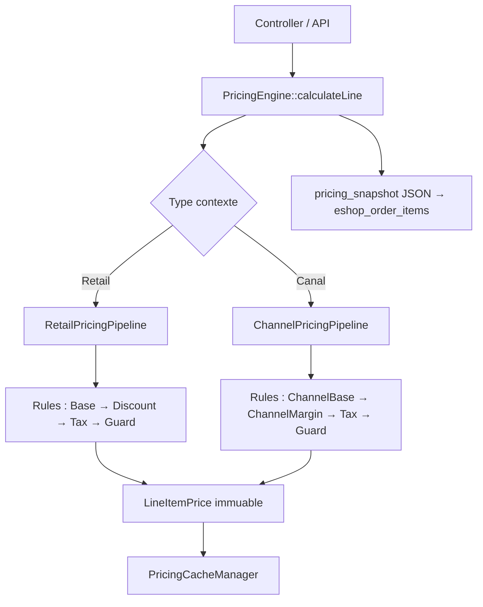

# Eshop360 — Moteur de Pricing Évolutif (v2)

> Architecte Technique Senior | Laravel 12 | Strategy + Pipeline  
> Version : 2.1 | Date : 2026-04-06 (mise à jour post-implémentation) · v2.0 initiale : 2026-04-04  
> Intègre : Audit pricing 2026-04-04 · Spec pricing_channels  
> **Convention** : `[D'APRÈS AUDIT]` = code constaté · `[NOUVEAU]` = proposition · ✅ `[IMPLÉMENTÉ]` = réalisé en code

> ## ✅ STATUT D'IMPLÉMENTATION (vérifié 2026-04-06)
>
> **Cette spec v2 est désormais MAJORITAIREMENT IMPLÉMENTÉE en code.** Les sections marquées `[NOUVEAU]` ci-dessous décrivent l'architecture cible — la plupart sont **déjà présentes dans `Modules/Eshop360/Pricing/`** :
>
> - ✅ `Modules/Eshop360/Pricing/Engines/PricingEngine.php`
> - ✅ `Modules/Eshop360/Pricing/Pipelines/RetailPricingPipeline.php`
> - ✅ `Modules/Eshop360/Pricing/Pipelines/ChannelPricingPipeline.php`
> - ✅ `Modules/Eshop360/Pricing/Rules/Retail/{BasePriceRule, DiscountProductRule, TaxRule, MinimumPriceGuard}.php`
> - ✅ `Modules/Eshop360/Pricing/Rules/Channel/{ChannelBasePriceRule, ChannelMarginRule, ChannelCreditRule}.php`
> - ✅ `Modules/Eshop360/Pricing/Rules/Wholesale/{WholesalePriceRule, PharmacyPriceRule}.php`
> - ✅ `Modules/Eshop360/Pricing/DTOs/{PricingContext, LineItemPrice, PricingResult, ChannelMarginResult}.php`
> - ✅ `Modules/Eshop360/Pricing/Registry/PricingRuleRegistry.php`
> - ✅ `Modules/Eshop360/Pricing/Cache/PricingCacheManager.php`
> - ✅ `Modules/Eshop360/Pricing/Events/ProductPricingRecalculated.php`
> - ✅ `Modules/Eshop360/Pricing/Services/{OrderQuantityResolver, WholesaleCalculatorService}.php`
> - ✅ Migrations DB : `2026_04_04_000005_eshop_create_pricing_rules_tables.php`, `000006_eshop_add_pricing_snapshots_to_order_items.php`, `000002_eshop_add_margin_fields_to_channel_product_prices.php`, `000003_eshop_create_channel_credits_table.php`, `000004_eshop_create_channel_credit_usages_table.php` — toutes appliquées
> - ✅ Test passant : `Modules/Eshop360/Tests/Unit/PricingEngineTest.php`
>
> **Reste à faire** :
>
> - ⚠️ **Multi-currency dans Pricing Engine** : `PricingContext` et `PricingResult` ne contiennent pas encore de notion de devise. `cacheKey()` ne discrimine pas par devise → risque de cache pollution si activation multi-currency. Voir `currency_multi_currency_evolution.md` pour le contexte.
> - ⚠️ **Intégration effective dans le checkout `OrderService`** : à confirmer (le `PricingEngine` est bien instanciable et testé en isolation, mais son utilisation dans `OrderService::createOrder()` reste à vérifier dans cette session — non bloquant pour cette mise à jour de doc).
> - ⚠️ **Suppression définitive du legacy `CodifarmMarginConfig`** : déjà fait par migration `2026_03_16_100003_drop_codifarm_tables_and_columns.php`. Le système est unifié sur `DistributionChannel` + `ChannelMarginLog`.
>
> **Pour les détails de validation, voir [STATUS.md](../STATUS.md) et [audit_comparatif_final.md](../audit_comparatif_final.md) v1.3.**

---

---

## TABLE DES MATIÈRES

1. [Problématique et contraintes](#1-problématique-et-contraintes)
2. [Architecture recommandée](#2-architecture-recommandée)
3. [Versioning des règles](#3-versioning-des-règles)
4. [Extensibilité](#4-extensibilité)
5. [Données et performances](#5-données-et-performances)
6. [Sécurité et cohérence](#6-sécurité-et-cohérence)

---

## 1. Problématique et contraintes

### 1.1 État actuel du pricing [D'APRÈS AUDIT]

L'audit identifie **3 services de pricing actifs** avec des rôles chevauchants :

| Service | Fichier | Responsabilité | Problème |
|---------|---------|----------------|----------|
| `ProductPricingService::resolve()` | `Eshop360/Services/` | Point d'entrée unique (canal ou retail) | Logique conditionnelle croissante |
| `CostCalculatorService` | `Eshop360/Services/` | PGHT, marges, prix canal | Recalcul global non transactionnel [D'APRÈS AUDIT §6.2 point 11] |
| `DistributionChannel::calculateSalePrice()` | `Eshop360/Models/` | Calcul prix canal sur le modèle | Logique métier dans le modèle |

**Règles actuelles hardcodées** [D'APRÈS AUDIT] :

```
ProductPricingService::resolve() :
  SI channelId fourni :
    1. ChannelProductPrice.sale_price (override manuel)
    2. SI absent/≤0 ET PGHT: prix = PGHT × (1 + channel.buy_rate)
    3. Sinon: prix = product.price

  SINON :
    1. prix = product.price
    2. Si discount_type = 'percentage': prix -= prix × discount_value / 100
    3. Si discount_type = 'fixed': prix = max(0, prix - discount_value)

CostCalculatorService::PGHT :
  PGHT = purchase_price_provisional × (1 + margin_rate)  // margin_rate défaut 13%

CostCalculatorService::channel_price :
  channel_price = PGHT × (1 + channel.buy_rate)
```

**Nouvelles règles à intégrer** [NOUVEAU — d'après spec] :

```
wholesale_price = pght + marge_wholesale  (% ou montant fixe, priorité manuelle)
pharmacy_price  = wholesale_price + marge_pharmacy  (% ou montant, priorité manuelle)
price           = manuel OU = wholesale_based
purchase_price_provisional = pght + marge_provisional  (% ou montant, priorité manuelle)

Canal :
  marge_totale     = channel_price - purchase_price
  part_proprietaire = marge_totale × (margin_owner_pct / 100)
  part_canal       = marge_totale × (margin_channel_pct / 100)
  part_dette       = marge_totale - part_proprietaire - part_canal  (si debt_enabled)
  CONTRAINTE       : margin_owner_pct + margin_channel_pct ≤ 100
```

**Problèmes identifiés** :
1. `CostCalculatorService::updateProductPricing()` recalcule tous les canaux sans verrou transactionnel [D'APRÈS AUDIT]
2. Coupon expiré entre panier et checkout non détecté (risque connu) [D'APRÈS AUDIT]
3. Pas de versioning des règles : impossible de retracer quel calcul a produit un prix historique
4. Double système de marge (`CodifarmMarginConfig` + `DistributionChannel`) — données potentiellement incohérentes

### 1.2 Contrainte impérative : ne pas casser l'historique

- `eshop_orders.total` et `eshop_order_items.unit_price` sont les valeurs définitives stockées — elles ne changent pas
- Le recalcul des nouvelles règles n'affecte que les **nouveaux** devis/commandes
- Les commandes historiques restent cohérentes par construction (prix figé à la création)

---

## 2. Architecture recommandée

### 2.1 Vue d'ensemble



### 2.2 Structure de fichiers [NOUVEAU]

```
Modules/Eshop360/
  Pricing/
    Contracts/
      PricingRuleInterface.php
      PricingContextInterface.php
    DTOs/
      PricingContext.php         (readonly, immuable)
      LineItemPrice.php          (readonly, immuable)
      PricingResult.php          (readonly, immuable)
      ChannelMarginResult.php    (nouveau — résultat répartition tripartite)
    Engines/
      PricingEngine.php          (orchestrateur)
    Pipelines/
      RetailPricingPipeline.php  (flux retail : base → discount → tax → guard)
      ChannelPricingPipeline.php (flux canal : channel_base → margin → tax → guard)
    Rules/
      Retail/
        BasePriceRule.php          (price ou wholesale selon mode)
        DiscountProductRule.php    (discount_type / discount_value produit)
        CouponRule.php             (code promo CartService)
        TaxRule.php                (eshop_product_taxes inclusive/exclusive)
        MinimumPriceGuard.php      (total >= 0, log si < cost_price)
      Channel/
        ChannelBasePriceRule.php   (channel_price ou PGHT × buy_rate)
        ChannelMarginRule.php      (owner / channel / debt) [NOUVEAU]
        ChannelCreditRule.php      (déduction crédit canal) [NOUVEAU]
        TaxRule.php                (réutilisé)
        MinimumPriceGuard.php      (réutilisé)
      Wholesale/
        WholesalePriceRule.php     [NOUVEAU]
        PharmacyPriceRule.php      [NOUVEAU]
    Registry/
      PricingRuleRegistry.php
    Cache/
      PricingCacheManager.php
    Services/
      ProductPricingService.php    (remplace l'existant progressivement)
      ChannelMarginService.php     (remplace MarginService)
      WholesaleCalculatorService.php [NOUVEAU]
```

### 2.3 Interfaces et DTOs clés

```php
// Modules/Eshop360/Pricing/Contracts/PricingRuleInterface.php
interface PricingRuleInterface
{
    public function slug(): string;
    public function priority(): int;  // 10=base, 50=remises, 80=taxe, 90=guards
    public function isApplicable(PricingContext $ctx): bool;
    public function apply(PricingContext $ctx, LineItemPrice $current): LineItemPrice;
}

// Modules/Eshop360/Pricing/DTOs/PricingContext.php
readonly class PricingContext
{
    public function __construct(
        public readonly int        $instanceId,
        public readonly int        $productId,
        public readonly float      $basePrice,        // product.price
        public readonly float      $costPrice,        // product.cost_price
        public readonly float      $pght,             // product.pght
        public readonly float      $wholesalePrice,   // product.wholesale_price [NOUVEAU]
        public readonly float      $taxRate,
        public readonly bool       $taxInclusive,
        public readonly int        $quantity,
        public readonly ?int       $customerId,
        public readonly ?int       $channelId,
        public readonly ?string    $couponCode,
        public readonly ?string    $discountType,     // 'none','percentage','fixed'
        public readonly float      $discountValue,
        public readonly \DateTimeImmutable $evaluatedAt,
    ) {}
}

// Modules/Eshop360/Pricing/DTOs/LineItemPrice.php
readonly class LineItemPrice
{
    public function __construct(
        public readonly float $unitPrice,
        public readonly float $discountAmount,
        public readonly float $taxAmount,
        public readonly float $total,
        public readonly array $appliedRules,
        // [NOUVEAU] canal
        public readonly ?float $marginTotal    = null,
        public readonly ?float $partOwner      = null,
        public readonly ?float $partChannel    = null,
        public readonly ?float $partDebt       = null,
    ) {}

    public function withRule(string $slug, int $version, float $delta): self
    {
        return new self(
            unitPrice:      $this->unitPrice,
            discountAmount: $this->discountAmount,
            taxAmount:      $this->taxAmount,
            total:          $this->total + $delta,
            appliedRules:   [...$this->appliedRules, compact('slug', 'version', 'delta')],
        );
    }

    public function toSnapshot(): array
    {
        return [
            'evaluated_at'   => $this->evaluatedAt ?? now()->toIso8601String(),
            'unit_price'     => $this->unitPrice,
            'discount'       => $this->discountAmount,
            'tax'            => $this->taxAmount,
            'total'          => $this->total,
            'margin_total'   => $this->marginTotal,
            'part_owner'     => $this->partOwner,
            'part_channel'   => $this->partChannel,
            'part_debt'      => $this->partDebt,
            'applied_rules'  => $this->appliedRules,
        ];
    }
}
```

### 2.4 Implémentation des nouvelles règles [NOUVEAU]

#### WholesalePriceRule (spec §2.1)

```php
class WholesalePriceRule implements PricingRuleInterface
{
    public function slug(): string  { return 'wholesale_price'; }
    public function priority(): int { return 5; } // Avant BasePriceRule

    public function isApplicable(PricingContext $ctx): bool
    {
        // S'applique pour les ventes grossiste (pas retail standard)
        return $ctx->customerId !== null
            && Customer::find($ctx->customerId)?->group_type === 'wholesale';
    }

    public function apply(PricingContext $ctx, LineItemPrice $current): LineItemPrice
    {
        // Lecture du mode depuis le produit
        $product = Product::find($ctx->productId);
        $price   = match ($product->wholesale_price_mode) {
            'percentage' => $ctx->pght * (1 + $product->wholesale_price_rate / 100),
            'fixed'      => $ctx->pght + $product->wholesale_price_rate,
            'manual'     => $product->wholesale_price,
            default      => $product->wholesale_price,
        };

        $total = $price * $ctx->quantity;
        return new LineItemPrice(
            unitPrice:     $price,
            discountAmount: 0,
            taxAmount:     0,
            total:         $total,
            appliedRules:  [['slug' => $this->slug(), 'version' => 1, 'delta' => $total]],
        );
    }
}
```

#### ChannelMarginRule (spec §5) [NOUVEAU]

```php
class ChannelMarginRule implements PricingRuleInterface
{
    public function slug(): string  { return 'channel_margin'; }
    public function priority(): int { return 30; }

    public function isApplicable(PricingContext $ctx): bool
    {
        return $ctx->channelId !== null
            && app(FeatureResolver::class)->can($ctx->instanceId, 'eshop.pricing.channel_margins');
    }

    public function apply(PricingContext $ctx, LineItemPrice $current): LineItemPrice
    {
        $channelPrice = ChannelProductPrice::where('product_id', $ctx->productId)
            ->where('channel_id', $ctx->channelId)
            ->first();

        if (! $channelPrice) return $current;

        $purchasePrice = $channelPrice->purchase_price ?? $ctx->wholesalePrice;
        $salePrice     = $channelPrice->channel_price;
        $qty           = $ctx->quantity;

        $marginTotal  = ($salePrice - $purchasePrice) * $qty;
        $partOwner    = $marginTotal * ($channelPrice->margin_owner_pct / 100);
        $partChannel  = $marginTotal * ($channelPrice->margin_channel_pct / 100);
        $partDebt     = $channelPrice->debt_enabled
            ? $marginTotal - $partOwner - $partChannel
            : 0.0;

        // Validation spec §5.4 : owner + channel ≤ 100%
        // (garantie par contrainte CHECK en DB — cf. migration)

        return new LineItemPrice(
            unitPrice:      $salePrice,
            discountAmount: $current->discountAmount,
            taxAmount:      0.0,
            total:          $salePrice * $qty,
            appliedRules:   [...$current->appliedRules, ['slug' => $this->slug(), 'version' => 1, 'delta' => ($salePrice - $current->unitPrice) * $qty]],
            marginTotal:    $marginTotal,
            partOwner:      $partOwner,
            partChannel:    $partChannel,
            partDebt:       $partDebt,
        );
    }
}
```

#### ChannelCreditRule (spec §6) [NOUVEAU]

```php
class ChannelCreditRule implements PricingRuleInterface
{
    public function slug(): string  { return 'channel_credit'; }
    public function priority(): int { return 60; } // Après marges, avant taxe

    public function isApplicable(PricingContext $ctx): bool
    {
        return $ctx->channelId !== null
            && app(FeatureResolver::class)->can($ctx->instanceId, 'eshop.channel.credits');
    }

    public function apply(PricingContext $ctx, LineItemPrice $current): LineItemPrice
    {
        $credit = ChannelCredit::where('channel_id', $ctx->channelId)
            ->where('status', 'active')
            ->where(fn($q) => $q->whereNull('expires_at')->orWhere('expires_at', '>=', today()))
            ->lockForUpdate()  // éviter race condition
            ->first();

        if (! $credit || $credit->remaining_amount <= 0) return $current;

        $deduction = min($credit->remaining_amount, $current->total);
        // Ne pas appliquer ici — enregistrer l'intention, appliquer lors du checkout
        // (principe : prix affiché ≠ prix final avec crédit)

        return $current->withRule($this->slug(), 1, 0); // Marquer applicabilité sans modifier total
        // Le crédit réel est déduit dans ChannelCreditService::applyAtCheckout()
    }
}
```

### 2.5 PricingEngine (orchestrateur) [NOUVEAU]

```php
// Modules/Eshop360/Pricing/Engines/PricingEngine.php
class PricingEngine
{
    public function __construct(
        private readonly PricingRuleRegistry $registry,
        private readonly PricingCacheManager $cache,
        private readonly OrderQuantityResolver $qtyResolver,
    ) {}

    public function calculateLine(PricingContext $ctx): LineItemPrice
    {
        // Valider quantité AVANT calcul prix (spec §7.3)
        $this->qtyResolver->validate($ctx->quantity, $ctx->productId, $ctx->channelId);

        $cacheKey = $this->cacheKey($ctx);
        if (! $ctx->couponCode && $cached = $this->cache->get($cacheKey)) {
            return $cached;
        }

        $pipeline = $ctx->channelId
            ? new ChannelPricingPipeline($this->registry->getRulesForChannel($ctx->instanceId))
            : new RetailPricingPipeline($this->registry->getRulesForRetail($ctx->instanceId));

        $result = $pipeline->run($ctx);

        if (! $ctx->couponCode) {
            $this->cache->set($cacheKey, $result, ttl: 300);
        }

        return $result;
    }
}
```

---

## 3. Versioning des règles

### 3.1 Tables [NOUVEAU]

```sql
CREATE TABLE eshop_pricing_rules (
    id         BIGINT UNSIGNED AUTO_INCREMENT PRIMARY KEY,
    slug       VARCHAR(100) NOT NULL UNIQUE,
    name       VARCHAR(255) NOT NULL,
    class_name VARCHAR(255) NOT NULL,   -- FQCN
    priority   TINYINT UNSIGNED NOT NULL DEFAULT 50,
    pipeline   ENUM('retail','channel','wholesale','all') NOT NULL DEFAULT 'all',
    is_active  TINYINT(1) NOT NULL DEFAULT 1,
    is_core    TINYINT(1) NOT NULL DEFAULT 0,  -- règles core non désactivables
    created_at TIMESTAMP
);

CREATE TABLE eshop_pricing_rule_versions (
    id            BIGINT UNSIGNED AUTO_INCREMENT PRIMARY KEY,
    rule_id       BIGINT UNSIGNED NOT NULL,
    version       SMALLINT UNSIGNED NOT NULL DEFAULT 1,
    configuration JSON NOT NULL,      -- paramètres (taux, seuils...)
    start_date    DATE NOT NULL,
    end_date      DATE NULL,          -- NULL = actuellement active
    created_by    BIGINT UNSIGNED NULL,
    created_at    TIMESTAMP,
    UNIQUE KEY uq_rule_version (rule_id, version),
    FOREIGN KEY (rule_id) REFERENCES eshop_pricing_rules(id)
);

CREATE TABLE eshop_pricing_rule_configs (
    id          BIGINT UNSIGNED AUTO_INCREMENT PRIMARY KEY,
    rule_id     BIGINT UNSIGNED NOT NULL,
    instance_id BIGINT UNSIGNED NOT NULL,
    config      JSON NOT NULL,        -- surcharge tenant
    is_active   TINYINT(1) NOT NULL DEFAULT 1,
    UNIQUE KEY uq_rule_config (rule_id, instance_id),
    FOREIGN KEY (rule_id) REFERENCES eshop_pricing_rules(id)
);
```

### 3.2 Snapshot dans eshop_order_items [NOUVEAU]

```sql
-- Migration additive sur eshop_order_items
ALTER TABLE eshop_order_items
    ADD COLUMN pricing_snapshot JSON NULL
        COMMENT 'Snapshot complet des règles appliquées au moment de la commande'
        AFTER tax_amount,
    ADD COLUMN margin_snapshot JSON NULL
        COMMENT 'Répartition marge canal (owner/channel/debt) au moment de la commande'
        AFTER pricing_snapshot;
```

Exemple de valeur `pricing_snapshot` :

```json
{
  "evaluated_at": "2026-04-04T10:30:00Z",
  "pipeline": "channel",
  "base_price": 5000,
  "applied_rules": [
    { "slug": "channel_base_price", "version": 2, "delta": 5500 },
    { "slug": "channel_margin",     "version": 1, "delta": 0 },
    { "slug": "tax",                "version": 1, "delta": 990 }
  ],
  "unit_price": 5500,
  "tax_amount": 990,
  "total": 6490
}
```

Exemple de valeur `margin_snapshot` :

```json
{
  "purchase_price": 4000,
  "channel_price": 5500,
  "margin_total": 1500,
  "margin_owner_pct": 60,
  "margin_channel_pct": 30,
  "debt_enabled": true,
  "part_owner": 900,
  "part_channel": 450,
  "part_debt": 150
}
```

### 3.3 `eshop_channel_margin_logs` enrichi [NOUVEAU]

La table existante [D'APRÈS AUDIT] est enrichie :

```sql
ALTER TABLE eshop_channel_margin_logs
    ADD COLUMN order_item_id   BIGINT UNSIGNED NULL COMMENT 'Lien vers la ligne de commande',
    ADD COLUMN purchase_price  DECIMAL(15,4) NULL,
    ADD COLUMN margin_owner_pct  DECIMAL(5,2) NULL,
    ADD COLUMN margin_channel_pct DECIMAL(5,2) NULL,
    ADD COLUMN debt_enabled    TINYINT(1) NULL,
    ADD COLUMN rule_version    SMALLINT UNSIGNED NULL COMMENT 'Version règle pricing appliquée';
```

---

## 4. Extensibilité

### 4.1 Registre et injection [NOUVEAU]

```php
// Modules/Eshop360/Pricing/Registry/PricingRuleRegistry.php
class PricingRuleRegistry
{
    private array $rules = [];

    public function register(PricingRuleInterface $rule): void
    {
        $this->rules[$rule->slug()] = $rule;
    }

    public function getRulesForRetail(int $instanceId): array
    {
        return $this->getActiveRules($instanceId, 'retail');
    }

    public function getRulesForChannel(int $instanceId): array
    {
        return $this->getActiveRules($instanceId, 'channel');
    }

    private function getActiveRules(int $instanceId, string $pipeline): array
    {
        $activeSlugs = Cache::remember("pricing.rules.{$instanceId}.{$pipeline}", 3600, fn() =>
            DB::table('eshop_pricing_rules')
                ->where('is_active', true)
                ->where(fn($q) => $q->where('pipeline', $pipeline)->orWhere('pipeline', 'all'))
                ->where(fn($q) =>
                    $q->where('is_core', true)
                      ->orWhereExists(fn($sq) =>
                          $sq->from('eshop_pricing_rule_configs')
                             ->whereColumn('rule_id', 'eshop_pricing_rules.id')
                             ->where('instance_id', $instanceId)
                             ->where('is_active', true)
                      )
                )
                ->orderBy('priority')
                ->pluck('slug')
        );

        return collect($this->rules)
            ->filter(fn($rule) => in_array($rule->slug(), $activeSlugs->toArray()))
            ->sortBy(fn($rule) => $rule->priority())
            ->values()
            ->all();
    }
}
```

### 4.2 Extension par module externe [NOUVEAU]

Un module externe (ex: Menuiserie360) peut injecter sa propre règle de pricing sans toucher à Eshop360 :

```php
// Modules/Menuiserie360/Providers/Menuiserie360ServiceProvider.php
public function boot(): void
{
    $this->app->resolving(PricingRuleRegistry::class, function (PricingRuleRegistry $reg) {
        $reg->register(new DimensionBasedPriceRule());
    });
}
```

### 4.3 Calcul automatique en cascade wholesale → pharmacy → price [NOUVEAU]

```php
// Modules/Eshop360/Pricing/Services/WholesaleCalculatorService.php
class WholesaleCalculatorService
{
    /**
     * Recalcule wholesale_price, pharmacy_price et price (si mode auto)
     * lorsque pght ou purchase_price_provisional change.
     * Toutes les valeurs manuelles sont préservées.
     */
    public function recalculate(Product $product): array
    {
        $changes = [];

        // 1. wholesale_price (spec §2.1) — jamais si mode = 'manual'
        if ($product->wholesale_price_mode !== 'manual' && $product->pght > 0) {
            $wholesale = match ($product->wholesale_price_mode) {
                'percentage' => $product->pght * (1 + $product->wholesale_price_rate / 100),
                'fixed'      => $product->pght + $product->wholesale_price_rate,
                default      => $product->wholesale_price,
            };
            $changes['wholesale_price'] = round($wholesale, 4);
        } else {
            $wholesale = $product->wholesale_price;
        }

        // 2. pharmacy_price (spec §2.2) — base = wholesale calculé
        if ($product->pharmacy_price_mode !== 'manual' && $wholesale > 0) {
            $pharmacy = match ($product->pharmacy_price_mode) {
                'percentage' => $wholesale * (1 + $product->pharmacy_price_rate / 100),
                'fixed'      => $wholesale + $product->pharmacy_price_rate,
                default      => $product->pharmacy_price,
            };
            $changes['pharmacy_price'] = round($pharmacy, 4);
        }

        // 3. price public (spec §2.3) — seulement si mode = 'wholesale_based'
        if ($product->price_mode === 'wholesale_based' && $wholesale > 0) {
            $price = $wholesale * (1 + $product->price_rate / 100);
            $changes['price'] = round($price, 4);
        }

        return $changes; // L'appelant décide de sauvegarder (atomicité)
    }

    public function recalculateAndSave(Product $product): void
    {
        $changes = $this->recalculate($product);
        if (! empty($changes)) {
            $product->update($changes);
            // Invalider le cache pricing pour ce produit
            event(new ProductPricingRecalculated($product->id, $product->instance_id, $changes));
        }
    }
}
```

**Observer pour déclencher le recalcul** [NOUVEAU] :

```php
// Modules/Eshop360/Observers/ProductObserver.php
class ProductObserver
{
    public function updating(Product $product): void
    {
        // Si pght ou purchase_price_provisional change → recalcul en cascade
        if ($product->isDirty(['pght', 'purchase_price_provisional'])) {
            // Asynchrone pour les updates en masse
            WholesaleRecalculateJob::dispatch($product->id)
                ->onQueue('eshop-pricing')
                ->afterCommit();  // Attend la fin de la transaction
        }
    }
}
```

### 4.4 Bulk update quantités [NOUVEAU — spec §7]

```php
// Modules/Eshop360/Jobs/BulkUpdateOrderQuantitiesJob.php
class BulkUpdateOrderQuantitiesJob implements ShouldQueue
{
    use Batchable;

    public int $tries = 3;
    public int $timeout = 120;

    public function __construct(
        private readonly array $productIds,
        private readonly ?int  $minQty,
        private readonly ?int  $maxQty,
        private readonly int   $instanceId,
    ) {}

    public function handle(): void
    {
        // Validation : max >= min
        if ($this->minQty !== null && $this->maxQty !== null && $this->maxQty < $this->minQty) {
            $this->fail(new \InvalidArgumentException('max_order_quantity < min_order_quantity'));
            return;
        }

        // Update en chunk pour éviter timeout
        collect($this->productIds)->chunk(500)->each(function ($chunk) {
            Product::where('instance_id', $this->instanceId)
                ->whereIn('id', $chunk)
                ->update(array_filter([
                    'min_order_quantity' => $this->minQty,
                    'max_order_quantity' => $this->maxQty,
                ], fn($v) => $v !== null));
        });
    }
}

// Dispatch depuis controller :
Bus::batch([
    new BulkUpdateOrderQuantitiesJob($productIds, $minQty, $maxQty, $instanceId)
])->name('bulk-qty-update-'.$instanceId)
  ->onQueue('eshop-bulk')
  ->dispatch();
```

---

## 5. Données et performances

### 5.1 Tables récapitulatif [D'APRÈS AUDIT + NOUVEAU]

| Table | Statut | Rôle |
|-------|--------|------|
| `eshop_products` | Existant | +8 colonnes (pricing modes, qty limits) |
| `eshop_channel_product_prices` | Existant | +5 colonnes (purchase_price, margin pcts, debt) |
| `eshop_distribution_channels` | Existant | Inchangé |
| `eshop_channel_margin_logs` | Existant | +5 colonnes enrichissement |
| `eshop_codifarm_margin_config` | Existant → déprécié | Migré vers DistributionChannel |
| `eshop_order_items` | Existant | +2 colonnes JSON (snapshots) |
| `eshop_pricing_rules` | **Nouveau** | Registre des règles |
| `eshop_pricing_rule_versions` | **Nouveau** | Versioning configuration règles |
| `eshop_pricing_rule_configs` | **Nouveau** | Config par tenant |
| `eshop_channel_credits` | **Nouveau** | Crédit canal (spec §6) |
| `eshop_channel_credit_usages` | **Nouveau** | Journal utilisation crédit |

### 5.2 Index recommandés [NOUVEAU]

```sql
-- Pricing lookup rapide
CREATE INDEX idx_channel_prices_lookup
    ON eshop_channel_product_prices (channel_id, product_id);  -- déjà unique probablement

-- Margin logs par canal et date
CREATE INDEX idx_channel_margin_logs_channel_date
    ON eshop_channel_margin_logs (channel_id, created_at DESC);

-- Crédits canal actifs
CREATE INDEX idx_channel_credits_active
    ON eshop_channel_credits (channel_id, status, expires_at);

-- Pricing rules par instance et pipeline
CREATE INDEX idx_pricing_rule_configs_active
    ON eshop_pricing_rule_configs (instance_id, is_active);

-- Products bulk query (min/max qty)
CREATE INDEX idx_products_qty_limits
    ON eshop_products (instance_id, min_order_quantity, max_order_quantity);
```

### 5.3 Cache à deux niveaux [NOUVEAU]

```php
// Niveau 1 : Redis (TTL 5 min) — prix par ligne de calcul
// Niveau 2 : table eshop_product_pricing_cache (TTL 1h) — pré-calcul produits populaires

// Invalidation sur changement pght/mode/wholesale
// Via event ProductPricingRecalculated :
class OnProductPricingRecalculated
{
    public function handle(ProductPricingRecalculated $event): void
    {
        // Invalider Redis pour ce produit (tous les contextes)
        Redis::del(Redis::keys("pricing.*.{$event->productId}.*"));

        // Invalider toutes les règles liées à ce produit dans le cache
        Cache::forget("pricing.rules.{$event->instanceId}.retail");
        Cache::forget("pricing.rules.{$event->instanceId}.channel");
    }
}
```

### 5.4 Queue dédiée pour les recalculs [NOUVEAU]

```php
// config/queue.php — Queues dédiées par type de job
'eshop-pricing'  => [...],  // WholesaleRecalculateJob (priorité élevée)
'eshop-bulk'     => [...],  // BulkUpdateOrderQuantitiesJob (priorité basse)
'eshop-margin'   => [...],  // ChannelMarginLogJob (asynchrone)
```

---

## 6. Sécurité et cohérence

### 6.1 Double vérification serveur (principe fondamental) [D'APRÈS AUDIT — maintenu]

```php
// Le prix affiché en front est ESTIMÉ — le prix final est TOUJOURS recalculé
// CheckoutController::confirm() :
public function confirm(ConfirmOrderRequest $request): JsonResponse
{
    // 1. Valider les quantités (spec §7.3)
    foreach ($request->items as $item) {
        app(OrderQuantityResolver::class)->validate(
            $item['quantity'], $item['product_id'], $request->channel_id
        );
    }

    // 2. Recalculer côté serveur — JAMAIS faire confiance au prix front
    $serverResult = app(PricingEngine::class)->calculateOrder(
        instanceId: currentInstanceId(),
        items:      $request->items,
        channelId:  $request->channel_id,
        couponCode: $request->coupon_code,
    );

    // 3. Vérifier l'écart (tolérance 1%)
    $tolerance = $serverResult->total * 0.01;
    if (abs($request->total - $serverResult->total) > $tolerance) {
        return response()->json([
            'error'         => 'price_changed',
            'updated_total' => $serverResult->total,
            'message'       => 'Le prix a été mis à jour. Veuillez vérifier votre panier.',
        ], 409);
    }

    // 4. Créer la commande avec le PRIX SERVEUR (pas le prix front)
    $order = app(OrderService::class)->create($request->validated(), $serverResult);
    return response()->json(['order_id' => $order->id], 201);
}
```

### 6.2 Verrouillage stock + crédit canal lors du checkout [D'APRÈS AUDIT + NOUVEAU]

```php
// OrderService::create() — Dans une seule transaction DB
DB::transaction(function () use ($data, $pricingResult) {
    foreach ($pricingResult->lines as $line) {
        // Stock : lockForUpdate (correction race condition ISSUE-01 de l'audit)
        $stock = Stock::where('product_id', $line->productId)
            ->where('warehouse_id', $data['warehouse_id'])
            ->lockForUpdate()
            ->firstOrFail();

        if ($stock->getAvailableQuantity() < $line->quantity) {
            throw new InsufficientStockException($line->productId);
        }

        // [NOUVEAU] Crédit canal : lockForUpdate
        if ($line->channelCreditDeduction > 0) {
            $credit = ChannelCredit::where('id', $line->creditId)
                ->lockForUpdate()->firstOrFail();
            if ($credit->remaining_amount < $line->channelCreditDeduction) {
                throw new InsufficientCreditException($line->creditId);
            }
            $credit->decrement('used_amount', $line->channelCreditDeduction);
        }
    }
    // ... création commande avec snapshots ...
});
```

### 6.3 Cas limites et validations [NOUVEAU — d'après spec]

| Cas limite | Spec | Comportement | Implémentation |
|------------|------|-------------|----------------|
| `margin_owner + margin_channel > 100%` | §5.4 | Rejet | Contrainte CHECK en DB + validation FormRequest |
| Crédit canal épuisé | §6.3 | Erreur métier | `lockForUpdate` + `remaining_amount >= 0` CHECK |
| `min_order_quantity > max_order_quantity` | §7.3 | Rejet à la configuration | Validation dans `StoreProductRequest` |
| `quantity < min_order_quantity` | §7.3 | Rejet commande | `OrderQuantityResolver::validate()` |
| `quantity > max_order_quantity` | §7.3 | Rejet commande | Idem |
| `pght = 0` et `wholesale_price_mode = percentage` | §2.1 | Conserver la valeur manuelle actuelle | Guard dans `WholesaleCalculatorService` |
| `pharmacy_price < wholesale_price` | §2.2 | Autoriser mais logger un warning | Log warning, pas de blocage |
| Prix canal nul après calcul | §4.1 | Fallback sur `product.price` | `ChannelBasePriceRule::apply()` |

### 6.4 Audit intégré [NOUVEAU]

```php
// Chaque modification de prix produit (pght, wholesale modes) est auditée
// Via le trait HasAuditLog sur Product (à ajouter — action #17 de l'audit)
// Les logs de marge canal sont enrichis avec order_item_id (traçabilité complète)
// La colonne pricing_snapshot dans order_items permet la reconstitution forensique
```

---

*Document v2.0 — Intègre audits 2026-04-04 et spec pricing_channels. À mettre à jour lors de chaque ajout de règle.*
