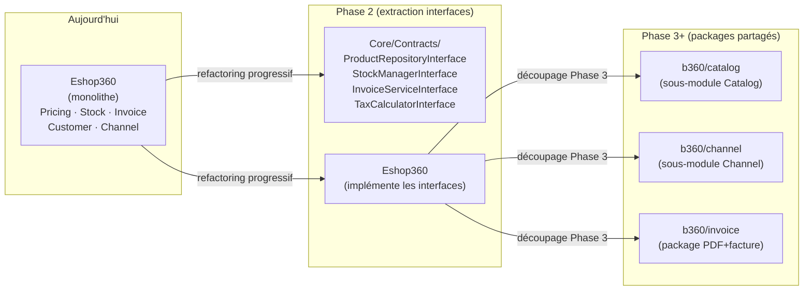

# Stratégie de Mutualisation des Données et Fonctionnalités (v2)

> Architecte Technique Senior | Laravel 12 | DDD | Multi-tenant  
> Version : 2.0 | Date : 2026-04-04  
> Intègre : Audit cartographie 2026-04-04 · Audit modules 2026-04-04 · Spec pricing_channels  
> **Convention** : `[D'APRÈS AUDIT]` = code constaté · `[NOUVEAU]` = proposition

---

## TABLE DES MATIÈRES

1. [Identification des ressources mutualisables](#1-identification-des-ressources-mutualisables)
2. [Stratégie de mutualisation](#2-stratégie-de-mutualisation)
3. [Intégration avec Menuiserie360 et autres modules](#3-intégration-avec-menuiserie360-et-autres-modules)
4. [Isolation et indépendance des modules](#4-isolation-et-indépendance-des-modules)
5. [Gouvernance technique](#5-gouvernance-technique)
6. [Points sensibles et risques](#6-points-sensibles-et-risques)

---

## 1. Identification des ressources mutualisables

### 1.1 Tables existantes partagées [D'APRÈS AUDIT]

L'audit confirme que toutes les données métier résident dans `Eshop360`. Il n'existe pas de package `b360/core` dédié aux données. Les tables actuellement partagées de facto :

| Table | Module propriétaire | Consommateurs actuels | Consommateurs potentiels |
|-------|--------------------|-----------------------|--------------------------|
| `eshop_products` | Eshop360 | Eshop360 (complet) | Menuiserie360, tout module catalogue |
| `eshop_customers` | Eshop360 | Eshop360 | Menuiserie360 (fiche client), tout module CRM |
| `eshop_stocks` | Eshop360 | Eshop360 | Menuiserie360 (consommation matière) |
| `eshop_invoices` | Eshop360 | Eshop360, Menuiserie360 (prévu) | Tout module facturation |
| `eshop_payments` | Eshop360 | Eshop360 | Tout module paiement |
| `eshop_distribution_channels` | Eshop360 | Eshop360 | Menuiserie360 si canaux multi-module |
| `eshop_channel_product_prices` | Eshop360 | Eshop360 | Menuiserie360 (prix matériaux par canal) |

**Tables système partagées** [D'APRÈS AUDIT — Core / app/] :

| Table | Localisation | Partagée par |
|-------|-------------|-------------|
| `users` + `instance_user` | `app/` + Core | Tous les modules |
| `instances` | `app/Instances/` | Tous les modules |
| `permissions`, `roles` | Core (Spatie) | Tous les modules |
| `settings` | Settings module | Tous les modules |
| `audit_logs` | Core | Core, (Eshop a sa propre table) |

**Incohérence identifiée** [D'APRÈS AUDIT] : Le trait `BelongsToInstance` existe dans deux endroits (`app/Models/Concerns/` et `Modules/Core/Database/Traits/`). Duplication à supprimer — version Core est la référence.

### 1.2 Services métiers réutilisables [D'APRÈS AUDIT]

| Service | Module | Réutilisable | Condition |
|---------|--------|-------------|-----------|
| `StockService` | Eshop360 | Oui | Via interface — **après** fix race condition P0 |
| `InvoiceService` | Eshop360 | Oui | Via interface — après correction `tax_rate` invoice_items |
| `ProductPricingService` | Eshop360 | Oui | Remplacer par PricingEngine (voir fichier 2) |
| `WholesaleCalculatorService` | [NOUVEAU] | Oui | Service réutilisable dès création |
| `TaxCalculatorService` | [À VÉRIFIER] | Oui | Si présent, à extraire en Core |
| `ExportService` (CSV/XLSX) | Eshop360 | Oui | Extraire en package partagé |
| `PdfService` | Eshop360 | Oui | Extraire en package partagé |
| `HRService` | Eshop360 | Non | Trop spécifique Eshop |
| `CartService` | Eshop360 | Partiel | Logique POS spécifique |

### 1.3 Nouvelles logiques transverses (spec pricing_channels) [NOUVEAU]

| Logique | Partageable | Module principal | Modules consommateurs |
|---------|-------------|-----------------|----------------------|
| Calcul `wholesale_price` depuis `pght` | Oui | Eshop360 | Menuiserie360 (prix matière) |
| Calcul `pharmacy_price` | Pharmacie/santé | Eshop360 | Module Pharmacie futur |
| Marges tripartites canal | Oui | Eshop360 | Menuiserie360 si canaux |
| Crédit canal | Partiel | Eshop360 | À évaluer pour Menuiserie360 |
| Min/Max quantité | Oui | Eshop360 | Menuiserie360 (quantité min matière) |
| Calcul TVA | Oui | Eshop360 | **Tous les modules** |

---

## 2. Stratégie de mutualisation

### 2.1 Approche pragmatique basée sur l'audit [D'APRÈS AUDIT + NOUVEAU]

L'audit recommande "Stabiliser puis découper" (option A). La mutualisation suit le même principe : **ne pas créer un package Core trop tôt**, mais extraire les interfaces au fur et à mesure que le découpage Eshop360 progresse.



**Raison de ne pas créer le package Core maintenant** : avec 83 modèles dans Eshop360 [D'APRÈS AUDIT], extraire des interfaces sans d'abord stabiliser le module crée une dette double (interface + module instable). L'ordre correct est : stabiliser → tester → interfacer → extraire.

### 2.2 Interfaces à créer maintenant (Phase 2) [NOUVEAU]

Ces interfaces peuvent être créées **maintenant** car les services correspondants sont suffisamment stables :

```php
// Modules/Core/Contracts/ProductRepositoryInterface.php
namespace Modules\Core\Contracts;

interface ProductRepositoryInterface
{
    public function findById(int $productId): ?ProductDTO;
    public function findByInstance(int $instanceId, array $filters = []): \Illuminate\Support\Collection;
    public function getPricingData(int $productId): ProductPricingDTO;  // [NOUVEAU] inclut pght, wholesale, etc.
    public function belongsToInstance(int $productId, int $instanceId): bool;
    public function updatePricingFields(int $productId, array $fields): void;  // [NOUVEAU] wholesale_price, etc.
}

// Modules/Core/Contracts/StockManagerInterface.php
namespace Modules\Core\Contracts;

interface StockManagerInterface
{
    /** @throws InsufficientStockException */
    public function deduct(int $productId, int $warehouseId, float $qty, string $ref): void;
    public function add(int $productId, int $warehouseId, float $qty, string $ref, string $type = 'in'): void;
    public function getAvailable(int $productId, int $warehouseId): float;
    public function reserve(int $productId, int $warehouseId, float $qty, string $ref): void;
    public function release(int $productId, int $warehouseId, float $qty, string $ref): void;
}

// Modules/Core/Contracts/ChannelRepositoryInterface.php  [NOUVEAU — spec §4]
namespace Modules\Core\Contracts;

interface ChannelRepositoryInterface
{
    public function findById(int $channelId): ?ChannelDTO;
    public function getChannelPrice(int $channelId, int $productId): ?ChannelPriceDTO;
    public function getChannelMargin(int $channelId, int $productId): ?ChannelMarginDTO;
    public function getActiveCredit(int $channelId): ?ChannelCreditDTO;  // [NOUVEAU — spec §6]
    public function getOrderQuantityLimits(int $channelId, int $productId): OrderQuantityLimitsDTO;  // [NOUVEAU — spec §7]
}

// Modules/Core/Contracts/TaxCalculatorInterface.php
namespace Modules\Core\Contracts;

interface TaxCalculatorInterface
{
    public function calculate(float $amount, float $rate, bool $inclusive = false): TaxResultDTO;
    public function getProductRates(int $productId): array;  // taxes multiples
}
```

### 2.3 DTOs partagés (Core) [NOUVEAU]

```php
// Modules/Core/DTOs/ProductPricingDTO.php  — inclut tous les champs pricing spec
readonly class ProductPricingDTO
{
    public function __construct(
        public readonly int    $productId,
        public readonly float  $price,
        public readonly float  $costPrice,
        public readonly float  $pght,
        public readonly float  $wholesalePrice,
        public readonly string $wholesalePriceMode,   // [NOUVEAU]
        public readonly ?float $wholesalePriceRate,   // [NOUVEAU]
        public readonly float  $pharmacyPrice,
        public readonly string $pharmacyPriceMode,    // [NOUVEAU]
        public readonly ?float $pharmacyPriceRate,    // [NOUVEAU]
        public readonly string $priceMode,            // [NOUVEAU] 'manual','wholesale_based'
        public readonly ?float $priceRate,            // [NOUVEAU]
        public readonly float  $taxRate,
        public readonly bool   $taxInclusive,
        public readonly int    $minOrderQuantity,     // [NOUVEAU — spec §7]
        public readonly ?int   $maxOrderQuantity,     // [NOUVEAU — spec §7]
    ) {}
}

// Modules/Core/DTOs/ChannelPriceDTO.php  [NOUVEAU]
readonly class ChannelPriceDTO
{
    public function __construct(
        public readonly int    $channelId,
        public readonly int    $productId,
        public readonly ?float $purchasePrice,        // [NOUVEAU — spec §4.2]
        public readonly ?float $channelPrice,
        public readonly float  $marginOwnerPct,       // [NOUVEAU — spec §5.2]
        public readonly float  $marginChannelPct,     // [NOUVEAU — spec §5.2]
        public readonly bool   $debtEnabled,          // [NOUVEAU — spec §5.3]
        public readonly bool   $isManualOverride,
        public readonly ?int   $minOrderQuantity,     // [NOUVEAU — spec §7]
        public readonly ?int   $maxOrderQuantity,     // [NOUVEAU — spec §7]
    ) {}
}

// Modules/Core/DTOs/ChannelCreditDTO.php  [NOUVEAU — spec §6]
readonly class ChannelCreditDTO
{
    public function __construct(
        public readonly int    $id,
        public readonly int    $channelId,
        public readonly float  $amount,
        public readonly float  $usedAmount,
        public readonly float  $remainingAmount,
        public readonly string $type,
        public readonly string $status,
        public readonly ?\DateTimeImmutable $expiresAt,
    ) {}
}
```

### 2.4 Bindings dans les Service Providers [NOUVEAU]

```php
// Modules/Eshop360/Providers/Eshop360ServiceProvider.php — enrichissement
public function register(): void
{
    // Existant (ne pas modifier)
    // ...

    // [NOUVEAU] Binding des nouvelles interfaces
    $this->app->bind(
        \Modules\Core\Contracts\ChannelRepositoryInterface::class,
        \Modules\Eshop360\Repositories\ChannelRepository::class
    );
    $this->app->bind(
        \Modules\Core\Contracts\TaxCalculatorInterface::class,
        \Modules\Eshop360\Services\TaxCalculatorService::class
    );
}
```

---

## 3. Intégration avec Menuiserie360 et autres modules

### 3.1 Exploitation des données pricing sans couplage [NOUVEAU]

Menuiserie360 a besoin des prix de matières premières (profilés alu, vitrages) qui sont des produits dans `eshop_products`. Avec les nouvelles fonctionnalités spec, Menuiserie360 peut :
- Lire le `cost_price` pour calculer le coût d'un devis
- Lire le `wholesale_price` (nouveau calcul auto depuis `pght`) comme base d'achat interne
- Appliquer les min/max quantités commande pour les sorties d'atelier

```php
// Modules/Menuiserie360/Domain/Commercial/Services/DevisCalculatorService.php
class DevisCalculatorService
{
    public function __construct(
        private readonly ProductRepositoryInterface $products,  // ← interface Core
        private readonly TaxCalculatorInterface     $taxCalc,   // ← interface Core
        private readonly StockManagerInterface      $stock,     // ← interface Core
        private readonly OrderQuantityResolver      $qtyResolver, // ← service Eshop360 partagé
    ) {}

    public function calculateLigne(LigneDevisDTO $ligne): LigneCalculeeDTO
    {
        // Lire via interface — JAMAIS directement Product::find()
        $pricing = $this->products->getPricingData($ligne->productId);

        // [NOUVEAU] Utiliser wholesale_price calculé automatiquement (spec §2.1)
        // Le DevisCalculatorService de Menuiserie360 bénéficie du recalcul auto
        $coutBase = $pricing->wholesalePrice > 0 ? $pricing->wholesalePrice : $pricing->costPrice;

        // Validation min/max quantité (spec §7)
        $this->qtyResolver->validate($ligne->quantite, $ligne->productId, channelId: null);

        // Calcul spécifique menuiserie (surface m²)
        $surface   = ($ligne->largeurMm / 1000) * ($ligne->hauteurMm / 1000);
        $coutMat   = $coutBase * $surface * $ligne->quantite;
        $coutMO    = $this->getTarifMO($ligne->productId) * $surface * $ligne->quantite;
        $totalHT   = ($coutMat + $coutMO) * (1 + $ligne->margePercent / 100);

        // TVA via interface — JAMAIS recoder la logique TVA
        $tax = $this->taxCalc->calculate($totalHT, 18.0, inclusive: false);

        return new LigneCalculeeDTO(
            coutMatiereU: $coutMat / $ligne->quantite,
            coutMoU:      $coutMO / $ligne->quantite,
            prixHt:       $totalHT,
            montantTva:   $tax->taxAmount,
            prixTtc:      $tax->amountTtc,
        );
    }
}
```

### 3.2 Intégration canaux avec Menuiserie360 [NOUVEAU — spec §4]

Si un client menuiserie est aussi un canal de distribution (ex: une entreprise de pose qui revend des menuiseries) :

```php
// Menuiserie360 peut lire les prix canal sans modifier la logique Eshop360
$channelPrice = app(ChannelRepositoryInterface::class)
    ->getChannelPrice($channelId, $productId);

if ($channelPrice) {
    // Utiliser purchase_price (spec §4.2) comme base de coût pour le devis
    $coutBase = $channelPrice->purchasePrice ?? $pricing->wholesalePrice;
    
    // Respecter les min/max quantités canal (spec §7)
    $limits = app(ChannelRepositoryInterface::class)
        ->getOrderQuantityLimits($channelId, $productId);
}
```

### 3.3 Gestion des divergences fonctionnelles via Events [NOUVEAU]

```php
// [NOUVEAU] Modules/Core/Events/ProductPricingRecalculated.php
class ProductPricingRecalculated
{
    public function __construct(
        public readonly int   $productId,
        public readonly int   $instanceId,
        public readonly array $updatedFields, // ['wholesale_price' => 5000, ...]
    ) {}
}

// [NOUVEAU] Modules/Core/Events/ChannelCreditUpdated.php
class ChannelCreditUpdated
{
    public function __construct(
        public readonly int    $creditId,
        public readonly int    $channelId,
        public readonly float  $newRemainingAmount,
        public readonly string $action,  // 'allocated', 'used', 'cancelled'
    ) {}
}

// Menuiserie360 écoute et réagit si nécessaire
// Modules/Menuiserie360/Domain/Production/Listeners/OnProductPricingRecalculated.php
class OnProductPricingRecalculated
{
    public function handle(ProductPricingRecalculated $event): void
    {
        // Vérifier si ce produit est utilisé dans des devis Menuiserie360 en cours
        // Si oui, marquer les devis comme "prix à revalider"
        if (isset($event->updatedFields['wholesale_price'])) {
            Devis::where('instance_id', $event->instanceId)
                ->where('statut', 'brouillon')
                ->whereHas('lignes', fn($q) => $q->where('product_ref', $event->productId))
                ->update(['prix_revalidation_requise' => true]);
        }
    }
}
```

### 3.4 Table satellite Menuiserie360 — attributs spécifiques [NOUVEAU]

Menuiserie360 ne modifie JAMAIS `eshop_products`. Il étend via table satellite :

```sql
-- Table satellite : pas de FK déclarée vers eshop_products (indépendance migration)
CREATE TABLE mnu_product_attributes (
    id             BIGINT UNSIGNED AUTO_INCREMENT PRIMARY KEY,
    instance_id    BIGINT UNSIGNED NOT NULL,
    product_ref    BIGINT UNSIGNED NOT NULL,      -- référence logique, pas FK
    profile_type   VARCHAR(100) NULL,
    unit           ENUM('ml','m2','piece') NOT NULL DEFAULT 'piece',
    -- [NOUVEAU] Surcharge min/max quantité pour le contexte menuiserie
    -- (indépendant du min/max global Eshop360 — spec §7.2 "niveau groupé")
    mnu_min_qty    INT UNSIGNED NULL,
    mnu_max_qty    INT UNSIGNED NULL,
    created_at     TIMESTAMP,
    updated_at     TIMESTAMP,
    UNIQUE KEY uq_mnu_product (instance_id, product_ref),
    INDEX idx_mnu_product_ref (instance_id, product_ref)
);
```

---

## 4. Isolation et indépendance des modules

### 4.1 Les nouvelles fonctionnalités n'introduisent pas de dépendances indues [NOUVEAU]

Analyse par feature de la spec :

| Feature (spec) | Dépendance introduite | Évaluation | Mitigation |
|----------------|----------------------|-----------|-----------|
| `wholesale_price` auto | Aucune — champ + service Eshop360 | ✅ Sûre | — |
| `pharmacy_price` auto | Dépend de `wholesale_price` (intra-Eshop) | ✅ Sûre | Cascade intra-module uniquement |
| `price` auto | Dépend de `wholesale_price` (intra-Eshop) | ✅ Sûre | — |
| Marges tripartites canal | Enrichit `eshop_channel_product_prices` | ✅ Sûre | Colonnes nullables → rétrocompat |
| Crédit canal | Nouvelles tables `eshop_channel_credits` | ✅ Sûre | Module flag `eshop.channel.credits` |
| Min/Max quantité | Enrichit `eshop_products` et `eshop_channel_product_prices` | ✅ Sûre | Colonnes nullables, valeurs par défaut |
| Bulk update quantités | Job asynchrone + chunk | ✅ Sûre | Queue dédiée, pas d'impact DB direct |

**Conclusion** : aucune feature de la spec n'introduit de couplage inter-modules. Toutes sont internes à Eshop360 avec des colonnes additives nullables.

### 4.2 Effets de bord à contrôler [D'APRÈS AUDIT + NOUVEAU]

```
[RISQUE EXISTANT] CostCalculatorService::updateProductPricing()
  → Recalcule les prix de TOUS les canaux quand purchase_price_provisional change
  → Sans verrou transactionnel [D'APRÈS AUDIT — action #11 quick wins]
  → [NOUVEAU] Ce recalcul doit maintenant inclure wholesale_price et pharmacy_price
  → MITIGATION : Wrapper transactionnel + Job asynchrone si > 10 canaux

[RISQUE NOUVEAU] WholesaleCalculatorService recalcule en cascade
  → pght change → wholesale change → pharmacy change → price change (si mode auto)
  → Risque de boucle si un Observer déclenche un autre recalcul
  → MITIGATION : Vérification isDirty() avant dispatch + flag anti-récursion
```

```php
// Guard anti-récursion dans le Job
class WholesaleRecalculateJob implements ShouldQueue
{
    public function handle(WholesaleCalculatorService $service): void
    {
        $product = Product::find($this->productId);
        if (! $product) return;

        // Désactiver temporairement les observers pour éviter la boucle
        Product::withoutObservers(function () use ($product, $service) {
            $changes = $service->recalculate($product);
            if (! empty($changes)) {
                $product->update($changes);
            }
        });
    }
}
```

### 4.3 Tests d'intégration anti-régression [NOUVEAU]

```php
// Tests/Integration/PricingNonRegressionTest.php
class PricingNonRegressionTest extends TestCase
{
    /**
     * [D'APRÈS AUDIT] Les 16 tests Eshop360 qui échouent ne doivent pas augmenter
     * après l'ajout des nouvelles features pricing.
     */
    public function test_existing_channel_price_resolution_unchanged(): void
    {
        // Créer un produit SANS les nouveaux modes (mode = 'manual')
        $product = Product::factory()->create([
            'price'                => 10000,
            'pght'                 => 8000,
            'wholesale_price'      => 8500,  // Manuel — ne doit pas changer
            'wholesale_price_mode' => 'manual',
        ]);

        // Créer un canal avec override manuel
        $channel = DistributionChannel::factory()->create();
        ChannelProductPrice::factory()->create([
            'product_id'        => $product->id,
            'channel_id'        => $channel->id,
            'channel_price'     => 9000,
            'is_manual_override' => true,
        ]);

        // Vérifier que ProductPricingService retourne toujours le prix override
        $resolved = app(ProductPricingService::class)->resolve($product->id, $channel->id);
        $this->assertEquals(9000, $resolved);
    }

    public function test_wholesale_price_auto_does_not_affect_existing_manual_wholesale(): void
    {
        $product = Product::factory()->create([
            'pght'                 => 5000,
            'wholesale_price'      => 6000,  // Manuel
            'wholesale_price_mode' => 'manual',
        ]);

        // Simuler un changement de pght
        $product->update(['pght' => 5500]);

        // Le wholesale_price manuel ne doit PAS avoir changé
        $product->refresh();
        $this->assertEquals(6000, $product->wholesale_price);
    }

    public function test_margin_owner_plus_channel_constraint(): void
    {
        $this->expectException(\Illuminate\Validation\ValidationException::class);

        // margin_owner + margin_channel = 110% → doit être rejeté
        $request = new UpdateChannelProductPriceRequest([
            'margin_owner_pct'   => 70,
            'margin_channel_pct' => 40,  // 70 + 40 = 110% → invalide
        ]);
        $request->validateResolved();
    }
}
```

---

## 5. Gouvernance technique

### 5.1 Règles d'accès aux données partagées [NOUVEAU]

| Opération | Via | Exemple |
|-----------|-----|---------|
| **Lire un produit (externe)** | `ProductRepositoryInterface::findById()` | Menuiserie360 lit les attributs |
| **Lire pricing complet** | `ProductRepositoryInterface::getPricingData()` | Inclut wholesale, pharmacy, min/max qty |
| **Modifier wholesale/pharmacy** | `WholesaleCalculatorService` (Eshop360 interne) | Déclenché par Observer/Job |
| **Lire prix canal** | `ChannelRepositoryInterface::getChannelPrice()` | Inclut purchase_price, marges |
| **Lire crédit canal** | `ChannelRepositoryInterface::getActiveCredit()` | Spec §6 |
| **Déduire crédit canal** | `ChannelCreditService::deduct()` | Avec lockForUpdate |
| **Lire min/max quantité** | `ChannelRepositoryInterface::getOrderQuantityLimits()` | Spec §7, résolution 3 niveaux |
| **Modifier min/max en masse** | `BulkUpdateOrderQuantitiesJob` | Via queue, chunk 500 |
| **Déduire stock** | `StockManagerInterface::deduct()` | Avec lockForUpdate |
| **Lire stock** | `StockManagerInterface::getAvailable()` | — |
| **Créer facture** | `InvoiceServiceInterface::create()` | Adapter Eshop360 |
| **Calcul TVA** | `TaxCalculatorInterface::calculate()` | Universel |

**Interdit** :
- `DB::table('eshop_products')->update(...)` depuis Menuiserie360 ou tout module externe
- `DB::table('eshop_channel_credits')->decrement(...)` hors service dédié
- Import direct de `Modules\Eshop360\Models\Product` hors Eshop360

### 5.2 Standards de développement inter-modules [D'APRÈS AUDIT + NOUVEAU]

```bash
# Analyse de dépendances (interdit les violations inter-modules)
vendor/bin/deptrac analyse --fail-on-uncovered

# PHPStan niveau 6 (cible niveau 8 à terme)
vendor/bin/phpstan analyse Modules/ --level=6 --configuration=phpstan.neon

# Code style
vendor/bin/pint --preset=laravel

# Tests
php artisan test --testsuite=Eshop360  # cible : 0 failed (actuellement 16 failed)
php artisan test --testsuite=Menuiserie360
php artisan module:validate-contracts  # vérifie que tous les bindings sont résolus
```

### 5.3 Documentation obligatoire par module [NOUVEAU]

Chaque module (ou sous-module lors du découpage Eshop360) doit maintenir un `README.md` :

```markdown
# Module : Eshop360 / Channel  (exemple)

## Contracts exposés
- `ChannelRepositoryInterface` → `Eshop360\Repositories\ChannelRepository`

## Events émis
- `Core\Events\ChannelCreditUpdated` — quand un crédit est créé/utilisé/annulé
- `Core\Events\ProductPricingRecalculated` — quand wholesale/pharmacy/price sont recalculés

## Events écoutés
- Aucun (module Eshop360 est le producteur, pas le consommateur de ces events)

## Tables propriétaires
- eshop_distribution_channels, eshop_channel_product_prices
- eshop_channel_margin_logs, eshop_channel_credits, eshop_channel_credit_usages

## Nouvelles colonnes (spec pricing_channels)
- eshop_channel_product_prices: purchase_price, margin_owner_pct, margin_channel_pct, debt_enabled, min/max_order_quantity
- eshop_channel_credits: table complète (nouvelle)

## Feature flags requis
- `eshop.pricing.channel_margins` → marges tripartites
- `eshop.channel.credits` → système de crédit

## [À VÉRIFIER DANS LE CODE]
- Présence exacte des colonnes dans eshop_channel_product_prices (voir migration actuelle)
- Compatibilité `is_manual_override` avec nouveau champ `purchase_price`
```

---

## 6. Points sensibles et risques

### 6.1 Risque de dépendance excessive [D'APRÈS AUDIT + NOUVEAU]

| Risque | Niveau actuel [D'APRÈS AUDIT] | Impact nouvelles features | Atténuation |
|--------|------------------------------|--------------------------|-------------|
| Eshop360 trop gros (83 modèles) | **CRITIQUE** | Chaque feature pricing ajoute au monolithe | Limiter à < 5 colonnes additives par migration ; planifier le découpage Phase 2 en parallèle |
| Core dépend de données Eshop | Inexistant aujourd'hui | Risque si interfaces mal conçues | Core = interfaces + DTOs + events uniquement, jamais de logique métier |
| Menuiserie360 fait des JOIN sur eshop_* | Non constaté | Risque si on cède à la facilité | PHPStan rule + deptrac + revue de code systématique |

### 6.2 Risque de rigidité du Core [NOUVEAU]

Le Core actuel est déjà bien découpé [D'APRÈS AUDIT — système de hooks élégant]. Le risque est d'y ajouter trop d'abstractions :

```
RÈGLE : Core = interfaces + events + traits + DTOs
INTERDIT dans Core :
  - Implémentations concrètes (Repository, Service)
  - Logique métier (calcul prix, allocation stock)
  - Dépendances vers modules métier

AUTORISÉ dans Core :
  - Interfaces de contrat (ProductRepositoryInterface)
  - DTOs immuables readonly class
  - Traits techniques (BelongsToInstance, HasAuditLog)
  - Events génériques (ProductPricingRecalculated, StockUpdated)
```

**Indicateur d'alerte** : si `Modules/Core/` dépasse 80 fichiers PHP (hors tests) → revue d'architecture.

### 6.3 Risque de complexité croissante [NOUVEAU]

Les nouvelles fonctionnalités pricing (spec) ajoutent de la complexité à un système déjà complexe [D'APRÈS AUDIT — double système de marge, 3 services pricing]. Plan pour maîtriser :

| Action | Timing | Responsable |
|--------|--------|-------------|
| Migrer CodifarmMarginConfig → DistributionChannel (Phase 1) | AVANT activation nouvelles features | Lead dev |
| Supprimer FeatureGate deprecated (Phase 1) | AVANT activation nouvelles features | Lead dev |
| Documenter le pipeline pricing dans le README Eshop360/Pricing | À chaque nouvelle règle | Développeur auteur |
| Revue d'architecture mensuelle (deptrac + taille modules) | Mensuel | Architecte |
| Tests de non-régression pricing (§6.3 du fichier b360_evolution) | À chaque PR modifiant un service pricing | CI automatique |

### 6.4 Points À VÉRIFIER DANS LE CODE avant implémentation [D'APRÈS AUDIT PARTIEL]

| Point | Raison | Fichier probable |
|-------|--------|-----------------|
| Colonnes exactes de `eshop_channel_product_prices` | L'audit liste `is_manual_override` mais pas tous les champs — vérifier si `purchase_price`, `margin_owner_pct`, `margin_channel_pct` existent déjà | `Modules/Eshop360/Database/Migrations/*channel_product_prices*` |
| `wholesale_price` et `pharmacy_price` dans `eshop_products` | L'audit confirme leur présence, mais pas les modes de calcul — vérifier colonnes manquantes | `Modules/Eshop360/Database/Migrations/*products*` |
| `TaxCalculatorService` existence | Mentionné comme candidat à l'extraction, mais non confirmé dans l'audit | `Modules/Eshop360/Services/TaxCalculatorService.php` |
| `reserved_quantity` câblage | L'audit signale que `reserved_quantity` n'est jamais incrémentée au checkout — vérifier si le fix P1 est fait avant les nouvelles features stock | `Modules/Eshop360/Services/StockService.php` |
| `updateProductPricing()` wrapper transactionnel | L'audit recommande de l'ajouter — doit être fait AVANT l'extension wholesale/pharmacy | `Modules/Eshop360/Services/CostCalculatorService.php` |

---

*Document v2.0 — Intègre les audits 2026-04-04 et la spec pricing_channels. Révision suivante après Phase 2.*
