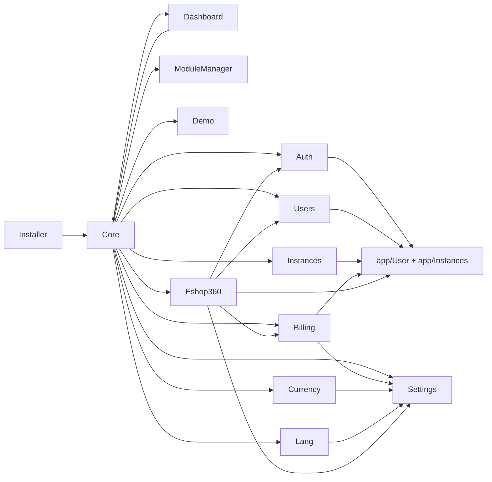

# Vue globale B360

> ⚠️ **Archive historique (pré-R-101).** Certains constats ont été résolus depuis ; lire d'abord `docs/context/PROJECT_DIGEST.md`, `docs/memory/OPEN_RISKS.md`, `docs/memory/RECENT_DECISIONS.md` et les ADR pertinents. Voir aussi [`DOCUMENTATION_INDEX.md`](../DOCUMENTATION_INDEX.md) pour la taxonomy.

Sources analysees :
- `modules_statuses.json`, `Modules/*/module.json`, `Modules/*/Routes/*.php`, `Modules/*/Models/*.php`, `Modules/*/Services/*.php`
- `database/migrations/*` et `Modules/*/Database/Migrations/*`
- `docs/CARTOGRAPHIE-FONCTIONNELLE.md`, `docs/AUDIT_COMPLET_B360.md`, `docs/GUIDE-CALCULS-ESHOP360.md`, `docs/README.md`
- `packages/` est absent du depot analyse
- Verification d'execution du 2026-04-04 : `php artisan test Modules/Eshop360/Tests` -> `219 passed / 16 failed`

## Liste complete des modules

| Module | Role principal | Perimetre metier | Statut | Preuves principales |
|---|---|---|---|---|
| Core | Socle multi-instance, hooks, RBAC, audit et administration technique | hooks, licences, maintenance, backups, fichiers, documentation, tours, audit | actif | `Modules/Core/Providers/CoreServiceProvider.php`, `Modules/Core/Routes/web.php` |
| Auth | Authentification globale et par instance | login, logout, 2FA, lockscreen, IP rules, login logs, selection d'instance | actif | `Modules/Auth/Routes/web.php`, `Modules/Auth/Models/*` |
| Users | Gestion des utilisateurs et affectations aux instances | CRUD users, roles, memberships, preferences | actif | `Modules/Users/Routes/web.php`, `Modules/Users/Services/*` |
| Instances | Pilotage des tenants B360 | CRUD instances, activation, provisioning DB, quotas fonctionnels | actif | `Modules/Instances/Routes/web.php`, `Modules/Instances/Services/InstanceProvisioner.php` |
| Settings | Configuration centralisee | parametres globaux, parametres par instance, groupes injectes par hooks | actif | `Modules/Settings/Services/SettingsManager.php`, `Modules/Settings/Routes/web.php` |
| Billing | Monetisation SaaS | plans, subscriptions, factures SaaS, paiements SaaS, feature gating | actif | `Modules/Billing/Routes/web.php`, `Modules/Billing/Services/*` |
| Dashboard | Shell UI protegee | dashboard d'instance, layout master, sidebar dynamique | actif | `Modules/Dashboard/Routes/web.php`, `Modules/Dashboard/View/Components/Sidebar.php` |
| Lang | I18n en base | switch locale, CRUD traductions, import/export | actif | `Modules/Lang/Routes/web.php`, `Modules/Lang/Services/TranslationRepository.php` |
| Currency | Multi-devise | CRUD devises, mise a jour de taux, format/convert | actif | `Modules/Currency/Routes/web.php`, `Modules/Currency/Services/CurrencyManager.php` |
| ModuleManager | Gestion de packages modules | lister, activer, desactiver, installer ZIP, supprimer | actif | `Modules/ModuleManager/Routes/web.php`, `Modules/ModuleManager/Services/ModuleInstaller.php` |
| Installer | Mise en route initiale | wizard prerequis, DB, admin, demarrage install | actif | `Modules/Installer/Routes/web.php`, `Modules/Installer/Services/InstallerRunner.php` |
| Demo | Donnees de demonstration | seed/reset des donnees par providers | actif | `Modules/Demo/Routes/web.php`, `Modules/Demo/Services/DemoManager.php` |
| Eshop360 | Monolithe metier retail/e-commerce | catalogue, stock, POS, ventes, achats, imports, finance, RH, CRM, canaux, API, portails, rapports | actif | `Modules/Eshop360/Routes/web.php`, `Modules/Eshop360/Providers/Eshop360ServiceProvider.php` |
| InventoryX | Squelette d'un futur sous-module inventaire | aucun perimetre fonctionnel exploitable constate | experimental | dossier `Modules/InventoryX/`, absence de `module.json` et de provider charge |

## Socle hors modules

Le depot contient aussi un socle non encapsule dans `Modules/` :
- `app/Instances/*` : modele et resolution des instances
- `app/Models/User.php` : utilisateur systeme, 2FA, roles, assignations Eshop
- `app/Models/Personne*.php`, `app/Models/Representant.php` : couche identite/tiers legacy, peu raccordee aux modules fonctionnels

## Interactions inter-modules

## Dependances critiques

| Module dependant | Dependance obligatoire | Type | Couplage | Justification |
|---|---|---|---|---|
| Auth | Core, app/User, app/Instance | core | fort | `CurrentInstance`, middleware `core.*`, colonnes 2FA sur `users` |
| Users | Core, app/User, Instances | core | fort | roles/permissions Spatie, pivot `instance_user`, services de role scope instance |
| Instances | Core, app/Instance, Settings | core | fort | provisioning, CRUD tenant, settings `instances.*`, middleware root super-admin |
| Settings | Core | core | fort | groupes de settings injectes via `HookRegistry`, stockage central `settings` |
| Billing | Core, Settings, app/Instance | core | fort | `FeatureRegistry`, gateway settings, `Subscription` liee a `Instance` |
| Dashboard | Core | core | fort | sidebar et widgets produits par hooks Core |
| Lang | Core, Settings | core | moyen | `CurrentInstance`, cache et surcharge global -> instance |
| Currency | Core, Settings | core | moyen | resolution devise via settings, CRUD devises via module |
| ModuleManager | Core | core | fort | table `modules`, cache module manager, hooks menu |
| Demo | Core, Eshop360 | support | moyen | providers demo via hooks, forte dependance aux seeders Eshop |
| Eshop360 | Core, Auth, Users, Settings, Billing, app/User, app/Instance | metier | tres fort | scopes d'instance/canal, permissions, feature gating, settings, users, webhooks et portails |

## Synthese rapide

- Maturite percue : socle Laravel modulaire reel, mais metier encore porte par un gros module `Eshop360` plus proche d'un monolithe modulaire que d'un vrai catalogue de bounded contexts.
- Cohesion d'ensemble : correcte sur le squelette SaaS (`Core` + `Auth` + `Users` + `Instances` + `Settings` + `Billing`), plus fragile des qu'on entre dans les flux Eshop et les regles de canal.
- Ecart documentation / code : le perimetre de haut niveau est globalement juste, mais l'etat d'operabilite est surestime par `docs/README.md` qui annonce `75 passed` sur `Modules/Eshop360/Tests`, alors que le depot au 2026-04-04 remonte `16` echecs sur cette meme suite.
- Point d'attention majeur 1 : le mode `database-per-instance` n'est pas aligne avec les migrations metier. `InstanceProvisioner` cherche `Modules/*/Database/InstanceMigrations`, dossier inexistant, pendant que les modules chargent `Database/Migrations`.
- Point d'attention majeur 2 : `Billing` et `Eshop360` dupliquent leurs stacks facture/paiement/webhook.
- Point d'attention majeur 3 : `InventoryX` est visible dans l'arborescence mais pas dans le systeme de modules actif.
