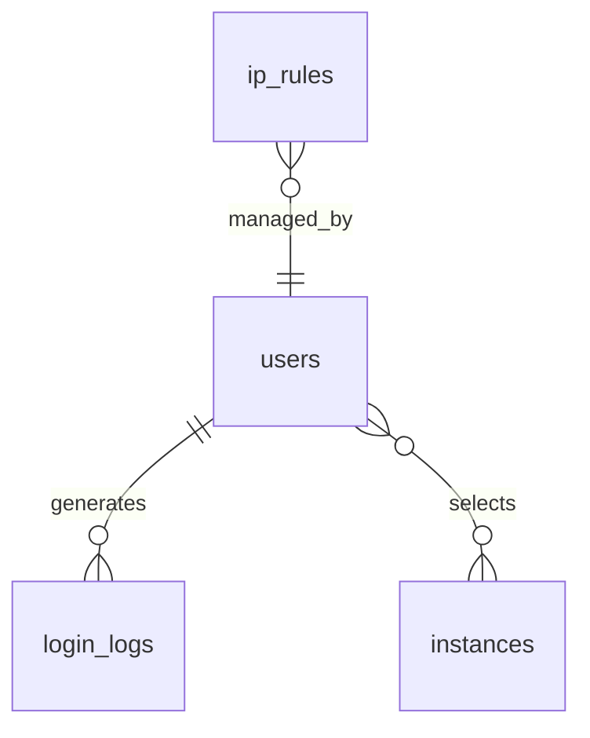

# Module : Auth

## 1. Description fonctionnelle
- Objectif : gerer l'authentification B360, la selection d'instance et les controles de securite autour de la connexion.
- Perimetre metier : login/logout, reset mot de passe, 2FA, lockscreen, restrictions IP, journalisation des connexions, redirection post-login.
- Utilisateurs cibles : tous les utilisateurs de la plateforme, administrateurs securite.

## 2. Liste des fonctionnalites
### 2.1 Fonctionnalites principales
- [F1] Authentification web et instance-aware (`LoginController`, `LogoutController`, `LoginRedirector`).
- [F2] Selection d'instance apres connexion globale (`InstanceSelectionController`).
- [F3] Double facteur via colonnes ajoutees a `users` et `TwoFactorController`.
- [F4] Restrictions par IP (`IpRuleController`, middleware `CheckIpAccess`).
- [F5] Journalisation des connexions reussies et echouees (`LogSuccessfulLogin`, `LogFailedLogin`).
- [F6] Lockscreen et reprise de session.

### 2.2 Sous-fonctionnalites
- Recaptcha V3 sur le login.
- Recovery codes 2FA.
- Historique des connexions consultable.

### 2.3 Cas d'usage cles
- Utilisateur -> se connecte globalement -> est redirige vers sa seule instance active ou vers l'ecran de selection.
- Administrateur -> active les restrictions IP -> bloque les connexions hors plages autorisees.
- Utilisateur securise -> active la 2FA -> doit valider un challenge avant d'acceder a l'instance.

## 3. Composants techniques associes
| Type | Classe/Fichier | Role |
|------|----------------|------|
| Provider | `Modules/Auth/Providers/AuthServiceProvider.php` | bootstrap du module |
| Controller | `Modules/Auth/Http/Controllers/LoginController.php` | login |
| Controller | `Modules/Auth/Http/Controllers/InstanceSelectionController.php` | choix d'instance |
| Controller | `Modules/Auth/Http/Controllers/TwoFactorController.php` | challenge et activation 2FA |
| Controller | `Modules/Auth/Http/Controllers/IpRuleController.php` | gestion des IP autorisees |
| Service | `Modules/Auth/Services/LoginRedirector.php` | redirections post-login |
| Listener | `Modules/Auth/Listeners/LogSuccessfulLogin.php` | log succes |
| Listener | `Modules/Auth/Listeners/LogFailedLogin.php` | log echec |
| Middleware | `Modules/Auth/Http/Middleware/*.php` | controle IP, lockscreen, 2FA |
| Model | `Modules/Auth/Models/{IpRule,LoginLog}.php` | persistence securite |

## 4. Modele de donnees
### 4.1 Tables propres au module
- `ip_rules` : liste blanche/noire d'IP.
- `login_logs` : traces de tentatives et connexions.

### 4.2 Tables partagees (avec quels modules)
- `users` : colonnes 2FA ajoutees par migration `2026_03_16_200001_add_two_factor_columns_to_users_table.php`; partage avec `Users`, `Core`, `Eshop360`.
- `instance_user` : utilisee indirectement pour choisir les instances actives via `LoginRedirector`.

### 4.3 Relations cles

## 5. Dependances
| Vers le module | Type (core/metier) | Niveau de couplage | Justification |
|----------------|--------------------|--------------------|---------------|
| Core | core | fort | s'appuie sur les middlewares et policies de plateforme |
| Users | core | moyen | le login travaille sur `App\Models\User` et sur les preferences/roles |
| Instances | core | moyen | la selection d'instance depend des memberships actifs |

## 6. Points sensibles
- Zone critique : le module modifie directement `users`, donc toute evolution 2FA impacte le modele central.
- Risque de regression : le flux global login -> selection d'instance -> redirection est distribue entre controllers, listeners et `LoginRedirector`.
- Code legacy ou fragile : la coexistence login global / login instance / lockscreen augmente les branches fonctionnelles.
- [A VERIFIER] Les flux API d'authentification sont moins visibles que les flux web; le module expose bien `Routes/api.php` mais le perimetre exact reste secondaire dans le depot.
