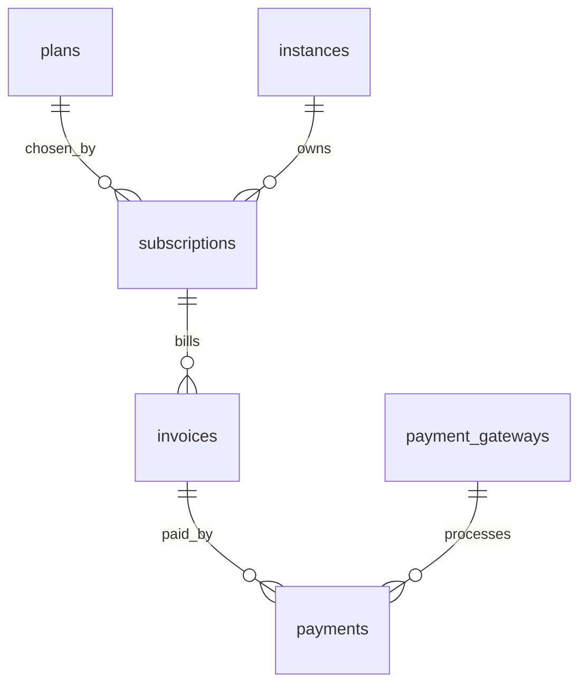

# Module : Billing

> ⚠️ **Archive historique (pré-R-101).** Certains constats ont été résolus depuis ; lire d'abord `docs/context/PROJECT_DIGEST.md`, `docs/memory/OPEN_RISKS.md`, `docs/memory/RECENT_DECISIONS.md` et les ADR pertinents. Voir aussi [`DOCUMENTATION_INDEX.md`](../../DOCUMENTATION_INDEX.md) pour la taxonomy.

## 1. Description fonctionnelle
- Objectif : gerer la monetisation SaaS de B360.
- Perimetre metier : plans, abonnements, factures SaaS, paiements, gateways, webhooks, features payantes.
- Utilisateurs cibles : super-admin, equipe finance SaaS, administrateurs d'instance pour la souscription.

## 2. Liste des fonctionnalites
### 2.1 Fonctionnalites principales
- [F1] Gestion des plans d'abonnement (`PlanController`, `PlanManager`).
- [F2] Gestion des souscriptions et upgrades (`SubscriptionController`, `SubscriptionManager`, `UpgradeController`).
- [F3] Facturation et paiements SaaS (`InvoiceController`, `InvoiceManager`, `Payment`).
- [F4] Gestion de gateways et checkout (`GatewaySettingsController`, `CheckoutController`, `GatewayManager`).
- [F5] Webhooks de paiement (`WebhookController`, `WebhookLog`).
- [F6] Registre de features billables (`FeatureRegistry`, hooks Billing).

### 2.2 Sous-fonctionnalites
- Visibilite des plans.
- Association plan-instance via `plan_instance`.
- Multiples adapters de paiement : Stripe, PayPal, CinetPay, InetPay, MTN MoMo, Orange Money, Wave, manuel.

### 2.3 Cas d'usage cles
- Super-admin -> cree un plan -> il devient disponible au checkout.
- Instance -> souscrit a un plan -> une souscription et une facture SaaS sont creees.
- Gateway externe -> envoie un webhook -> l'etat de paiement est synchronise.

## 3. Composants techniques associes
| Type | Classe/Fichier | Role |
|------|----------------|------|
| Provider | `Modules/Billing/Providers/BillingServiceProvider.php` | bootstrap |
| Controller | `Modules/Billing/Http/Controllers/PlanController.php` | plans |
| Controller | `Modules/Billing/Http/Controllers/SubscriptionController.php` | souscriptions |
| Controller | `Modules/Billing/Http/Controllers/CheckoutController.php` | checkout SaaS |
| Controller | `Modules/Billing/Http/Controllers/WebhookController.php` | webhooks |
| Service | `Modules/Billing/Services/{PlanManager,SubscriptionManager,InvoiceManager,GatewayManager,FeatureRegistry}.php` | coeur metier |
| Gateway | `Modules/Billing/Gateways/*.php` | connecteurs de paiement |
| Model | `Modules/Billing/Models/{Plan,Subscription,Invoice,Payment,WebhookLog}.php` | persistence |
| Middleware | `Modules/Billing/Http/Middleware/EnsureFeature.php` | blocage des features selon abonnement |

## 4. Modele de donnees
### 4.1 Tables propres au module
- `plans` : catalogues d'offres.
- `subscriptions` : abonnements des instances.
- `invoices` : factures SaaS.
- `payments` : paiements SaaS.
- `plan_instance` : rattachement de plan aux instances selon la migration `2026_03_08_000001`.
- `payment_gateways` : configuration des passerelles.
- `webhook_logs` : traces de callbacks de paiement.

### 4.2 Tables partagees (avec quels modules)
- `instances` : liees aux plans/souscriptions.
- `settings` : certaines configurations gateway/devise transitent via Settings.

### 4.3 Relations cles

## 5. Dependances
| Vers le module | Type (core/metier) | Niveau de couplage | Justification |
|----------------|--------------------|--------------------|---------------|
| Core | core | fort | hooks, permissions, menus et policies passent par Core |
| Settings | core | moyen | la configuration des gateways et de la devise y est partiellement lue |
| Instances | core | fort | le client de la facturation SaaS est l'instance |
| Eshop360 | metier | moyen | partage des concepts facture/paiement/features, mais pas de contrat commun |

## 6. Points sensibles
- Zone critique : les concepts `Invoice`, `Payment`, `WebhookLog` existent aussi dans `Eshop360`, avec un schema et un cycle de vie differents.
- Risque de regression : `FeatureRegistry` est la nouvelle reference des features payantes, mais `Eshop360` charge encore un wrapper `FeatureGate` deprecie.
- Code legacy ou fragile : forte duplication de gateways entre SaaS Billing et retail Eshop.
- [A VERIFIER] Le perimetre exact des API `Routes/api.php` doit etre relu si l'objectif est une exposition externe des operations de billing.
