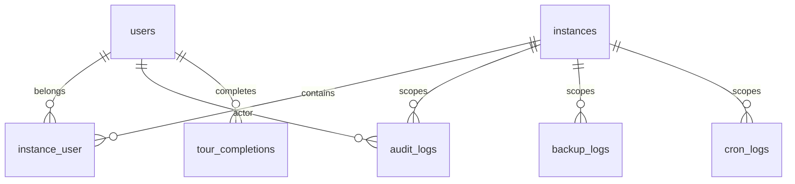

# Module : Core

> ⚠️ **Archive historique (pré-R-101).** Certains constats ont été résolus depuis ; lire d'abord `docs/context/PROJECT_DIGEST.md`, `docs/memory/OPEN_RISKS.md`, `docs/memory/RECENT_DECISIONS.md` et les ADR pertinents. Voir aussi [`DOCUMENTATION_INDEX.md`](../../DOCUMENTATION_INDEX.md) pour la taxonomy.

## 1. Description fonctionnelle
- Objectif : fournir le socle transversal de B360 (hooks, contexte d'instance, securite plateforme, RBAC, administration technique).
- Perimetre metier : resolution d'instance, appartenance utilisateur-instance, administration technique, audit, sauvegardes, licences, documentation interne, guided tours.
- Utilisateurs cibles : super-admin racine, administrateurs d'instance, developpeurs de modules.

## 2. Liste des fonctionnalites
### 2.1 Fonctionnalites principales
- [F1] Resolution et securisation du contexte d'instance via middleware (`BindInstanceFromRoute`, `EnsureInstanceResolved`, `EnsureInstanceMembershipActive`, `SetSpatieTeamContextFromInstance`).
- [F2] Registre de hooks pour menus, widgets dashboard, groupes de settings, permissions, features facturables et providers de demo (`HookRegistry`, `HookManager`).
- [F3] RBAC transverse avec synchronisation des permissions et roles Spatie (`RolePermissionManager`).
- [F4] Administration technique : audit logs, cron logs, maintenance, sauvegardes, file manager, themes.
- [F5] Services de plateforme : licences et guided tours.

### 2.2 Sous-fonctionnalites
- Cache et filtrage des hooks.
- Scope `instance_id` partage via `BelongsToInstance` et `InstanceScope`.
- Seeders de documentation et de RBAC.
- API interne de licence.

### 2.3 Cas d'usage cles
- Super-admin -> active un module -> le module devient visible et ses hooks sont enregistres.
- Utilisateur membre -> ouvre une route d'instance -> le contexte Spatie team est aligne sur l'instance courante.
- Administrateur -> consulte les journaux -> identifie une action ou un cron en erreur.

## 3. Composants techniques associes
| Type | Classe/Fichier | Role |
|------|----------------|------|
| Provider | `Modules/Core/Providers/CoreServiceProvider.php` | charge routes, vues, migrations et enregistre le socle |
| Provider | `Modules/Core/Providers/CoreHooksProvider.php` | contribution des hooks noyau |
| Service | `Modules/Core/Services/RolePermissionManager.php` | synchronise roles et permissions |
| Service | `Modules/Core/Services/LicenseManager.php` | lecture/validation des licences |
| Service | `Modules/Core/Services/TourService.php` | suivi des guided tours |
| Hook | `Modules/Core/Hooks/Registry/HookRegistry.php` | registre central des contributions |
| Hook | `Modules/Core/Hooks/HookManager.php` | bootstrap des contributeurs de hooks |
| Middleware | `Modules/Core/Http/Middleware/*.php` | securisation du shell SaaS |
| Controller | `Modules/Core/Http/Controllers/*` | audit, backups, maintenance, docs, files, tours |
| Console | `Modules/Core/Console/Commands/DatabaseBackup.php` | sauvegarde base |

## 4. Modele de donnees
### 4.1 Tables propres au module
- `modules` : registre applicatif des modules, utilise aussi par `ModuleManager`.
- `instance_user` : pivot d'appartenance utilisateur-instance avec statut et dates.
- `licenses` : gestion de licences et etat d'activation.
- `backup_logs` : historique des sauvegardes.
- `audit_logs` : journal d'actions applicatives.
- `cron_logs` : journal d'execution des taches planifiees.
- `tour_completions` : progression des guided tours.
- `documentation_pages` : documentation interne editable.

### 4.2 Tables partagees (avec quels modules)
- `instances` : utilisee avec `Instances`, `Billing`, `Users`, `Auth`, `Dashboard`, `Eshop360`.
- `users` : modele central consomme par presque tous les modules.
- `roles`, `permissions`, `model_has_roles`, `model_has_permissions` : tables Spatie partagees avec `Users` et `Auth`.

### 4.3 Relations cles

## 5. Dependances
| Vers le module | Type (core/metier) | Niveau de couplage | Justification |
|----------------|--------------------|--------------------|---------------|
| Instances | core | fort | le contexte d'instance repose sur `instances` et sur `App\Instances\Instance` |
| Users | core | fort | le pivot `instance_user` et le RBAC s'appuient sur `users` |
| Auth | core | moyen | les middlewares et policies prolongent les flux d'authentification |
| Dashboard | core | moyen | le shell dashboard consomme les hooks et menus du Core |
| Billing | metier | moyen | `BillableFeature` et hooks de gateways passent par le registre Core |

## 6. Points sensibles
- Zone critique : `Modules/Core/Hooks/*` est le bus implicite de l'ecosysteme; une regression ici impacte plusieurs modules en cascade.
- Risque de regression : le contexte d'instance est partage entre middleware Core et code hors modules dans `app/Instances/*`.
- Code legacy ou fragile : `Modules/Core/Modules/ModuleManager.php` et le socle `app/Instances/*` montrent que le noyau reel deborde du module Core.
- [A VERIFIER] La strategie cible de separation base systeme / base metier n'est pas portee uniquement par Core; elle depend aussi de `Instances/InstanceProvisioner`.
