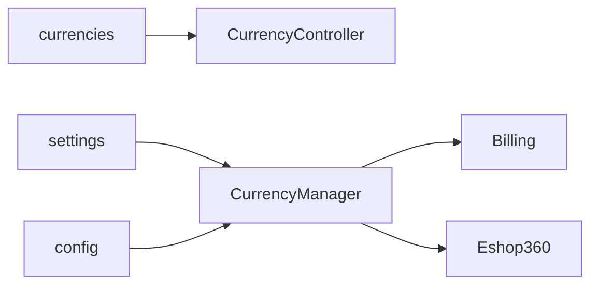

# Module : Currency

## 1. Description fonctionnelle
- Objectif : administrer les devises et convertir/formater les montants.
- Perimetre metier : CRUD des devises, definition d'une devise par defaut, mise a jour des taux, conversion.
- Utilisateurs cibles : administrateurs financiers, modules consommateurs de montants.

## 2. Liste des fonctionnalites
### 2.1 Fonctionnalites principales
- [F1] CRUD des devises (`CurrencyController`).
- [F2] Definition d'une devise par defaut.
- [F3] Mise a jour des taux via commande console (`UpdateExchangeRates`).
- [F4] Conversion et formatage via `CurrencyManager`.

### 2.2 Sous-fonctionnalites
- Integration d'un partiel de settings.
- Appel HTTP externe a `open.er-api.com` pour recuperer des taux.

### 2.3 Cas d'usage cles
- Administrateur -> ajoute une devise -> elle devient selectable dans l'interface.
- Administrateur -> definit une devise par defaut -> les montants sont formates en consequence.
- Cron/commande -> met a jour les taux -> `CurrencyManager` peut convertir avec les nouveaux taux.

## 3. Composants techniques associes
| Type | Classe/Fichier | Role |
|------|----------------|------|
| Provider | `Modules/Currency/Providers/CurrencyServiceProvider.php` | bootstrap |
| Controller | `Modules/Currency/Http/Controllers/CurrencyController.php` | CRUD/UI |
| Service | `Modules/Currency/Services/CurrencyManager.php` | lecture devise active, conversion |
| Console | `Modules/Currency/Console/Commands/UpdateExchangeRates.php` | MAJ des taux |
| Model | `Modules/Currency/Models/Currency.php` | persistence |

## 4. Modele de donnees
### 4.1 Tables propres au module
- `currencies` : definition des devises et de leurs taux.

### 4.2 Tables partagees (avec quels modules)
- `settings` : lues par `CurrencyManager` pour `currency.active`, `billing.currency` et `currency.rates`.

### 4.3 Relations cles

## 5. Dependances
| Vers le module | Type (core/metier) | Niveau de couplage | Justification |
|----------------|--------------------|--------------------|---------------|
| Settings | core | fort | `CurrencyManager` lit la devise active et les taux dans `settings` |
| Billing | metier | moyen | fallback explicite sur `billing.currency` |
| Eshop360 | metier | moyen | les montants retail ont vocation a consommer ce service |

## 6. Points sensibles
- Zone critique : la source de verite est mixte entre table `currencies`, `settings` et `config`.
- Risque de regression : un admin peut croire modifier la devise via CRUD alors que `CurrencyManager` lira encore une autre cle.
- Code legacy ou fragile : dependance a une API externe publique pour les taux.
- [A VERIFIER] Le niveau reel d'utilisation du module dans `Eshop360` doit etre confirme par une campagne de traces plus fine.
