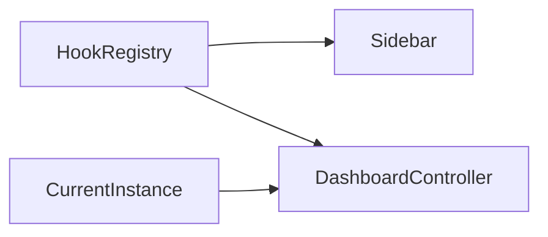

# Module : Dashboard

## 1. Description fonctionnelle
- Objectif : fournir le shell visuel d'accueil et le point d'entree de navigation de l'application.
- Perimetre metier : page dashboard, widgets, switch d'instance, sidebar et composition des contributions UI.
- Utilisateurs cibles : tous les utilisateurs connectes.

## 2. Liste des fonctionnalites
### 2.1 Fonctionnalites principales
- [F1] Affichage du dashboard principal (`DashboardController`).
- [F2] Construction de la sidebar a partir des contributions enregistrees.
- [F3] Support du changement d'instance et des statistiques de dashboard via tests dedies.

### 2.2 Sous-fonctionnalites
- Layout principal du back-office.
- Slots de widgets dashboard via hooks.

### 2.3 Cas d'usage cles
- Utilisateur connecte -> ouvre le dashboard -> voit les menus et widgets exposes pour son contexte.
- Utilisateur multi-instance -> change d'instance -> l'affichage se recompose avec le nouveau contexte.

## 3. Composants techniques associes
| Type | Classe/Fichier | Role |
|------|----------------|------|
| Provider | `Modules/Dashboard/Providers/DashboardServiceProvider.php` | bootstrap du module |
| Provider | `Modules/Dashboard/Providers/DashboardHooksProvider.php` | contribution au shell |
| Controller | `Modules/Dashboard/Http/Controllers/DashboardController.php` | page dashboard |
| View Component | `Modules/Dashboard/View/Components/Sidebar.php` | construction de la navigation |

## 4. Modele de donnees
### 4.1 Tables propres au module
- Aucune table metier specifique identifiee.

### 4.2 Tables partagees (avec quels modules)
- `instances` et `instance_user` : utilisees indirectement pour afficher le bon contexte.

### 4.3 Relations cles

## 5. Dependances
| Vers le module | Type (core/metier) | Niveau de couplage | Justification |
|----------------|--------------------|--------------------|---------------|
| Core | core | fort | sidebar, widgets et permissions reposent sur hooks + contexte |
| Instances | core | moyen | le dashboard est affiche dans un contexte d'instance |
| Tous modules contributeurs | metier | moyen | le shell n'a de valeur que via les menus/widgets fournis par les autres modules |

## 6. Points sensibles
- Zone critique : le module a peu de logique autonome; il depend fortement de l'etat du `HookRegistry`.
- Risque de regression : une contribution de module mal formee peut degrader la sidebar ou les widgets.
- Code legacy ou fragile : `DashboardServiceProvider` charge des migrations mais aucun fichier de migration n'est present dans le module.
- [A VERIFIER] Le role exact des routes API dashboard reste secondaire dans le depot courant.
