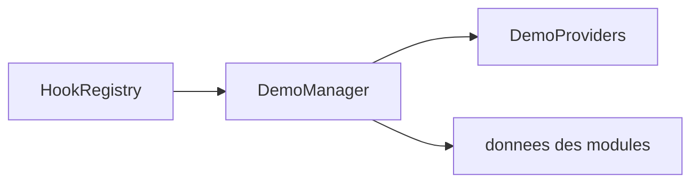

# Module : Demo

## 1. Description fonctionnelle
- Objectif : fournir un outillage de demonstration et de remise a zero de donnees exemples.
- Perimetre metier : seed demo, reset demo, exposition d'un ecran de pilotage, middleware de garde.
- Utilisateurs cibles : equipe produit, avant-vente, developpeurs/demo admins.

## 2. Liste des fonctionnalites
### 2.1 Fonctionnalites principales
- [F1] Ecran de pilotage demo (`DemoController`).
- [F2] Seeding demo via `DemoManager` et `DemoSeedCommand`.
- [F3] Reset demo via `DemoResetCommand`.
- [F4] Decouverte des providers de demo via hooks Core.

### 2.2 Sous-fonctionnalites
- Garde d'acces via `DemoGuard`.
- Aggregation de plusieurs providers de donnees demo.

### 2.3 Cas d'usage cles
- Administrateur demo -> lance un seed -> les providers enregistres alimentent l'instance.
- Administrateur demo -> lance un reset -> les jeux de donnees demo sont nettoyes puis regeneres.

## 3. Composants techniques associes
| Type | Classe/Fichier | Role |
|------|----------------|------|
| Provider | `Modules/Demo/Providers/DemoServiceProvider.php` | bootstrap |
| Provider | `Modules/Demo/Providers/DemoHooksProvider.php` | collecte des providers demo |
| Controller | `Modules/Demo/Http/Controllers/DemoController.php` | UI |
| Service | `Modules/Demo/Services/DemoManager.php` | orchestration seed/reset |
| Console | `Modules/Demo/Console/{DemoSeedCommand,DemoResetCommand}.php` | execution CLI |
| Middleware | `Modules/Demo/Http/Middleware/DemoGuard.php` | garde d'acces |

## 4. Modele de donnees
### 4.1 Tables propres au module
- Aucune table propre; le module agit sur les tables des modules contributeurs.

### 4.2 Tables partagees (avec quels modules)
- Potentiellement toutes les tables des modules qui fournissent un `DemoDataProvider`.

### 4.3 Relations cles

## 5. Dependances
| Vers le module | Type (core/metier) | Niveau de couplage | Justification |
|----------------|--------------------|--------------------|---------------|
| Core | core | fort | les providers demo sont collectes via hooks |
| Eshop360 | metier | fort | une grande partie de la valeur demo visible semble venir du perimetre retail |
| Tous modules contributeurs | metier | moyen | chaque provider pilote ses propres donnees |

## 6. Points sensibles
- Zone critique : `DemoManager` execute des seed/reset sur des modules multiples; une mauvaise contribution peut produire des donnees incoherentes.
- Risque de regression : la remise a zero n'est sure que si chaque provider est idempotent et bien isole.
- Code legacy ou fragile : le module n'a pas de persistance propre et depend entierement de conventions de hooks.
- [A VERIFIER] Le perimetre reel des providers demo actifs n'est pas directement visible sans tracer les hooks charges au runtime.
