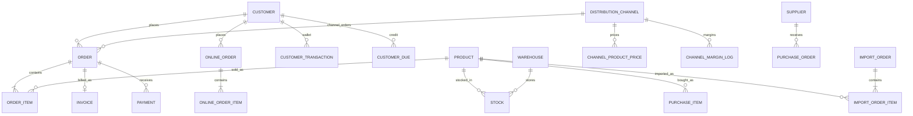

# Module : Eshop360

> ⚠️ **Archive historique (pré-R-101).** Certains constats ont été résolus depuis ; lire d'abord `docs/context/PROJECT_DIGEST.md`, `docs/memory/OPEN_RISKS.md`, `docs/memory/RECENT_DECISIONS.md` et les ADR pertinents. Voir aussi [`DOCUMENTATION_INDEX.md`](../../DOCUMENTATION_INDEX.md) pour la taxonomy.

Sources principales : `Modules/Eshop360/Routes/web.php`, `Modules/Eshop360/Providers/Eshop360ServiceProvider.php`, `Modules/Eshop360/Providers/Eshop360HooksProvider.php`, `Modules/Eshop360/Services/*`, `Modules/Eshop360/Models/*`, `Modules/Eshop360/Database/Migrations/*`, `docs/GUIDE-CALCULS-ESHOP360.md`.

## 1. Description fonctionnelle
- Objectif : porter le coeur metier retail/e-commerce de B360 dans un seul module instance-scope et, de plus en plus, channel-scope.
- Perimetre metier : catalogue, stock, POS, ventes, commandes, retours, promotions, clients, wallet/credit, fournisseurs, achats, imports, facturation, paiements, finance, RH, projets, portails client et canal, rapports, exports, webhooks, printing.
- Utilisateurs cibles : caissiers, managers, instance-admins, operateurs de canal, clients portail, integrateurs API.

## 2. Liste des fonctionnalites

### 2.1 Fonctionnalites principales
- [F1] Catalogue produits : CRUD produits, categories, marques, codes-barres, QR codes, variations, champs pharma. Cas typique : manager -> cree un produit avec categorie, marque, prix, taxes et variation -> article vendu au POS.
- [F2] Stock multi-entrepots : niveaux, ajustements, transferts, alertes, expiration. Cas typique : magasin -> transfere 25 unites d'un entrepot source vers un autre -> reservation puis mouvement.
- [F3] POS et panier : layouts POS, panier session/persistant, coupon, caisse, mises en attente, checkout. Cas typique : caissier -> ouvre une caisse, vend, encaisse, imprime un recu.
- [F4] Ventes et commandes : commandes manuelles/POS, retours, commandes en ligne, commandes canal. Cas typique : client portail -> cree une `OnlineOrder` -> back-office valide -> conversion en `Order`.
- [F5] Facturation et paiements retail : factures, templates, paiements morphiques, liens publics de paiement. Cas typique : comptable -> genere une facture depuis commande -> envoie un lien de paiement.
- [F6] Clients / CRM : fiches client, wallet, credit, dues, groupes, portail client, historique commandes. Cas typique : vendeur -> debite le wallet d'un client et cree une dette residuelle.
- [F7] Fournisseurs / achats / imports : bons d'achat, receptions, retours fournisseur, imports et repartition des frais. Cas typique : manager achat -> receptionne une importation -> met a jour `cost_price_real`.
- [F8] Finance / RH / charges : comptes, transactions, depenses, revenus, prets, cartes cadeaux, echeanciers, employes, salaires, commissions, pointage, charges temps reel.
- [F9] Canaux de distribution : prix par canal, portail canal, marges tripartites, utilisateurs canal, settings par canal.
- [F10] Rapports / exports / API / integrations : rapports ventes/stock/taxes/commissions, exports CSV/XLSX, API REST Eshop, webhooks, SMS, email, FNE, impression ESC/POS.

### 2.2 Sous-fonctionnalites
- Portail client : catalogue, panier, checkout, suivi commande, releve de compte.
- Portail canal : commandes B2B, stock canal, POS canal, retours, promotions, settings.
- User assignments : filtrage implicite par magasin, entrepot et client.
- Parametres metier : POS, facture, imprimantes, webhooks, affectations utilisateur.
- Projets et taches : projets, calendrier, evenements, commentaires de taches.
- Communication : messages, campagnes bulk, tickets support, templates email, passerelles SMS.

### 2.3 Cas d'usage cles
- Manager -> cree un produit, definit PGHT et prix canal -> canal vend au tarif resolu par `ProductPricingService`.
- Caissier -> ajoute des articles au panier -> `OrderService` cree la commande, ajuste le stock et cree un paiement delta.
- Responsable achat -> enregistre une importation -> `ImportService` repartit les frais et met a jour le cout reel.
- Client -> passe une commande en ligne -> `OnlineOrderService` force le prix serveur, puis convertit en commande B360.
- Operateur canal -> cree une commande portail -> `ChannelB2BService` puis `MarginService` calculent la marge tripartite.

## 3. Composants techniques associes

| Type | Classe/Fichier | Role |
|---|---|---|
| Controller | `Modules\Eshop360\Http\Controllers\Catalog\{ProductController,CategoryController,BrandController,BarcodeController}` | catalogue produits |
| Controller | `Modules\Eshop360\Http\Controllers\Inventory\{StockController,StockAdjustmentController,StockTransferController,WarehouseController}` | stock et transferts |
| Controller | `Modules\Eshop360\Http\Controllers\Sales\{CartController,CheckoutController,OrderController,SaleController}` | POS et commandes hub |
| Controller | `Modules\Eshop360\Http\Controllers\Portal\CustomerPortalController` | portail client |
| Controller | `Modules\Eshop360\Http\Controllers\ChannelPortal\*` | portail canal / B2B |
| Controller | `Modules\Eshop360\Http\Controllers\Report\{ReportController,AdvancedReportController,ExportController}` | rapports et exports |
| Controller | `Modules\Eshop360\Http\Controllers\Api\ApiController` | API Eshop v1/v2 |
| Middleware | `ApplyChannelContext`, `ResolveChannel`, `ResolveUserAssignments`, `ChannelMember`, `ChannelRole` | scoping canal et assignations |
| Service | `ProductPricingService`, `CartService`, `OrderService`, `StockService`, `ImportService`, `InvoiceService`, `OnlineOrderService` | moteur transactionnel |
| Service | `MarginService`, `ReportService`, `FinanceService`, `HRService`, `WebhookService`, `EshopSettingsService` | regles avancees et back-office |
| Model | `Product`, `Order`, `Invoice`, `Payment`, `Customer`, `DistributionChannel`, `PersistentCart`, `Stock`, `PurchaseOrder`, `OnlineOrder` | coeur de donnees |
| Job/Event | `ReportDataChanged`, `InvalidateReportCache`, `SendBulkEmail`, `SendBulkSms` | invalidation cache et envois asynchrones |

## 4. Modele de donnees

### 4.1 Tables propres au module
- Catalogue : `eshop_brands`, `eshop_categories`, `eshop_products`, `eshop_product_variations`, `eshop_taxes`, `eshop_product_taxes`, `eshop_product_groups`, `eshop_product_group_items`
- Stock : `eshop_warehouses`, `eshop_stores`, `eshop_stocks`, `eshop_stock_movements`, `eshop_stock_transfers`, `eshop_stock_transfer_items`, `eshop_cash_registers`, `eshop_holdings`
- Ventes et promotions : `eshop_orders`, `eshop_order_items`, `eshop_sale_returns`, `eshop_carts`, `eshop_coupons`, `eshop_discounts`, `eshop_discount_plans`, `eshop_quotations`, `eshop_quotation_items`, `eshop_online_orders`, `eshop_online_order_items`
- CRM et support : `eshop_customers`, `eshop_customer_groups`, `eshop_customer_transactions`, `eshop_customer_dues`, `eshop_messages`, `eshop_support_tickets`, `eshop_ticket_messages`, `eshop_support_teams`, `eshop_user_assignments`
- Achats et imports : `eshop_suppliers`, `eshop_supplier_store`, `eshop_purchase_orders`, `eshop_purchase_items`, `eshop_purchase_returns`, `eshop_purchase_return_items`, `eshop_import_orders`, `eshop_import_order_items`, `eshop_import_costs`
- Facturation et finance retail : `eshop_invoices`, `eshop_invoice_items`, `eshop_payments`, `eshop_payment_methods`, `eshop_payment_gateways`, `eshop_recurring_invoices`, `eshop_fne_invoices`, `eshop_accounts`, `eshop_account_transactions`, `eshop_account_transfers`, `eshop_expense_categories`, `eshop_expenses`, `eshop_income_sources`, `eshop_incomes`, `eshop_loans`, `eshop_loan_payments`, `eshop_gift_cards`, `eshop_gift_card_topups`, `eshop_installment_plans`, `eshop_installment_payments`, `eshop_company_charges`, `eshop_charge_logs`
- Canaux, projets et technique : `eshop_distribution_channels`, `eshop_channel_users`, `eshop_channel_margin_logs`, `eshop_channel_product_prices`, `eshop_projects`, `eshop_tasks`, `eshop_task_comments`, `eshop_events`, `eshop_webhooks`, `eshop_bulk_message_logs`, `eshop_api_logs`, `eshop_module_settings`, `eshop_receipt_templates`
- [À VERIFIER] `create_configurable_types_tables` existe, mais aucun modele/controller exploitable n'a ete identifie pour ces tables.

### 4.2 Tables partagees (avec quels modules)
- `users` : utilisee par `Eshop360` (`created_by`, `biller_id`, `received_by`, `user_id`) et partagee avec `Auth`, `Users`, `Core`
- `instances` : contexte de resolution partage avec `Core` et `Instances`
- `settings` : configuration globale partagee via `Settings`; `EshopSettingsService` ajoute en plus `eshop_module_settings`
- `notifications` : table globale partagee avec le noyau applicatif pour `NotificationController`
- `roles`, `permissions`, `model_has_roles`, `instance_user` : controle d'acces partage avec `Core`, `Auth`, `Users`
- `plans`, `subscriptions` : exploitees indirectement via `Billing` pour le feature gating paid/free

### 4.3 Relations cles

## 5. Dependances

| Vers le module | Type | Niveau de couplage | Justification |
|---|---|---|---|
| Core B360 | core | fort | `BelongsToInstance`, hooks, middleware `core.*`, audit, scoping, menu, current instance |
| Auth | core | fort | `auth`, portails prives, liens client/user, paiements publics et contextes connectes |
| Users | core | moyen | `UserAssignment`, `biller_id`, `received_by`, membres canal, permissions |
| Settings | core | fort | `EshopSettingsService`, settings POS/facture/impression, feature flags secondaires |
| Billing | core | moyen a fort | middleware `billing.feature:*`, `FeatureRegistry`, wrapper `FeatureGate` deprecie |
| Instances / app layer | core | fort | `CurrentInstance`, `App\Instances\Instance`, `App\Models\User` |
| Lang | support | faible | traductions UI seulement |
| Currency | support | faible | pas de dependance metier directe observee dans les services critiques |

## 6. Points sensibles
- Zone critique : le module concentre trop de sous-domaines dans un seul provider, une seule arborescence de migrations et un seul fichier de routes majeur (`Modules/Eshop360/Routes/web.php`).
- Risque de regression : `PersistentCart` utilise `BelongsToChannel`; sans canal, un utilisateur non hub-admin peut lever une exception a la creation (`Modules/Eshop360/Database/Traits/BelongsToChannel.php:21-30`). Cela recoupe les echecs de `CartServicePersistenceTest`.
- Risque de regression : `StockTransferController` incremente puis decremente `reserved_quantity` sans garde-fou (`.../StockTransferController.php:85`, `:136`, `:204`). La suite du 2026-04-04 remonte encore des valeurs negatives sur `StockTransferControllerTest`.
- Zone critique : logique de panier dupliquee entre `Modules/Eshop360/Services/CartService.php` et `Modules/Eshop360/Http/Controllers/Sales/CartController.php`, avec une troisieme variante dans `Portal/CustomerPortalController.php`.
- Zone critique : `ReportService` accumule ses cles de cache dans `report:manifest:{instance}` (`Modules/Eshop360/Services/ReportService.php:540-561`), ce qui recoupe l'echec courant de `ReportCacheTest`.
- Code legacy ou fragile : wrapper `FeatureGate` encore enregistre alors que le provider l'annonce deprecie au profit de `Billing\Services\FeatureRegistry` (`Modules/Eshop360/Providers/Eshop360ServiceProvider.php:80-82`).
- Signal d'operabilite : au 2026-04-04, `php artisan test Modules/Eshop360/Tests` retourne `219 passed / 16 failed`; les echecs visibles touchent panier, portail canal, portail client, rapports avances, transferts de stock et cache de rapports.
