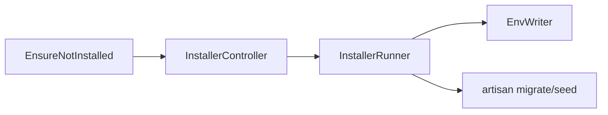

# Module : Installer

## 1. Description fonctionnelle
- Objectif : gerer l'installation initiale de l'application.
- Perimetre metier : verification prerequis, configuration DB, ecriture `.env`, creation admin, verrouillage d'installation.
- Utilisateurs cibles : equipe d'installation / devops / integrateur.

## 2. Liste des fonctionnalites
### 2.1 Fonctionnalites principales
- [F1] Wizard d'installation (`InstallerController`).
- [F2] Verification des prerequis plateforme.
- [F3] Configuration et test de la connexion base de donnees.
- [F4] Execution du runner d'installation (`InstallerRunner`).
- [F5] Ecriture des variables d'environnement (`EnvWriter`).
- [F6] Blocage des routes apres installation (`EnsureNotInstalled`).

### 2.2 Sous-fonctionnalites
- API et routes web dediees a l'installation.
- Seeders d'installation.
- Lock d'installation teste par `InstallLockTest`.

### 2.3 Cas d'usage cles
- Integrateur -> ouvre l'installer -> verifie prerequis puis renseigne la base.
- Integrateur -> finalise l'installation -> `.env` est mis a jour et les migrations/seeders sont lances.

## 3. Composants techniques associes
| Type | Classe/Fichier | Role |
|------|----------------|------|
| Provider | `Modules/Installer/Providers/InstallerServiceProvider.php` | bootstrap |
| Controller | `Modules/Installer/Http/Controllers/InstallerController.php` | wizard |
| Middleware | `Modules/Installer/Http/Middleware/EnsureNotInstalled.php` | verrou d'acces |
| Service | `Modules/Installer/Services/InstallerRunner.php` | orchestration |
| Service | `Modules/Installer/Services/EnvWriter.php` | ecriture `.env` |
| Seeder | `Modules/Installer/Database/seeders/InstallerDatabaseSeeder.php` | seed initial |

## 4. Modele de donnees
### 4.1 Tables propres au module
- Aucune table specifique identifiee.

### 4.2 Tables partagees (avec quels modules)
- L'installer prepare l'ensemble des tables de tous les modules actifs.

### 4.3 Relations cles

## 5. Dependances
| Vers le module | Type (core/metier) | Niveau de couplage | Justification |
|----------------|--------------------|--------------------|---------------|
| Core | core | moyen | l'installation prepare ensuite tout le noyau |
| Tous modules actifs | metier | fort | le runner initialise le socle qui leur permet de fonctionner |

## 6. Points sensibles
- Zone critique : toute erreur de l'installer laisse potentiellement un environnement semi-configure.
- Risque de regression : l'ecriture `.env` et l'initialisation des donnees sont des operations sensibles non transactionnelles.
- Code legacy ou fragile : presence d'un fichier parasite `InstallerDatabaseSeeder copy.php`.
- [A VERIFIER] Le detail exact des commandes artisan executees doit etre relu dans `InstallerRunner` avant industrialisation devops.
