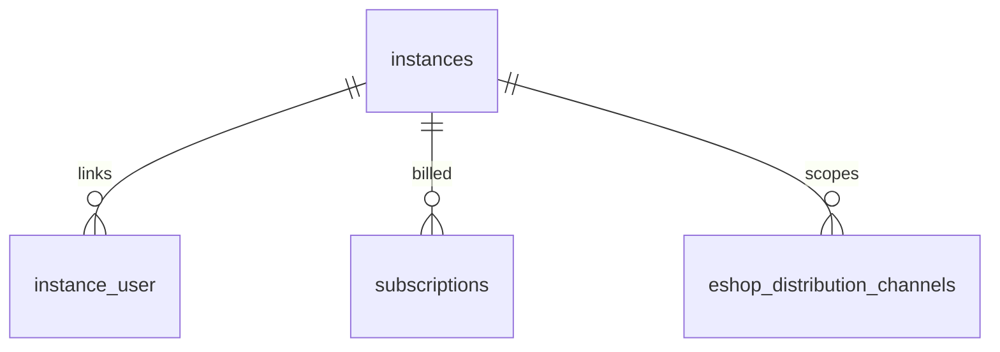

# Module : Instances

## 1. Description fonctionnelle
- Objectif : administrer les tenants/instances B360 et piloter leur provisionnement.
- Perimetre metier : CRUD des instances, activation/desactivation, affichage detaille, parametres d'instance, strategie de provisionnement.
- Utilisateurs cibles : super-admin racine, equipe plateforme.

## 2. Liste des fonctionnalites
### 2.1 Fonctionnalites principales
- [F1] Liste, creation, edition et consultation des instances (`InstanceController`).
- [F2] Activation/desactivation des instances via attributs du modele `Instance`.
- [F3] Provisionnement logique d'une instance (`InstanceProvisioner`).

### 2.2 Sous-fonctionnalites
- Validation des donnees de creation/mise a jour.
- Ecran de settings d'instance.
- Tests dedies au mode `database-per-instance`.

### 2.3 Cas d'usage cles
- Super-admin -> cree une instance -> celle-ci devient rattachable aux utilisateurs.
- Super-admin -> provisionne une instance -> le service tente d'appliquer la strategie de migrations cible.
- Super-admin -> suspend une instance -> l'acces est ensuite bloque par les controles de plateforme.

## 3. Composants techniques associes
| Type | Classe/Fichier | Role |
|------|----------------|------|
| Provider | `Modules/Instances/Providers/InstancesServiceProvider.php` | bootstrap du module |
| Controller | `Modules/Instances/Http/Controllers/InstanceController.php` | CRUD UI |
| Service | `Modules/Instances/Services/InstanceProvisioner.php` | provisionnement et migrations d'instance |
| Request | `Modules/Instances/Http/Requests/{InstanceStoreRequest,InstanceUpdateRequest}.php` | validation |
| Hook Provider | `Modules/Instances/Providers/InstancesHooksProvider.php` | integration menus/settings |

## 4. Modele de donnees
### 4.1 Tables propres au module
- Aucune table propre n'est definie par `Modules/Instances`; le module s'appuie sur `App\Instances\Instance` et sur la table `instances` geree hors du module.

### 4.2 Tables partagees (avec quels modules)
- `instances` : coeur du tenanting, partagee avec `Core`, `Auth`, `Users`, `Billing`, `Eshop360`.
- `instance_user` : partagee avec `Core` et `Users`.

### 4.3 Relations cles

## 5. Dependances
| Vers le module | Type (core/metier) | Niveau de couplage | Justification |
|----------------|--------------------|--------------------|---------------|
| Core | core | fort | politiques, middlewares et pivot utilisateur-instance sont dans Core |
| Users | core | fort | memberships relies aux instances |
| Billing | metier | moyen | abonnements et plans se rattachent a l'instance |
| Eshop360 | metier | moyen | l'essentiel des donnees retail est scope par instance |

## 6. Points sensibles
- Zone critique : `InstanceProvisioner` cherche des migrations dans `Modules/*/Database/InstanceMigrations`, mais les modules actifs chargent surtout `Database/Migrations`.
- Risque de regression : le vrai modele d'instance est dans `app/Instances/Instance.php`, donc la frontiere module / noyau n'est pas nette.
- Code legacy ou fragile : les tests `InstanceProvisioningDedicatedSuccessTest` suggerent une ambition multi-base, mais le layout actuel du code n'aligne pas clairement cette ambition.
- [A VERIFIER] Le support reel du mode `database-per-instance` doit etre confirme avant toute decision d'architecture.
