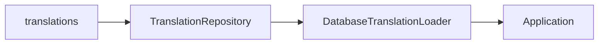

# Module : Lang

> ⚠️ **Archive historique (pré-R-101).** Certains constats ont été résolus depuis ; lire d'abord `docs/context/PROJECT_DIGEST.md`, `docs/memory/OPEN_RISKS.md`, `docs/memory/RECENT_DECISIONS.md` et les ADR pertinents. Voir aussi [`DOCUMENTATION_INDEX.md`](../../DOCUMENTATION_INDEX.md) pour la taxonomy.

## 1. Description fonctionnelle
- Objectif : gerer la langue active et les traductions stockees en base.
- Perimetre metier : switch de langue, CRUD des traductions, chargement DB des libelles.
- Utilisateurs cibles : administrateurs fonctionnels, utilisateurs front/back ayant besoin de changer de locale.

## 2. Liste des fonctionnalites
### 2.1 Fonctionnalites principales
- [F1] Changement de langue via `LangController`.
- [F2] Gestion des traductions via `TranslationController`.
- [F3] Chargement des traductions de base de donnees (`DatabaseTranslationLoader`, `TranslationRepository`).
- [F4] Gestion de la locale active (`LocaleManager`, middleware `SetLocale`).

### 2.2 Sous-fonctionnalites
- Import/export de traductions.
- Integration d'un composant UI `language-switcher`.

### 2.3 Cas d'usage cles
- Utilisateur -> change de langue -> la locale active est mise a jour pour la session.
- Administrateur -> importe des traductions -> les libelles DB deviennent disponibles.

## 3. Composants techniques associes
| Type | Classe/Fichier | Role |
|------|----------------|------|
| Provider | `Modules/Lang/Providers/LangServiceProvider.php` | bootstrap |
| Controller | `Modules/Lang/Http/Controllers/LangController.php` | changement de langue |
| Controller | `Modules/Lang/Http/Controllers/TranslationController.php` | CRUD/import/export |
| Middleware | `Modules/Lang/Http/Middleware/SetLocale.php` | applique la locale |
| Service | `Modules/Lang/Services/{LocaleManager,TranslationRepository,DatabaseTranslationLoader}.php` | logique de traduction |
| Model | `Modules/Lang/Models/Translation.php` | persistence |

## 4. Modele de donnees
### 4.1 Tables propres au module
- `translations` : cle, locale, texte traduit.

### 4.2 Tables partagees (avec quels modules)
- Aucune table partagee obligatoire, mais tous les modules peuvent consommer les traductions via Laravel.

### 4.3 Relations cles

## 5. Dependances
| Vers le module | Type (core/metier) | Niveau de couplage | Justification |
|----------------|--------------------|--------------------|---------------|
| Core | core | moyen | hooks/settings UI et shell applicatif |
| Settings | core | faible | la langue par defaut peut etre exposee dans les settings |

## 6. Points sensibles
- Zone critique : `TranslationRepository` utilise un `Cache::flush()` lors de certains imports, ce qui est large pour une operation de traduction.
- Risque de regression : un import massif peut invalider trop de cache applicatif.
- Code legacy ou fragile : le depot ne montre que `fr` et `en` en ressources, ce qui peut limiter l'usage reel.
- [A VERIFIER] Le niveau de couverture API/public des traductions n'est pas une priorite visible dans le code.
