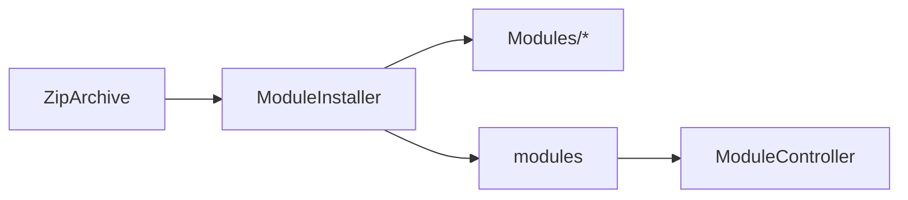

# Module : ModuleManager

> ⚠️ **Archive historique (pré-R-101).** Certains constats ont été résolus depuis ; lire d'abord `docs/context/PROJECT_DIGEST.md`, `docs/memory/OPEN_RISKS.md`, `docs/memory/RECENT_DECISIONS.md` et les ADR pertinents. Voir aussi [`DOCUMENTATION_INDEX.md`](../../DOCUMENTATION_INDEX.md) pour la taxonomy.

## 1. Description fonctionnelle
- Objectif : administrer le cycle de vie des modules B360 installes.
- Perimetre metier : liste, detail, activation/desactivation, suppression et installation a partir d'un ZIP.
- Utilisateurs cibles : super-admin, equipe technique plateforme.

## 2. Liste des fonctionnalites
### 2.1 Fonctionnalites principales
- [F1] Liste et detail des modules (`ModuleController`).
- [F2] Activation/desactivation des modules via la table `modules` et le mecanisme nwidart.
- [F3] Installation d'un module a partir d'une archive (`ModuleInstaller`).
- [F4] Destruction de module exposee par controller/tests.

### 2.2 Sous-fonctionnalites
- Validation de `module.json`.
- Recherche du manifest a la racine ou dans un sous-dossier unique du ZIP.
- Lancement de migrations apres installation.

### 2.3 Cas d'usage cles
- Super-admin -> charge un ZIP -> le module est copie sous `Modules/`, enregistre et migre.
- Super-admin -> desactive un module -> il ne contribue plus au shell applicatif.

## 3. Composants techniques associes
| Type | Classe/Fichier | Role |
|------|----------------|------|
| Provider | `Modules/ModuleManager/Providers/ModuleManagerServiceProvider.php` | bootstrap |
| Controller | `Modules/ModuleManager/Http/Controllers/ModuleController.php` | UI et actions |
| Service | `Modules/ModuleManager/Services/ModuleInstaller.php` | installation depuis ZIP |
| Hook Provider | `Modules/ModuleManager/Providers/ModuleManagerHooksProvider.php` | integration menu |

## 4. Modele de donnees
### 4.1 Tables propres au module
- Aucune table propre; le module reutilise `modules` creee par `Core`.

### 4.2 Tables partagees (avec quels modules)
- `modules` : partagee avec `Core`.

### 4.3 Relations cles

## 5. Dependances
| Vers le module | Type (core/metier) | Niveau de couplage | Justification |
|----------------|--------------------|--------------------|---------------|
| Core | core | fort | la table `modules`, les policies et le chargement module reposent sur le noyau |
| Tous modules | metier | moyen | agit sur leur presence et leur activation |

## 6. Points sensibles
- Zone critique : `ModuleInstaller` supprime le dossier cible existant avant recopie (`File::deleteDirectory($targetDir)`), ce qui rend l'operation risquee.
- Risque de regression : une archive invalide ou mal structuree peut casser un module existant si le nom cible collide.
- Code legacy ou fragile : le module pilote des operations filesystem lourdes sans transaction globale.
- [A VERIFIER] La suppression de module cote controller doit etre relue avant usage en production si des donnees persistent en base.
