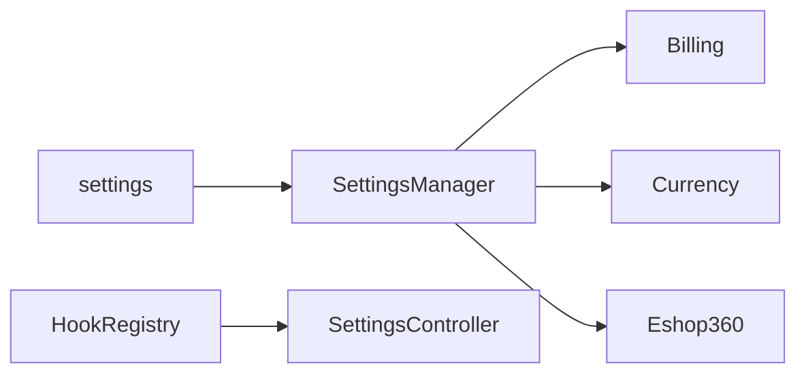

# Module : Settings

## 1. Description fonctionnelle
- Objectif : centraliser les parametres globaux et les groupes de configuration exposes par les modules.
- Perimetre metier : gestion de cles/valeurs, groupes de settings, branding, securite, email, SMS, notifications, options Eshop exposees dans l'UI.
- Utilisateurs cibles : administrateurs de la plateforme et administrateurs d'instance selon les ecrans exposes.

## 2. Liste des fonctionnalites
### 2.1 Fonctionnalites principales
- [F1] Edition et persistence des parametres via `SettingsController`.
- [F2] Lecture/ecriture centralisees via `SettingsManager`.
- [F3] Extension des groupes de settings via hooks Core.
- [F4] Helper global `setting()`.

### 2.2 Sous-fonctionnalites
- Mise en cache par groupe.
- Partiels de vues pour branding, email, notifications, security, sms.
- Ecrans de settings Eshop dans le module Settings, ce qui signale un croisement avec `Eshop360`.

### 2.3 Cas d'usage cles
- Administrateur -> modifie un parametre branding -> la valeur est stockee dans `settings`.
- Module contributeur -> enregistre un groupe de settings via hooks -> il apparait dans l'UI de configuration.
- Code applicatif -> appelle `setting('x.y')` -> recupere une valeur mise en cache.

## 3. Composants techniques associes
| Type | Classe/Fichier | Role |
|------|----------------|------|
| Provider | `Modules/Settings/Providers/SettingsServiceProvider.php` | bootstrap du module |
| Provider | `Modules/Settings/Providers/SettingsBootstrapProvider.php` | chargement du helper/settings au boot |
| Controller | `Modules/Settings/Http/Controllers/SettingsController.php` | UI de gestion |
| Service | `Modules/Settings/Services/SettingsManager.php` | source centrale de lecture/ecriture |
| Model | `Modules/Settings/Models/Setting.php` | persistence |
| Helper | `Modules/Settings/helpers.php` | fonction `setting()` |

## 4. Modele de donnees
### 4.1 Tables propres au module
- `settings` : stockage cle/valeur des configurations applicatives.

### 4.2 Tables partagees (avec quels modules)
- `settings` : utilisee par `Currency`, `Billing`, `Eshop360` et potentiellement d'autres modules via `setting()`.

### 4.3 Relations cles

## 5. Dependances
| Vers le module | Type (core/metier) | Niveau de couplage | Justification |
|----------------|--------------------|--------------------|---------------|
| Core | core | fort | les groupes de settings sont portes par le systeme de hooks |
| Billing | metier | moyen | gateways et billing consomment des cles de config |
| Currency | metier | moyen | devise active et taux passent en partie par `settings` |
| Eshop360 | metier | fort | plusieurs partials `eshop_*` et services Eshop consomment des cles |

## 6. Points sensibles
- Zone critique : `SettingsManager` ecrit/lit la table `settings` comme source centrale, mais `Eshop360` introduit aussi `eshop_module_settings`.
- Risque de regression : la cache de settings masque rapidement les incoherences de source de verite.
- Code legacy ou fragile : les partiels `eshop_invoice`, `eshop_pos`, `eshop_printer` dans ce module montrent que des concerns metiers Eshop ont remonte dans le module de plateforme.
- [A VERIFIER] Le scope exact des settings (global, par instance, par canal) n'est pas uniforme dans tous les modules.
