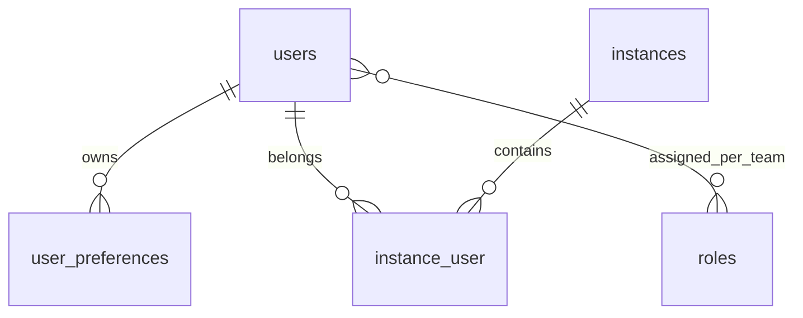

# Module : Users

> ⚠️ **Archive historique (pré-R-101).** Certains constats ont été résolus depuis ; lire d'abord `docs/context/PROJECT_DIGEST.md`, `docs/memory/OPEN_RISKS.md`, `docs/memory/RECENT_DECISIONS.md` et les ADR pertinents. Voir aussi [`DOCUMENTATION_INDEX.md`](../../DOCUMENTATION_INDEX.md) pour la taxonomy.

## 1. Description fonctionnelle
- Objectif : administrer les utilisateurs, leurs roles par instance et leurs preferences.
- Perimetre metier : CRUD utilisateurs, rattachement a une ou plusieurs instances, statut de membership, edition des roles, preferences utilisateur.
- Utilisateurs cibles : administrateurs d'instance, super-admin, parfois l'utilisateur final pour ses preferences.

## 2. Liste des fonctionnalites
### 2.1 Fonctionnalites principales
- [F1] CRUD des utilisateurs (`UserController`).
- [F2] Gestion des roles et permissions par instance (`RoleController`, `TeamRoleAssigner`).
- [F3] Synchronisation des memberships utilisateur-instance (`UserMembershipController`, `MembershipService`).
- [F4] Preferences utilisateur (`UserPreferenceController`, `UserPreferenceService`).

### 2.2 Sous-fonctionnalites
- Politique d'acces sur les operations utilisateur.
- Seeders RBAC.
- Vues de synthese memberships dans la fiche utilisateur.

### 2.3 Cas d'usage cles
- Admin d'instance -> ajoute un utilisateur a son instance -> le pivot `instance_user` est cree avec statut.
- Admin d'instance -> modifie les roles -> les roles Spatie sont synchronises sur l'equipe courante.
- Utilisateur -> met a jour ses preferences -> ses choix sont persistants.

## 3. Composants techniques associes
| Type | Classe/Fichier | Role |
|------|----------------|------|
| Provider | `Modules/Users/Providers/UsersServiceProvider.php` | bootstrap principal |
| Controller | `Modules/Users/Http/Controllers/UserController.php` | CRUD utilisateurs |
| Controller | `Modules/Users/Http/Controllers/RoleController.php` | edition des roles |
| Controller | `Modules/Users/Http/Controllers/UserMembershipController.php` | gestion des rattachements |
| Controller | `Modules/Users/Http/Controllers/UserPreferenceController.php` | preferences |
| Service | `Modules/Users/Services/MembershipService.php` | operations sur `instance_user` |
| Service | `Modules/Users/Services/TeamRoleAssigner.php` | sync roles par team |
| Service | `Modules/Users/Services/UserPreferenceService.php` | persistence preferences |
| Policy | `Modules/Users/Policies/UserPolicy.php` | autorisation |
| Model | `Modules/Users/Models/UserPreference.php` | preferences |

## 4. Modele de donnees
### 4.1 Tables propres au module
- `user_preferences` : preferences par utilisateur.

### 4.2 Tables partagees (avec quels modules)
- `users` : table centrale, partagee avec `Auth`, `Core`, `Billing`, `Eshop360`.
- `instance_user` : pivot partage avec `Core` et `Instances`.
- tables Spatie RBAC : partagees avec `Core` et `Auth`.

### 4.3 Relations cles

## 5. Dependances
| Vers le module | Type (core/metier) | Niveau de couplage | Justification |
|----------------|--------------------|--------------------|---------------|
| Core | core | fort | roles, permissions et pivot `instance_user` reposent sur le socle Core |
| Auth | core | moyen | partage du modele `User` et du cycle de connexion |
| Instances | core | fort | memberships et team context sont relies aux instances |
| Settings | core | faible | certaines preferences peuvent etre completees par settings globaux |

## 6. Points sensibles
- Zone critique : `TeamRoleAssigner` applique une liste de roles attendus (`instance-admin`, `manager`, `agent`, `user`) qui fixe implicitement le RBAC de base.
- Risque de regression : la logique membership et la logique role sont separees entre `MembershipService` et `TeamRoleAssigner`; un statut inactif mal gere peut laisser des roles incoherents.
- Code legacy ou fragile : le module gere peu de donnees propres; il depend fortement du modele global `User` hors module.
- [A VERIFIER] Les liens entre `users` et les entites `Personne*` de `app/Models` ne sont pas formalises dans ce module.
