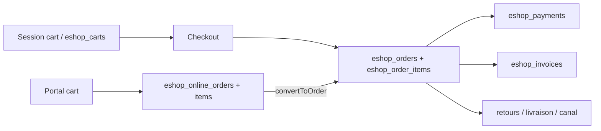

# Focus Eshop360

Sources principales :
- `Modules/Eshop360/Services/{ProductPricingService,CartService,OrderService,OnlineOrderService,InvoiceService,ImportService,StockService,MarginService,ReportService}.php`
- `Modules/Eshop360/Models/{Product,Order,Invoice,Payment,Customer,OnlineOrder,DistributionChannel,PersistentCart,Coupon}.php`
- `Modules/Eshop360/Routes/{web,api}.php`
- `docs/GUIDE-CALCULS-ESHOP360.md`

## 1. Gestion des produits

### Structure de tables
- `eshop_products` : coeur catalogue (`category_id`, `brand_id`, `supplier_id`, `price`, `cost_price`, `purchase_price_factory`, `purchase_price_provisional`, `pght`, `cost_price_real`, `tax_rate`, `tax_inclusive`, `discount_type`, `discount_value`, `selling_type`, champs pharma)
- `eshop_product_variations` : variantes par produit, SKU/image/prix specifiques
- `eshop_categories`, `eshop_brands` : classement catalogue
- `eshop_taxes`, `eshop_product_taxes` : taxes multiples
- `eshop_product_groups`, `eshop_product_group_items` : regroupements
- `eshop_channel_product_prices` : prix par canal

### Logique observee
- La resolution du prix runtime passe par `ProductPricingService::resolve()` (`Modules/Eshop360/Services/ProductPricingService.php:18-58`).
- Ordre de priorite constate :
  1. prix manuel du canal (`eshop_channel_product_prices.sale_price`)
  2. prix derive via `DistributionChannel::calculateSalePrice()` sur le `pght`
  3. prix produit standard
- Les remises produit sont appliquees au niveau du service de pricing via `discount_type` / `discount_value`.

### Import / export
- Import metier : `ImportService` cree un `ImportOrder`, ajoute des `ImportCost`, simule puis persiste la repartition (`allocateCosts` / `simulateAllocation`), enfin receptionne le stock.
- Export metier : les exports observes sont des exports de rapports (`ExportController` + `ReportService`), pas un moteur generique d'export catalogue independant.

### Champs personnalisables
- Constates sur le produit : champs pharma (`dci`, `dosage`, `form`, `packaging`), multi-images, barcode/qrcode, dates de fabrication/peremption, prix multiples, `selling_type`.
- [À VERIFIER] Les tables creees par `create_configurable_types_tables` n'ont pas de couche applicative clairement raccordee.

## 2. Gestion des prix

### Regles de calcul actuelles
- Prix catalogue :
  - prix de base = `product.price`
  - remise produit = `discount_type` + `discount_value`
  - prix canal = override manuel ou `pght * (1 + buy_rate)`
- Commande / panier :
  - `OrderService::createFromItems()` recalcule chaque ligne, agrège `line_subtotal`, `line_discount`, `line_tax`, `shipping_amount`, puis derive `payment_status` (`Modules/Eshop360/Services/OrderService.php:54-144` et `:373-381`)
  - `CartService::calculateTotals()` additionne `lineTotal`, taxe et coupon (`Modules/Eshop360/Services/CartService.php:227-268`)
- Commande en ligne :
  - `OnlineOrderService` ignore le prix client et reprend le prix serveur (`Modules/Eshop360/Services/OnlineOrderService.php:35`, `:54`)

### Tables liees
- `eshop_products`
- `eshop_channel_product_prices`
- `eshop_coupons`
- `eshop_discounts`
- `eshop_discount_plans`
- `eshop_taxes`
- `eshop_product_taxes`

### Comportement observe
- HT/TTC :
  - le schema produit porte `tax_inclusive`
  - mais les calculs critiques courants (`CartService`, `OrderService`, `OnlineOrderService`) appliquent surtout `tax_rate` par multiplication, sans moteur unifie HT/TTC sur tous les parcours
  - conclusion : support schema present, execution partiellement harmonisee seulement
- Coupons :
  - valides via `Coupon::scopeValid()` et `visibleToChannel()`
  - un coupon hub (`channel_id = null`) n'est visible que hors contexte canal (`Modules/Eshop360/Models/Coupon.php:47-53`)
- Promotions :
  - remises automatiques persistent en tables, mais la logique centrale la plus visible reste le couple remises produit + coupon

## 3. Commandes / Panier

### Cycle de vie observe

### Tables
- `eshop_carts`, `eshop_orders`, `eshop_order_items`, `eshop_online_orders`, `eshop_online_order_items`, `eshop_invoices`, `eshop_invoice_items`, `eshop_payments`, `eshop_holdings`, `eshop_cash_registers`

### Evenements / effets observes
- `OrderService` dispatch `ReportDataChanged` et `WebhookService::dispatch('order.created', ...)`
- `InvoiceService` cree des paiements morphiques et recalcule le statut
- `OnlineOrderService::advanceStatus()` impose un workflow ferme :
  - `pending_validation -> validated -> preparing -> prepared -> shipping -> delivered -> received -> invoiced`

### Points structurants
- Il existe au moins trois implementations de panier :
  - `Services/CartService.php`
  - `Http/Controllers/Sales/CartController.php`
  - `Http/Controllers/Portal/CustomerPortalController.php`
- Le panier persistant `eshop_carts` est write-through DB pour utilisateur connecte, mais il herite du scope canal implicite via `PersistentCart`.

## 4. Clients

### Lien avec `User`
- `Customer` porte `user_id` vers `App\Models\User` (`Modules/Eshop360/Models/Customer.php:59`)
- le portail client resout le client soit par `user_id`, soit par email (`CustomerPortalController::resolveCustomer()`)
- le modele client reste donc propre a Eshop, mais branche sur le compte systeme global

### Champs specifiques Eshop
- adresse / ville / pays
- wallet (`wallet_balance`)
- credit (`credit_limit`)
- groupe client
- support team
- notes, points de fidelite/bonus
- historique : `orders`, `onlineOrders`, `transactions`, `dues`, `supportTickets`

## 5. Stock

### Structure
- `eshop_stocks` : quantite et `reserved_quantity` par produit / entrepot / magasin
- `eshop_stock_movements` : journal des mouvements
- `eshop_stock_transfers` + `eshop_stock_transfer_items` : transferts
- `eshop_warehouses`, `eshop_stores` : topologie logistique

### Regles observees
- `StockService::adjustStock()` interdit le stock negatif et enregistre toujours un `StockMovement`
- transferts :
  - creation -> reserve la quantite source
  - completion -> diminue `quantity` source, libere `reserved_quantity`, cree les mouvements, alimente la destination
  - annulation -> libere la reservation

### Point sensible majeur
- Les tests actuels montrent encore des `reserved_quantity` negatives lors de completion/annulation de transfert, ce qui invalide la promesse de robustesse de ce flux au 2026-04-04.

## 6. Integrations avec les autres modules

### Appels sortants observes
- `Billing` : feature gating `billing.feature:*`, `FeatureRegistry`
- `Core` : `CurrentInstance`, hooks, audit, team context, notifications, webhooks
- `Settings` : `EshopSettingsService` + table `settings`
- Externes : CinetPay/InetPay, webhooks HTTP, SMS drivers, email templates, FNE, imprimantes ESC/POS

### Points d'entree recus
- API REST `api/eshop360/v1` et `v2`
- webhooks de paiement publics
- routes portail client
- routes portail canal
- event interne `ReportDataChanged`

## 7. Reutilisable vs trop specifique

### Reutilisable globalement
- `ProductPricingService` : moteur de priorite prix produit / canal
- `OrderService` et `InvoiceService` : creation de documents transactionnels et statuts de paiement
- `ReportService` : grille de rapports ready-made, si le cache est assaini
- `OnlineOrderService` : workflow de commande en ligne avec prix serveur impose

### Trop specifique / trop couple
- `BelongsToChannel` applique un scope implicite a des modeles utilitaires (`PersistentCart`, `Coupon`, `Customer`) : utile pour l'isolation canal, penalise pour le hub
- marge tripartite, PGHT, buy/debt/channel/owner share : logique tres specifique au modele de distribution actuel
- champs pharma + FNE : verticalisation forte
- coexistence de `settings` et `eshop_module_settings` : duplication de configuration

## 8. Conclusion focus

- Eshop360 couvre bien plus qu'un simple e-shop : c'est deja un ERP retail modulaire par dossiers, mais pas encore par vrais sous-domaines independants.
- Le coeur transactionnel est present et lisible, mais la qualite d'isolation chute des que les scopes implicites (`instance`, `channel`, `assignments`) se croisent.
- La priorite technique avant toute nouvelle extension devrait etre l'unification du panier/pricing, la fiabilisation des transferts de stock, puis la clarification des frontieres avec `Billing` et `Settings`.
