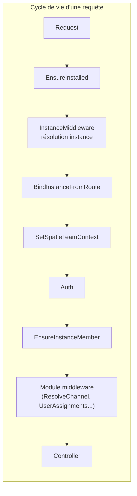

# B360 — Vue globale du système

> **Date de production :** 2026-04-04
> **Source :** analyse statique exhaustive du code source, migrations, service providers et documentation existante.

---

## 1. Liste complète des modules

| # | Module | Rôle principal | Périmètre métier | Statut |
|---|--------|---------------|-------------------|--------|
| 1 | **Installer** | Orchestration de l'installation initiale de la plateforme | Vérification prérequis, création BDD, écriture `.env`, seeding initial | Actif |
| 2 | **Core** | Socle technique partagé : multi-tenancy, hooks, audit, middleware | Instances, permissions (Spatie), audit logs, backups, maintenance, documentation, tours, licences, gestion modules | Actif |
| 3 | **Auth** | Authentification et sécurité d'accès | Login global/instance, 2FA (TOTP), lockscreen, IP rules, login logs, reset password | Actif |
| 4 | **Users** | Gestion des utilisateurs et rôles | CRUD utilisateurs, rôles/permissions, memberships multi-instances, préférences | Actif |
| 5 | **Dashboard** | Tableau de bord dynamique | Widgets via hooks, vue d'ensemble par instance | Actif |
| 6 | **Instances** | Provisionnement et gestion des instances (tenants) | CRUD instances, activation/désactivation, provisionnement DB | Actif |
| 7 | **Settings** | Paramétrage centralisé | Groupes de paramètres (via hooks), stockage clé/valeur, test email | Actif |
| 8 | **Billing** | Facturation plateforme (SaaS) | Plans, abonnements, factures plateforme, passerelles de paiement, feature flags, webhooks | Actif |
| 9 | **Lang** | Internationalisation | Gestion locales, traductions DB, import/export, switch locale | Actif |
| 10 | **Currency** | Gestion des devises | CRUD devises, taux de change, mise à jour auto | Actif |
| 11 | **ModuleManager** | Gestion du cycle de vie des modules | Activation/désactivation, upload, suppression de modules | Actif |
| 12 | **Demo** | Données de démonstration | Seeding données démo, réinitialisation | Actif |
| 13 | **Eshop360** | Module métier e-commerce / gestion commerciale complète | Catalogue, POS, stocks, clients/CRM, fournisseurs, achats, importations, facturation, commandes en ligne, canaux revendeurs, finance, RH, projets, rapports, API | Actif |
| 14 | **InventoryX** | Module inventaire avancé (prévu) | Gestion inventaire étendue | **Expérimental** (squelette vide) |

### Statistiques globales

| Métrique | Valeur |
|----------|--------|
| Modules actifs | 13 |
| Contrôleurs | 95+ |
| Modèles Eloquent | 108 |
| Services | 91 |
| Migrations | 146+ |
| Middleware | 28 |
| Service Providers | 30 |
| Commandes Artisan schedulées | 11 |

---

## 2. Diagramme des interactions inter-modules

```mermaid
flowchart TB
    subgraph Platform["Socle Plateforme"]
        CORE["Core<br/>Multi-tenancy, Hooks,<br/>Audit, Middleware"]
        AUTH["Auth<br/>Login, 2FA, IP Rules"]
        USERS["Users<br/>CRUD, Roles, Memberships"]
        INST["Instances<br/>Provisionnement"]
        SETTINGS["Settings<br/>Paramétrage"]
        BILLING["Billing<br/>Plans, Abonnements,<br/>Feature Flags"]
        LANG["Lang<br/>i18n"]
        CURRENCY["Currency<br/>Devises"]
        DASH["Dashboard<br/>Widgets"]
        MM["ModuleManager<br/>Cycle de vie"]
        DEMO["Demo<br/>Données test"]
        INSTALLER["Installer<br/>Setup initial"]
    end

    subgraph Business["Module Métier"]
        ESHOP["Eshop360<br/>E-commerce complet"]
    end

    %% Dépendances Core
    AUTH -->|User model, sessions| CORE
    USERS -->|Spatie Permissions, instance_user| CORE
    INST -->|InstanceManager, InstanceResolver| CORE
    SETTINGS -->|HookRegistry settings_groups| CORE
    BILLING -->|HookRegistry features, gateways| CORE
    DASH -->|HookRegistry widgets| CORE
    MM -->|ModuleManager, modules table| CORE
    DEMO -->|HookRegistry demo_providers| CORE
    LANG -->|Middleware SetLocale| CORE
    CURRENCY -->|indépendant, table currencies| CORE

    %% Dépendances Eshop
    ESHOP ==>|BelongsToInstance, middleware stack,<br/>HookRegistry (menu, widgets,<br/>permissions, settings, features)| CORE
    ESHOP -->|User model, HasRoles| USERS
    ESHOP -->|Login, sessions| AUTH
    ESHOP -->|FeatureRegistry, EnsureFeature| BILLING
    ESHOP -.->|Settings lecture/écriture| SETTINGS
    ESHOP -.->|Currency conversion| CURRENCY
    ESHOP -.->|Traductions| LANG

    %% Flux inter-platform
    INSTALLER -->|Crée DB, seed Core + Users| CORE
    INSTALLER -->|Crée super-admin| USERS
    BILLING -->|SubscriptionManager vérifie| INST

    style ESHOP fill:#f9a825,stroke:#f57f17,stroke-width:3px
    style CORE fill:#1565c0,stroke:#0d47a1,stroke-width:3px,color:#fff
```

### Flux de données principaux



---

## 3. Dépendances critiques

| Module source | Dépend de | Type | Criticité | Justification |
|--------------|-----------|------|-----------|---------------|
| **Tous les modules** | Core | Core | **Critique** | HookRegistry, middleware stack, Instance model, audit, permissions |
| **Eshop360** | Core | Core | **Critique** | BelongsToInstance, middleware complet, HookRegistry pour menus/widgets/permissions/settings |
| **Eshop360** | Users | Core | Fort | Modèle User, trait HasRoles (Spatie), UserAssignment pour scoping ressources |
| **Eshop360** | Auth | Core | Fort | Sessions, login flows, IP rules |
| **Eshop360** | Billing | Core | Fort | FeatureRegistry / EnsureFeature pour paywall, FeatureGate (wrapper deprecated) |
| **Eshop360** | Settings | Core | Moyen | Lecture paramètres instance (POS, imprimante, factures) |
| **Eshop360** | Currency | Core | Faible | Conversion devises (pas de couplage direct fort) |
| **Billing** | Core | Core | Fort | HookRegistry features/gateways, instance model |
| **Billing** | Instances | Core | Fort | SubscriptionManager lie subscription → instance |
| **Auth** | Core | Core | Fort | Middleware, User model |
| **Users** | Core | Core | Fort | Spatie Permissions, instance_user pivot |
| **Dashboard** | Core | Core | Moyen | HookRegistry widgets |
| **Installer** | Core, Users | Core | Fort | Seeding initial (instances, rôles, super-admin) |

---

## 4. Mécanisme d'extensibilité : le système de Hooks

Le Core expose un **HookRegistry** qui permet aux modules de s'enregistrer dynamiquement sans couplage direct :

| Type de Hook | DTO | Usage |
|-------------|-----|-------|
| `menu` | `MenuItem` | Entrées de navigation sidebar (parent/enfant, priorité) |
| `widgets` | `DashboardWidget` | Widgets du Dashboard |
| `settings_groups` | `SettingsGroup` | Groupes de paramètres dans Settings |
| `permissions` | `PermissionGroup` | Groupes de permissions affichés dans la gestion des rôles |
| `features` | `BillableFeature` | Fonctionnalités payantes (feature flags Billing) |
| `payment_gateways` | `PaymentGatewayDefinition` | Passerelles de paiement plateforme |
| `demo_providers` | `DemoDataProvider` | Fournisseurs de données démo |
| `notification_types` | (objet libre) | Types de notifications |

**11 HooksProviders** enregistrés (voir `Config/hooks.php`), un par module actif.

---

## 5. Synthèse rapide

### Maturité perçue

| Aspect | Niveau | Commentaire |
|--------|--------|------------|
| **Socle plateforme** (Core, Auth, Users, Instances, Billing) | ★★★★☆ | Architecture solide, multi-tenancy fonctionnelle, hooks extensibles |
| **Eshop360** | ★★★☆☆ | Très riche fonctionnellement mais inégal : POS/stocks/rapports opérationnels, facturation/RH fragiles |
| **Modules support** (Lang, Currency, Settings, Dashboard) | ★★★★☆ | Simples et efficaces |
| **Tests** | ★★☆☆☆ | 396 tests passants mais couverture inégale (Auth, Dashboard, Users sans tests dédiés) |

### Cohérence d'ensemble

- **Points forts** : Architecture modulaire propre (nwidart), système de hooks élégant, isolation multi-tenant via traits/scopes, middleware stack bien ordonné
- **Points faibles** : Eshop360 est un méga-module (83 modèles, 70+ contrôleurs, 128 migrations) — c'est un monolithe dans le modulaire. Certaines fonctionnalités (RH, projets, communication) semblent greffées sans cohérence métier forte avec le e-commerce.

### Points d'attention majeurs

1. **Race condition stock** — Pas de `lockForUpdate()` sur les déductions de stock (risque corruption)
2. **Eshop360 trop gros** — Candidat au découpage en sous-modules (Catalog, POS, Finance, HR, CRM)
3. **Double système de feature gates** — `FeatureGate` (Eshop360, deprecated) vs `FeatureRegistry` (Billing) coexistent
4. **Modèles Project/Task cassés** — Trait `BelongsToInstance` manquant → crash runtime
5. **Facturation fragile** — Incohérences `invoice_number` vs `reference`, champ `tax_rate` manquant sur `invoice_items`
6. **Codifarm/Channel duplication** — Deux systèmes de marge coexistent (`CodifarmMarginConfig` et `DistributionChannel`)
7. **Absence d'observers** — 0 observer dans tout le projet ; la logique post-save est dispersée dans les contrôleurs
