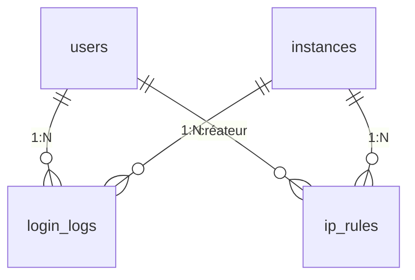

# Module : Auth

> ⚠️ **Archive historique (pré-R-101).** Certains constats ont été résolus depuis ; lire d'abord `docs/context/PROJECT_DIGEST.md`, `docs/memory/OPEN_RISKS.md`, `docs/memory/RECENT_DECISIONS.md` et les ADR pertinents. Voir aussi [`DOCUMENTATION_INDEX.md`](../../DOCUMENTATION_INDEX.md) pour la taxonomy.

## 1. Description fonctionnelle
- **Objectif :** Gérer l'authentification des utilisateurs (login global et par instance), la sécurité d'accès (2FA, IP rules, lockscreen) et la traçabilité des connexions.
- **Périmètre métier :** Authentification, autorisation d'accès, sécurité périmétrique.
- **Utilisateurs cibles :** Tous les utilisateurs (login), admins instance (IP rules, login logs).

## 2. Liste des fonctionnalités

### 2.1 Fonctionnalités principales
- **[F1] Login dual** — Login global (`/login`) et login instance (`/i/{slug}/login`) avec résolution automatique de l'instance active.
- **[F2] Sélection d'instance** — Après login global, l'utilisateur choisit parmi ses instances actives.
- **[F3] Réinitialisation mot de passe** — Formulaire forgot + email token + reset.
- **[F4] Two-Factor Authentication (TOTP)** — Activation, confirmation, challenge, recovery codes.
- **[F5] Lockscreen** — Verrouillage de session avec déverrouillage par mot de passe.
- **[F6] IP Rules** — Whitelist/blacklist IP par instance.
- **[F7] Login Logs** — Historique des connexions (succès/échec/verrouillage) par utilisateur et instance.

### 2.2 Sous-fonctionnalités
- reCAPTCHA v3 (rule `RecaptchaV3` présente mais non câblée dans les routes)
- Listeners automatiques sur `Illuminate\Auth\Events\Login` et `Failed`

### 2.3 Cas d'usage clés
- Utilisateur → `/login` → saisit credentials → système vérifie → si multi-instances → redirigé vers sélection instance → choisit → redirigé vers dashboard instance
- Admin → active 2FA → scan QR → confirme OTP → 2FA actif → prochains logins demandent OTP
- Admin instance → configure IP deny `1.2.3.4` → requêtes depuis cette IP bloquées (middleware `CheckIpAccess`)
- Utilisateur → inactif 15min → lockscreen → saisit mot de passe → déverrouillé

## 3. Composants techniques associés

| Type | Classe/Fichier | Rôle |
|------|----------------|------|
| Controller | `LoginController` | showGlobal, loginGlobal, showInstance, loginInstance |
| Controller | `ForgotPasswordController` | show, send |
| Controller | `ResetPasswordController` | show, reset |
| Controller | `TwoFactorController` | enable, confirm, disable, challenge, recovery |
| Controller | `LockscreenController` | show, lock, unlock |
| Controller | `InstanceSelectionController` | select, choose, noActive |
| Controller | `IpRuleController` | index, store, destroy |
| Controller | `LoginLogController` | index, userHistory |
| Middleware | `CheckIpAccess` | Vérifie IP contre les rules de l'instance |
| Middleware | `CheckLockscreen` | Force lockscreen si session verrouillée |
| Middleware | `EnsureTwoFactorChallenge` | Redirige vers challenge 2FA si non vérifié |
| Listener | `LogSuccessfulLogin` | Écoute `Auth\Events\Login` → crée `LoginLog` |
| Listener | `LogFailedLogin` | Écoute `Auth\Events\Failed` → crée `LoginLog` |
| Request | `LoginRequest` | Validation : email, password, remember |
| Rule | `RecaptchaV3` | Validation reCAPTCHA v3 (non câblée) |
| Service | `LoginRedirector` | Logique de redirection post-login |
| Model | `IpRule` | Règles IP (allow/deny) par instance |
| Model | `LoginLog` | Historique connexions |

## 4. Modèle de données

### 4.1 Tables propres au module

| Table | Description | Colonnes clés |
|-------|-------------|---------------|
| `ip_rules` | Règles IP par instance | instance_id, ip_address, type (allow/deny), user_id, created_by |
| `login_logs` | Journal des connexions | user_id, instance_id, ip_address, user_agent, status (success/failed/locked) |

### 4.2 Tables partagées

| Table | Utilisée par | Champ de jointure |
|-------|-------------|-------------------|
| `users` | Auth, Core, Users, Eshop360 | user_id (FK) |
| `instances` | Auth (instance_id), Core | instance_id (FK) |
| `sessions` | Auth (implicite via Laravel) | user_id |

### 4.3 Relations clés

## 5. Dépendances

| Vers le module | Type | Niveau de couplage | Justification |
|---------------|------|-------------------|---------------|
| Core | core | **Fort** | User model, Instance model, middleware stack, sessions |
| Users | core | Moyen | User model (HasRoles pour 2FA, profil) |

## 6. Points sensibles

- **Zone critique :** Le `LoginController` a une logique de résolution d'instance active (`resolveActiveInstance()`) — si l'utilisateur a une seule instance, il est redirigé automatiquement. Cela crée un couplage implicite avec la table `instance_user`.
- **Risque de régression :** La `RecaptchaV3` rule est présente mais **non utilisée** dans `LoginRequest`. Si activée sans configuration, elle bloquera tous les logins.
- **Code sous-exploité :** Le middleware `CheckLockscreen` et `EnsureTwoFactorChallenge` existent mais leur intégration dans le middleware stack global n'est pas systématique sur toutes les routes.
- **Duplication potentielle :** Les champs `two_factor_secret`, `two_factor_recovery_codes`, `two_factor_confirmed_at` sont sur le modèle `User` (dans la migration principale), pas dans une migration Auth — couplage schéma.
