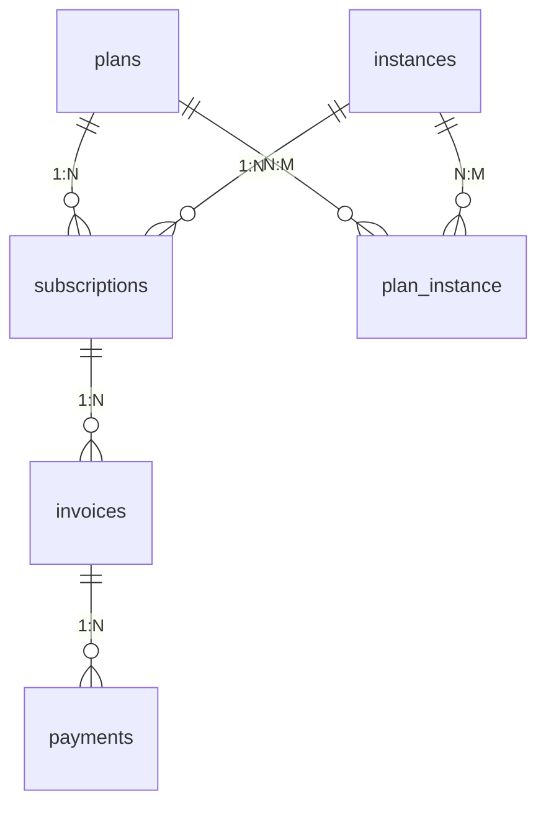

# Module : Billing

## 1. Description fonctionnelle
- **Objectif :** Gérer la facturation de la plateforme SaaS — plans d'abonnement, souscriptions, factures plateforme, passerelles de paiement et feature flags.
- **Périmètre métier :** Monétisation SaaS (B2B : plateforme → instances clientes).
- **Utilisateurs cibles :** Super-admins (gestion plans, gateways), instance-admins (abonnement, factures, upgrade).

## 2. Liste des fonctionnalités

### 2.1 Fonctionnalités principales
- **[F1] Plans d'abonnement** — CRUD plans avec prix mensuel/annuel, période d'essai, features (JSON), visibilité.
- **[F2] Souscriptions** — Cycle de vie : trial → active → past_due → cancelled → expired.
- **[F3] Factures plateforme** — Génération factures avec taxes, statuts (draft/pending/paid/failed/refunded/cancelled).
- **[F4] Passerelles de paiement** — 8 gateways : CinetPay, InetPay, Manual, MtnMomo, OrangeMoney, PayPal, Stripe, Wave.
- **[F5] Feature flags** — `FeatureRegistry` et `EnsureFeature` middleware pour contrôler l'accès aux fonctionnalités payantes.
- **[F6] Webhooks** — Réception et logging des callbacks des passerelles de paiement.

### 2.2 Sous-fonctionnalités
- Checkout flow (initiation paiement)
- Upgrade (changement de plan)
- Gateway settings (configuration par passerelle)
- Test connection sur les gateways
- `plan_instance` pivot pour visibilité spécifique

### 2.3 Cas d'usage clés
- Super-admin → crée plan "Pro" à 50€/mois → active features "pos", "reports-advanced" → publie
- Instance-admin → s'abonne au plan "Pro" → checkout CinetPay → webhook reçu → subscription active → features débloquées
- Middleware `EnsureFeature` → vérifie que l'instance a la feature "pos" dans son plan actif → sinon 403

## 3. Composants techniques associés

| Type | Classe/Fichier | Rôle |
|------|----------------|------|
| Controller | `PlanController` | CRUD plans |
| Controller | `SubscriptionController` | index, subscribe, update, cancel |
| Controller | `InvoiceController` | index, show, pay |
| Controller | `UpgradeController` | show (formulaire upgrade) |
| Controller | `CheckoutController` | initiate (démarrage paiement) |
| Controller | `GatewaySettingsController` | index, edit, update, toggle, test |
| Controller | `WebhookController` | handle (reception webhooks) |
| Service | `PlanManager` | Logique métier plans |
| Service | `SubscriptionManager` | Cycle de vie souscriptions |
| Service | `InvoiceManager` | Génération/gestion factures |
| Service | `FeatureRegistry` | Registre des features par plan |
| Service | `GatewayManager` | Orchestration multi-gateways |
| Middleware | `EnsureFeature` | Vérifie accès feature payante |
| Model | `Plan` | Plans d'abonnement |
| Model | `Subscription` | Souscriptions |
| Model | `Invoice` | Factures plateforme |
| Model | `Payment` | Paiements |
| Model | `WebhookLog` | Logs webhooks |
| Contract | `PaymentGatewayInterface` | Contrat gateway |
| Contract | `PaymentRequest/Response` | DTOs paiement |
| Gateway | `CinetPayGateway`, `StripeGateway`, etc. | 8 implémentations |

## 4. Modèle de données

### 4.1 Tables propres au module
*(Toutes sur connection `system`)*

| Table | Description | Colonnes clés |
|-------|-------------|---------------|
| `plans` | Plans d'abonnement | slug (unique), price_monthly, price_yearly, trial_days, features (json) |
| `subscriptions` | Souscriptions actives | instance_id, plan_id, status, trial_ends_at, starts_at, ends_at |
| `plan_instance` | Visibilité plan ↔ instance | plan_id + instance_id (unique) |
| `invoices` | Factures plateforme | instance_id, subscription_id, number (unique), amount, tax, total, status |
| `payments` | Paiements | invoice_id, amount, method, status, gateway_slug, gateway_reference |
| `payment_gateways` | Config passerelles | slug (unique), is_active, supported_currencies (json) |
| `billing_webhook_logs` | Logs webhooks | gateway_slug, instance_id, event_type, payload (json), result (json) |

### 4.3 Relations clés

## 5. Dépendances

| Vers le module | Type | Niveau de couplage | Justification |
|---------------|------|-------------------|---------------|
| Core | core | **Fort** | HookRegistry (features, gateways), Instance model |
| Instances | core | Fort | subscription.instance_id, SubscriptionManager lie les instances |

## 6. Points sensibles

- **Zone critique :** `FeatureRegistry` est le gardien des features payantes. Si le module Billing est désactivé, Eshop360 tombe en fallback avec son propre `FeatureGate` (deprecated) — risque de contournement paywall.
- **Dual middleware :** `billing.feature` et `eshop.feature` pointent vers le même middleware (`EnsureFeature`) quand Billing est actif, mais `eshop.feature` a un fallback vers `EnsurePaidFeature` si Billing absent.
- **Tables sur `system` :** Toutes les tables Billing sont sur la connection `system` (DB centrale) — pas de données dans les DBs d'instance.
- **Contrats bien définis :** `PaymentGatewayInterface`, `PaymentRequest`, `PaymentResponse`, `PaymentStatus`, `RefundResult`, `WebhookResult` — bonne abstraction.
