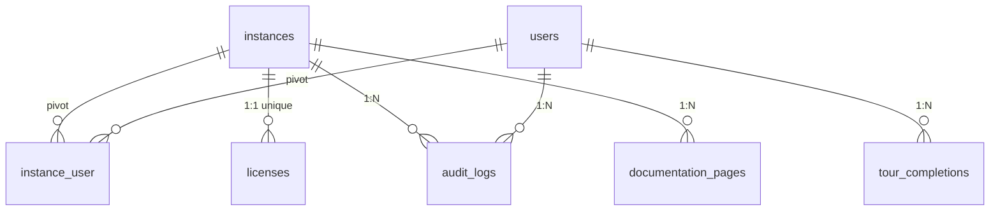

# Module : Core

## 1. Description fonctionnelle
- **Objectif :** Fournir le socle technique partagé par tous les modules — multi-tenancy, système de hooks, audit, middleware stack, gestion des modules et licences.
- **Périmètre métier :** Infrastructure transversale (pas de logique métier propre).
- **Utilisateurs cibles :** Super-admins (backups, maintenance, licences), tous les utilisateurs (tours, documentation), modules (hooks, middleware).

## 2. Liste des fonctionnalités

### 2.1 Fonctionnalités principales
- **[F1] Multi-tenancy par instances** — Résolution d'instance via path (`/i/{slug}/`), subdomain, domain ou header. Middleware stack complet pour isolation.
- **[F2] Système de Hooks** — HookRegistry permet aux modules d'enregistrer menus, widgets, settings, permissions, features, gateways, demo providers sans couplage direct.
- **[F3] Gestion des modules** — ModuleManager track l'état (enabled/disabled) des modules, utilisé par HookManager pour filtrer les hooks.
- **[F4] Audit trail** — Logs d'audit (action, modèle, old/new values, IP, user-agent) par instance.
- **[F5] Backups** — Sauvegarde manuelle/programmée de la base de données avec historique.
- **[F6] Maintenance mode** — Activation/désactivation du mode maintenance par instance avec IPs autorisées.
- **[F7] Documentation intégrée** — Pages de documentation éditables par instance, avec visibilité par rôle.
- **[F8] Tours/Onboarding** — Système de tours guidés avec suivi de complétion par utilisateur.
- **[F9] Licences** — Vérification et suivi des licences par instance (API).
- **[F10] Cron monitoring** — Logs des tâches planifiées avec durée et statut.

### 2.2 Sous-fonctionnalités
- Thèmes (switch UI via ThemeController)
- Security Headers (middleware automatique)
- `BelongsToInstance` trait (GlobalScope pour isolation données)
- `CurrentInstance` singleton (accès instance courante)
- `TeamContext` (contexte Spatie teams)

### 2.3 Cas d'usage clés
- Super-admin → active le mode maintenance sur une instance → les utilisateurs voient le message, les IPs whitelistées passent
- Module Eshop360 → boot → enregistre hooks (menus, widgets, permissions) → Core les distribue aux vues
- Artisan command → exécute backup → Core logge dans `backup_logs`
- Requête entrante → middleware stack Core résout l'instance → injecte dans le contexte → tous les modules scoped

## 3. Composants techniques associés

| Type | Classe/Fichier | Rôle |
|------|----------------|------|
| ServiceProvider | `CoreServiceProvider` | Enregistre HookRegistry, ModuleManager, HookManager, sous-providers |
| ServiceProvider | `CoreHttpServiceProvider` | Middleware aliases (8 alias) |
| ServiceProvider | `CoreAuthServiceProvider` | `Gate::before` pour super-admin bypass avec team context |
| ServiceProvider | `CoreConsoleServiceProvider` | Commande `DatabaseBackup` |
| Controller | `BackupController` | CRUD backups, download, restore |
| Controller | `MaintenanceController` | Toggle/update maintenance |
| Controller | `AuditLogController` | Liste/détail audit logs |
| Controller | `DocumentationController` | CRUD pages documentation |
| Controller | `TourController` | Tours disponibles, steps, complétion |
| Controller | `ThemeController` | Liste/switch thèmes |
| Controller | `CronLogController` | Affichage logs cron |
| Controller (API) | `LicenseApiController` | Vérification/statut licences |
| Hooks | `HookManager` | Boot tous les HooksProviders des modules actifs |
| Hooks | `HookRegistry` | Registre central (menu, widgets, settings, permissions, features, gateways, demo) |
| Support | `CurrentInstance` | Singleton accès instance courante |
| Support | `TeamContext` | Gestion contexte Spatie teams |
| Service | `LicenseManager` | Validation licences |
| Service | `RolePermissionManager` | Orchestration rôles/permissions |
| Service | `TourService` | Gestion tours |
| Middleware | `BindInstanceFromRoute` | Résolution instance depuis route param |
| Middleware | `EnsureInstanceResolved` | Vérifie qu'une instance est résolue |
| Middleware | `SetSpatieTeamContextFromInstance` | Injecte team_id dans Spatie |
| Middleware | `CheckInstanceMaintenance` | Bloque si maintenance active |
| Middleware | `EnsureInstanceMembershipActive` | Vérifie membership active |
| Middleware | `EnsureRootSuperAdmin` | Réservé super-admin ROOT |
| Middleware | `RedirectIfNotInstalled` | Redirige vers installer |
| Middleware | `RedirectRootAfterInstall` | Redirige après installation |
| Middleware | `SecurityHeaders` | Headers sécurité HTTP |
| Policy | `InstancePolicy` | view/manage instances |
| Policy | `ModulePolicy` | view/manage modules |
| Trait | `BelongsToInstance` | GlobalScope isolation tenant |
| Trait | `LogsCronExecution` | Wrapper logging cron |

## 4. Modèle de données

### 4.1 Tables propres au module

| Table | Description | Colonnes clés |
|-------|-------------|---------------|
| `modules` | État des modules (connection: system) | name (unique), is_enabled, meta (json) |
| `instance_user` | Pivot user/instance (connection: system) | instance_id + user_id (PK composite), status (active/invited/disabled) |
| `licenses` | Licences par instance (connection: system) | instance_id (unique), license_key (unique), type, status, expires_at |
| `audit_logs` | Journal d'audit | instance_id, user_id, action, model, model_id, old_values, new_values |
| `backup_logs` | Historique sauvegardes | filename, size_bytes, type, status, created_by |
| `cron_logs` | Logs tâches planifiées | command, status, output, duration_ms, executed_at |
| `tour_completions` | Suivi complétion tours | user_id + tour_id (unique), completed_at |
| `documentation_pages` | Pages documentation | instance_id + slug (unique), title, content, category, role_visibility |

### 4.2 Tables partagées

| Table | Utilisée par | Champ de jointure |
|-------|-------------|-------------------|
| `instances` | Core, Auth, Billing, Eshop360, tous | `instance_id` (FK) |
| `users` | Core, Auth, Users, Eshop360 | `user_id` (FK) |
| `roles` / `permissions` | Core (Spatie), Users, Eshop360 | `team_id` = `instance_id` |

### 4.3 Relations clés

## 5. Dépendances

| Vers le module | Type | Niveau de couplage | Justification |
|---------------|------|-------------------|---------------|
| — | — | — | Core est le socle, il ne dépend d'aucun autre module |

**Note :** Tous les autres modules dépendent de Core.

## 6. Points sensibles

- **Zone critique :** Le middleware stack est l'épine dorsale — tout désordre dans l'ordre des middleware casse l'isolation tenant.
- **Risque de régression :** `CoreAuthServiceProvider` fait un `Gate::before` avec switch team_id (0 pour super-admin) — toute modification risque de casser l'auth globale.
- **Code legacy :** `CoreController` semble être un CRUD générique non utilisé directement (hérité du scaffold nwidart).
- **`modules` table sur connection system :** Si la DB system est down, le boot des hooks échoue silencieusement (design défensif via try/catch dans InstanceResolver).
