# Module : Eshop360

## 1. Description fonctionnelle
- **Objectif :** Module métier e-commerce / gestion commerciale complète — couvre le cycle complet de l'activité d'un commerce (pharmacie, distribution, retail) : catalogue, POS, stocks, clients, fournisseurs, achats, importations, facturation, commandes en ligne, canaux revendeurs, finance, RH, projets, rapports et API.
- **Périmètre métier :** Commerce de détail, distribution, pharmacie (Codifarm/SAPHIR), gestion commerciale complète.
- **Utilisateurs cibles :** Caissiers (POS), managers (rapports, stocks), instance-admins (configuration, canaux), revendeurs (portail channel), clients finaux (portail client, commandes en ligne).

## 2. Liste des fonctionnalités

### 2.1 Fonctionnalités principales

| Code | Fonctionnalité | Description |
|------|---------------|-------------|
| F1 | **Catalogue produits** | CRUD produits, catégories hiérarchiques, marques, variations (SKU), groupes de produits, codes-barres/QR |
| F2 | **Gestion des stocks** | Multi-entrepôts, multi-magasins, mouvements (in/out/adjustment/transfer/return), transferts inter-dépôts, alertes stock bas, alertes expiration |
| F3 | **Point de vente (POS)** | Interface POS (5 layouts), caisse enregistreuse, holdings (paniers suspendus), wallet client, impression tickets |
| F4 | **Panier & Checkout** | Panier session (scoped instance+channel), persistance DB 7j, coupons, calcul taxes, multi-variation |
| F5 | **Commandes** | Cycle complet (pending→processing→completed→cancelled→refunded), statut paiement, source (pos/online/manual) |
| F6 | **Facturation** | Factures, factures récurrentes, devis (quotations), conversion devis→facture, PDF, email, templates |
| F7 | **Clients & CRM** | CRUD clients, groupes, wallet, points fidélité, historique, dues (créances), transactions, portail client |
| F8 | **Fournisseurs & Achats** | CRUD fournisseurs, bons de commande, réception, retours fournisseurs |
| F9 | **Importations** | Commandes d'import (sea/air/land), coûts d'import (freight/customs/tax/…), allocation coûts (par valeur ou quantité), calcul prix de revient réel |
| F10 | **Commandes en ligne** | Cycle complet (pending_validation→validated→preparing→shipping→delivered→received→invoiced→cancelled) |
| F11 | **Canaux de distribution** | Canaux revendeurs, portail channel complet (POS, stocks, clients, rapports, marge), tarification par canal |
| F12 | **Marges & Pricing** | Marge tripartite (debt/channel/owner), PGHT, calcul prix canal automatique, override manuel |
| F13 | **Finance** | Comptes bancaires/cash/mobile, dépenses/revenus, prêts, cartes cadeaux, plans échelonnement, P&L |
| F14 | **Promotions** | Coupons (% ou fixe), remises (plans, segments), limites d'usage |
| F15 | **Rapports** | Ventes, inventaire, produits, bestsellers, clients, achats, factures, avancés (cashbook, P&L, taxes, canaux, charges) |
| F16 | **Exports** | CSV/XLSX pour produits, ventes, factures, clients, fournisseurs, stocks |
| F17 | **RH** | Employés, salaires, commissions, pointage |
| F18 | **Projets & Tâches** | Projets avec budget, tâches (Kanban), commentaires, événements |
| F19 | **Communication** | Messages internes, email templates, SMS (7 drivers), envois en masse |
| F20 | **Support** | Tickets support, messages, priorités, statuts |
| F21 | **API REST** | API complète (produits, stocks, clients, ventes, achats, rapports, commandes en ligne, dashboard, canaux, charges) |
| F22 | **Charges d'exploitation** | Charges fixes (loyer, électricité, salaires…), accumulation temps réel, absorption coûts |
| F23 | **FNE** | Signature électronique de factures (Facture Normalisée Électronique) |

### 2.2 Sous-fonctionnalités
- Navigation hiérarchique dynamique (HierarchicalMenuService)
- Webhooks sortants (order.created, etc.)
- Impression thermique (ESC/POS)
- Assignation utilisateur ↔ ressources (entrepôts, magasins)
- Paramètres spécifiques (POS, imprimante, facture, FNE, général)

### 2.3 Cas d'usage clés

| Acteur | Action | Résultat |
|--------|--------|----------|
| Caissier | Scanne produit au POS → ajoute au panier → valide | Commande créée, stock déduit, ticket imprimé |
| Manager | Consulte rapports avancés → P&L du mois | Vue financière complète avec comparaison période précédente |
| Admin | Crée un canal "Revendeur Abidjan" → configure marge | Canal actif, portail dédié, prix calculés automatiquement depuis PGHT |
| Client en ligne | Passe commande sur portail → paye → reçoit confirmation | OnlineOrder créée, statut pending_validation |
| Gestionnaire stock | Crée transfert inter-dépôts → valide | Stock déduit source, crédité destination, mouvements tracés |
| Comptable | Enregistre dépense → consulte P&L | Dépense catégorisée, P&L mis à jour |

## 3. Composants techniques associés

### Contrôleurs (78 fichiers)

| Domaine | Contrôleurs | Méthodes clés |
|---------|-------------|---------------|
| Catalogue | ProductController, CategoryController, BrandController, BarcodeController | CRUD + variations + bulk + barcode generation |
| Stocks | StockController, StockAdjustmentController, StockTransferController, WarehouseController | CRUD + alertes + transferts |
| Ventes/POS | SaleController, PosController, CartController, CheckoutController | 5 layouts POS, register, holdings, wallet |
| Commandes | OrderController, OnlineOrderController | CRUD + receipts + status management |
| Clients | CustomerController, CustomerPortalController, ChannelCustomerPortalController | CRUD + wallet + stats + due tracking + portail |
| Achats | PurchaseController, PurchaseReturnController | CRUD + receiving + stock allocation |
| Factures | InvoiceController, RecurringInvoiceController | CRUD + payments + PDF + email + templates |
| Canaux | ChannelController + 15 ChannelPortal* controllers | Portail complet (POS, stocks, clients, rapports, settings) |
| Finance | AccountController, ExpenseController, IncomeController, GiftCardController, InstallmentController, LoanController | Comptes + dépenses + revenus + cartes + prêts |
| Rapports | ReportController, AdvancedReportController, ExportController | Rapports + analytics + export multi-format |
| RH | EmployeeController, AttendanceController, SalaryController | CRUD + pointage + paie |
| Projets | ProjectController, TaskController, EventController | Projets + tâches Kanban + événements |
| Communication | MessageController, BulkMessageController, SmsGatewayController, EmailTemplateController | Messages + SMS + email |
| Support | SupportTicketController | Tickets + réponses |
| Paiements | CinetPayController, InetPayController, PaymentGatewayController, PublicPaymentController | Gateways + callbacks + paiement public |
| Imports | ImportController | Commandes import + coûts + simulation + réception |
| API | ApiController | API REST complète |
| Config | EshopSettingsController, UserAssignmentController, WebhookController | Paramètres + assignations + webhooks |

### Services (45+ fichiers)

| Service | Rôle | Singletons |
|---------|------|------------|
| `OrderService` | Création commande, paiement, statut, commissions | ✅ |
| `StockService` | Ajustement stock, transferts, alertes | ✅ |
| `InvoiceService` | Génération factures, paiements, numérotation | ✅ |
| `CartService` | Panier session + persistance DB | ✅ |
| `ProductPricingService` | Résolution prix (channel/default/discount) | ✅ |
| `MarginService` | Marge tripartite, sync, summary | ✅ |
| `CostCalculatorService` | PGHT, prix canal, prix de revient réel | ✅ |
| `FinanceService` | Comptes, wallet, cartes cadeaux, installments, P&L | ✅ |
| `ChannelAccessService` | Contrôle accès canaux | ✅ |
| `ChannelB2BService` | Opérations B2B canaux | ✅ |
| `OnlineOrderService` | Traitement commandes en ligne | ✅ |
| `ChargesService` | Charges d'exploitation | ✅ |
| `ImportService` | Import orders + costing | ✅ |
| `ReportService` | Génération rapports + cache | ✅ |
| `HRService` | Employés, commissions, salaires | ✅ |
| `PaymentGatewayManager` | Orchestration multi-gateways (10 drivers) | — |
| `SmsManager` + 7 drivers | SMS multi-provider | — |
| `PdfService` | Génération PDF | ✅ |
| `ExportService` | Export CSV/XLSX | ✅ |
| `AuditService` | Audit trail module | ✅ |
| `WebhookService` | Dispatch webhooks sortants | ✅ |
| `FeatureGate` | Feature flags (deprecated → Billing) | ✅ |

### Middleware (11 fichiers)

| Middleware | Alias | Rôle |
|-----------|-------|------|
| `ApiInstanceAuth` | `eshop360.api.auth` | Auth API par instance |
| `ApiLogger` | `eshop360.api.log` | Logging requêtes API |
| `ResolveChannel` | `eshop.channel.resolve` | Résolution canal depuis route |
| `ChannelMember` | `eshop.channel.member` | Vérifie membership canal |
| `ChannelRole` | `eshop.channel.role` | Vérifie rôle canal |
| `EnsureChannelFeature` | `eshop.channel.feature` | Feature flags par canal |
| `EnsurePaidFeature` | (fallback) | Feature flags payantes (fallback si Billing absent) |
| `ResolveUserAssignments` | `eshop.user.assignments` | Résolution assignations user |
| `ApplyChannelContext` | `eshop.channel.context` | Applique contexte canal |
| `ApplyCurrentInstanceUrlDefaults` | — | URL defaults instance |

### Events & Listeners

| Event | Listener | Effet |
|-------|----------|-------|
| `ReportDataChanged` | `InvalidateReportCache` | Invalide cache rapports par domaine (sales/stock/finance/all) |

### Jobs

| Job | Queue | Comportement |
|-----|-------|-------------|
| `SendBulkEmail` | ✅ | Chunks 50 destinataires, track envoyés/échecs |
| `SendBulkSms` | ✅ | Chunks 50 destinataires, track envoyés/échecs |

### Console Commands (9)

| Commande | Schedule |
|----------|----------|
| `eshop360:stock-alerts` | Daily 07:00 |
| `eshop360:expiry-alerts --days=30` | Daily 07:15 |
| `eshop360:expiry-alerts --days=7` | Daily 07:20 |
| `eshop360:installment-reminders` | Daily 08:00 |
| `eshop360:birthday-alerts` | Daily 09:00 |
| `eshop360:recurring-invoices` | Daily 06:00 |
| `eshop:generate-recurring-invoices` | Daily 07:00 |
| `eshop360:expire-subscriptions` | Hourly |
| `eshop:check-low-stock` | Hourly |

### Notifications (5)

- `ExpiryAlertNotification`, `LowStockNotification`, `NewOrderNotification`, `NewSupportTicketNotification`, `PaymentReceivedNotification`

## 4. Modèle de données

### 4.1 Tables propres au module (128 migrations)

**Catalogue (7 tables)**
- `eshop_products` — Produit principal (instance_id+sku unique), 30+ colonnes, soft deletes
- `eshop_product_variations` — Variantes SKU (product_id FK cascade)
- `eshop_categories` — Catégories hiérarchiques (parent_id self-join)
- `eshop_brands` — Marques
- `eshop_taxes`, `eshop_product_taxes` — Taxes inclusive/exclusive par produit
- `eshop_product_groups`, `eshop_product_group_items` — Groupes logiques

**Stocks & Entrepôts (6 tables)**
- `eshop_warehouses` — Entrepôts (instance_id+code unique)
- `eshop_stores` — Magasins liés à un entrepôt
- `eshop_stocks` — Niveaux de stock (instance+product+warehouse+store unique)
- `eshop_stock_movements` — Journal mouvements (in/out/adjustment/transfer/return)
- `eshop_stock_transfers`, `eshop_stock_transfer_items` — Transferts inter-dépôts

**Ventes & Commandes (8 tables)**
- `eshop_orders`, `eshop_order_items` — Commandes POS/manuelles
- `eshop_online_orders`, `eshop_online_order_items` — Commandes en ligne
- `eshop_invoices`, `eshop_invoice_items` — Factures
- `eshop_quotations`, `eshop_quotation_items` — Devis
- `eshop_sale_returns` — Retours ventes

**Clients (4 tables)**
- `eshop_customers` — Clients (instance_id+code unique)
- `eshop_customer_groups` — Segments clients
- `eshop_customer_transactions` — Transactions wallet
- `eshop_customer_dues` — Créances clients

**Fournisseurs & Achats (7 tables)**
- `eshop_suppliers`, `eshop_supplier_store` — Fournisseurs + liaison magasins
- `eshop_purchase_orders`, `eshop_purchase_items` — Commandes achat
- `eshop_purchase_returns`, `eshop_purchase_return_items` — Retours achat
- `eshop_import_orders`, `eshop_import_order_items`, `eshop_import_costs` — Importations

**Finance (12 tables)**
- `eshop_accounts`, `eshop_account_transactions`, `eshop_account_transfers` — Comptes
- `eshop_payments`, `eshop_payment_methods` — Paiements polymorphiques
- `eshop_expenses`, `eshop_expense_categories` — Dépenses
- `eshop_incomes`, `eshop_income_sources` — Revenus
- `eshop_loans`, `eshop_loan_payments` — Prêts
- `eshop_gift_cards`, `eshop_gift_card_topups` — Cartes cadeaux
- `eshop_installment_plans`, `eshop_installment_payments` — Échelonnements

**Canaux & Marges (5 tables)**
- `eshop_distribution_channels` — Canaux revendeurs
- `eshop_channel_product_prices` — Prix par canal (channel+product unique)
- `eshop_channel_margin_logs` — Logs marge tripartite
- `eshop_codifarm_margin_config` — Config marge Codifarm (legacy)
- `eshop_codifarm_margin_logs` — Logs marge Codifarm (legacy)

**Promotions (3 tables)**
- `eshop_coupons` — Codes promo
- `eshop_discounts` — Remises
- `eshop_discount_plans` — Plans de remise

**RH (4 tables)**
- `eshop_employees` — Employés (soft deletes)
- `eshop_employee_salaries` — Fiches de paie
- `eshop_employee_commissions` — Commissions
- `eshop_attendance` — Pointage

**Opérations (4 tables)**
- `eshop_cash_registers` — Caisses enregistreuses
- `eshop_holdings` — Paniers suspendus (items JSON)
- `eshop_company_charges`, `eshop_charge_logs` — Charges + accumulation
- `eshop_persistent_carts` — Paniers persistants (7j)

**Communication (4 tables)**
- `eshop_email_templates` — Templates email
- `eshop_sms_gateways`, `eshop_sms_logs` — SMS gateways + logs
- `eshop_messages` — Messages internes

**Support (2 tables)**
- `eshop_support_tickets`, `eshop_ticket_messages` — Tickets + messages

**Projets (2 tables)**
- `eshop_projects`, `eshop_tasks` — Projets + tâches

**Audit & Intégrations (4 tables)**
- `eshop_audit_logs` — Audit trail module
- `eshop_webhooks`, `eshop_webhook_logs` — Webhooks + logs
- `eshop_api_logs` — Logs API

**Autre**
- `eshop_receipt_templates` — Templates tickets de caisse
- `eshop_fne_invoices` — Factures FNE signées
- `eshop_events` — Événements projets
- `eshop_module_settings` [À VÉRIFIER]
- `eshop_user_assignments` — Assignations user ↔ ressources

### 4.3 Relations clés

```mermaid
erDiagram
    eshop_products ||--o{ eshop_product_variations : "1:N"
    eshop_products ||--o{ eshop_order_items : "1:N"
    eshop_products ||--o{ eshop_stocks : "1:N"
    eshop_products }o--|| eshop_categories : "N:1"
    eshop_products }o--|| eshop_brands : "N:1"

    eshop_orders ||--o{ eshop_order_items : "1:N"
    eshop_orders }o--|| eshop_customers : "N:1"
    eshop_orders }o--|| eshop_stores : "N:1"
    eshop_orders }o--o| eshop_distribution_channels : "N:1"
    eshop_orders ||--o{ eshop_payments : "1:N polymorphic"
    eshop_orders ||--o| eshop_invoices : "1:1"
    eshop_orders ||--o{ eshop_channel_margin_logs : "1:N"

    eshop_customers ||--o{ eshop_orders : "1:N"
    eshop_customers ||--o{ eshop_customer_transactions : "1:N"
    eshop_customers ||--o{ eshop_customer_dues : "1:N"

    eshop_warehouses ||--o{ eshop_stores : "1:N"
    eshop_warehouses ||--o{ eshop_stocks : "1:N"
    eshop_stocks ||--o{ eshop_stock_movements : "1:N"

    eshop_distribution_channels ||--o{ eshop_channel_product_prices : "1:N"
    eshop_distribution_channels ||--o{ eshop_channel_margin_logs : "1:N"

    eshop_suppliers ||--o{ eshop_purchase_orders : "1:N"
    eshop_suppliers ||--o{ eshop_import_orders : "1:N"
```

## 5. Dépendances

| Vers le module | Type | Niveau de couplage | Justification |
|---------------|------|-------------------|---------------|
| Core | core | **Fort** | BelongsToInstance, middleware stack complet, HookRegistry (menu, widgets, permissions, settings, features) |
| Users | core | **Fort** | User model, HasRoles, UserAssignment scoping |
| Auth | core | **Fort** | Sessions, login, middleware auth |
| Billing | core | **Fort** | FeatureRegistry, EnsureFeature middleware (paywall) |
| Settings | core | **Moyen** | Lecture/écriture paramètres via EshopSettingsService |
| Currency | core | **Faible** | Conversion devises (pas de couplage direct) |
| Lang | core | **Faible** | Traductions (namespace eshop360 + eshop) |

## 6. Points sensibles

### Zones critiques
- **Race condition stock :** `StockService::adjustStock()` utilise `DB::transaction()` + `increment()` mais pas de `lockForUpdate()`. Sous forte charge POS, risque de corruption stock.
- **Numérotation TOCTOU :** `generateOrderNumber()` et `generateInvoiceNumber()` vérifient l'unicité avant insertion — risque de doublon en concurrence.
- **Wallet auto-pay :** `FinanceService::creditWallet()` lit les dues puis boucle pour payer — risque de double-paiement en concurrence.

### Risques de régression
- **Facturation fragile :** Incohérence `invoice_number` vs `reference`, `tax_rate` manquant sur `invoice_items`.
- **Modèles Project/Task :** Le trait `BelongsToInstance` est manquant → crash runtime. [Documenté dans audits existants]
- **Conversion devis→facture :** Si les champs requis manquent, l'insertion échoue silencieusement.

### Code legacy ou fragile
- **Dual système marge :** `CodifarmMarginConfig` (legacy) et `DistributionChannel` coexistent — duplication de données et de logs.
- **FeatureGate (deprecated) :** Wrapper autour de `Billing\FeatureRegistry`, mais contient des constantes hardcodées (FREE_FEATURES, PAID_FEATURES) qui ne sont plus la source de vérité.
- **InetPayService :** Alias vers CinetPayService (`$this->app->singleton(InetPayService::class, fn ($app) => $app->make(CinetPayService::class))`) — vestiges de migration.
- **Double namespace traductions :** `eshop360` et `eshop` (backward-compat) chargés en parallèle.
- **Module trop gros :** 83 modèles, 78 contrôleurs, 128 migrations, 45+ services — c'est un monolithe dans l'architecture modulaire. Candidat au découpage en sous-modules (Catalog, POS, Finance, HR, CRM, Channel).
