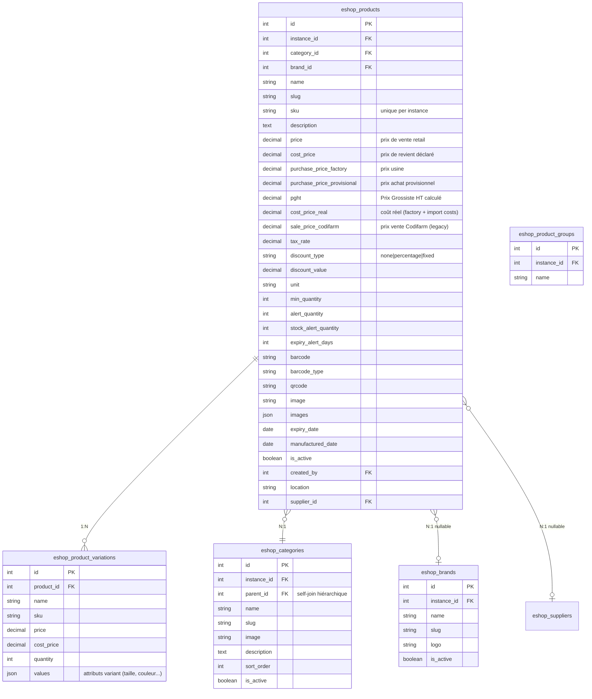
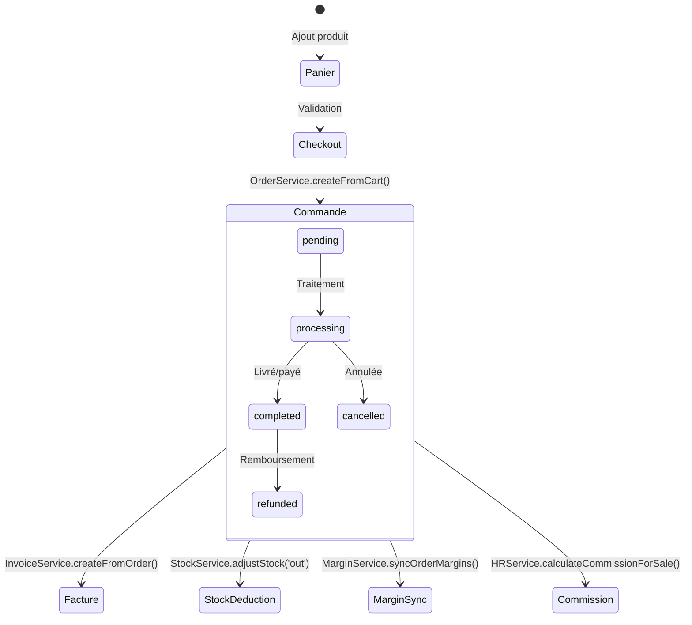
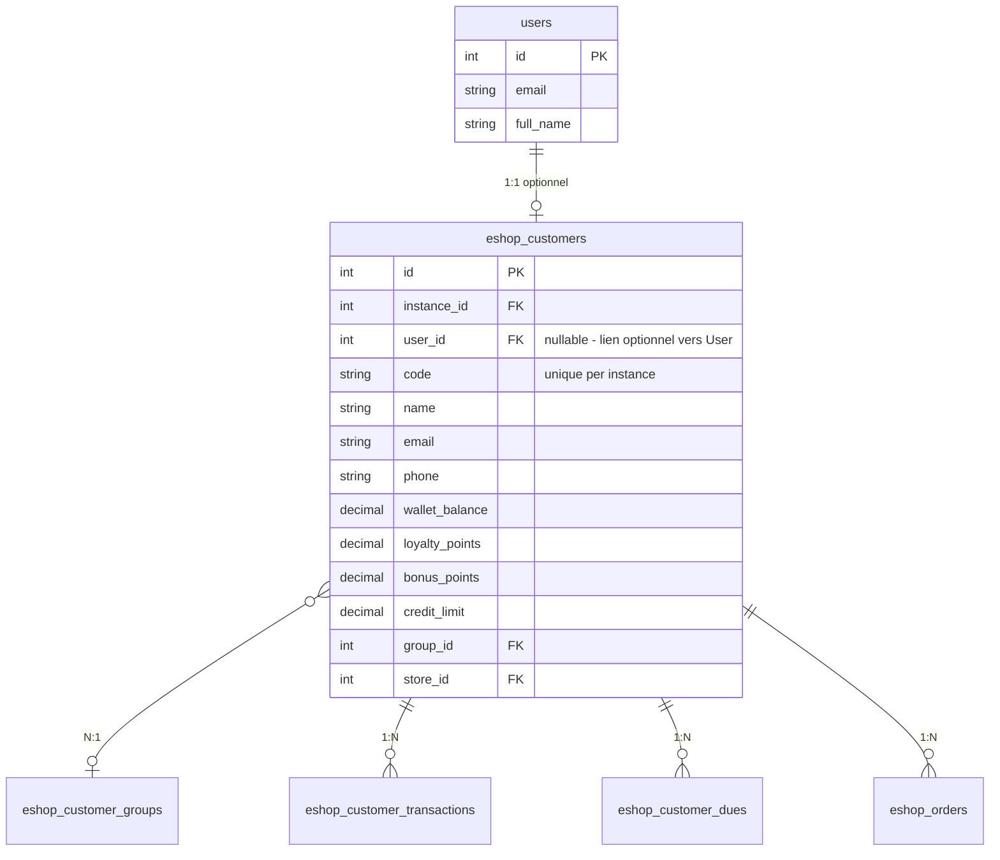

# Focus Eshop360 — Analyse métier approfondie

> **Date :** 2026-04-04
> **Source :** Analyse statique du code (services, modèles, migrations, contrôleurs).

---

## 1. Gestion des produits

### 1.1 Structure des tables



### 1.2 Logique d'import/export

**Import :**
- `ImportController` gère les commandes d'import (import orders) — ce n'est **pas** un import CSV/Excel de produits, mais un flux de commande fournisseur étranger (sea/air/land).
- `ImportService` orchestre : simulation de coûts, allocation, réception, mise à jour stock.
- Pas d'import CSV/Excel de produits identifié dans le code. [À VÉRIFIER]

**Export :**
- `ExportService` exporte les produits en CSV/XLSX (colonnes : name, sku, price, cost_price, category, brand, stock_qty).

### 1.3 Champs personnalisables

- **Non :** Pas de système de champs dynamiques (custom fields). Les colonnes sont fixes dans la migration.
- Le champ `json images` permet des images multiples.
- Le champ `json values` sur les variations permet des attributs libres (taille, couleur, etc.) mais sans schema défini.

### 1.4 Observations

- Le produit contient **6 colonnes de prix** différentes (`price`, `cost_price`, `purchase_price_factory`, `purchase_price_provisional`, `pght`, `cost_price_real`, `sale_price_codifarm`). Cette richesse est liée au modèle SAPHIR (distribution pharmaceutique) mais rend le modèle complexe.
- `sale_price_codifarm` est un vestige du système Codifarm (legacy).

---

## 2. Gestion des prix

### 2.1 Règles de calcul actuelles

Le pricing est géré par **3 services** complémentaires :

**`ProductPricingService::resolve()`** — Point d'entrée unique :
```
SI channelId fourni :
    1. Cherche ChannelProductPrice.sale_price (override explicite)
    2. Si absent/≤0 ET PGHT existe : prix = PGHT × (1 + channel.buy_rate)
    3. Sinon : prix = product.price (fallback)
SINON :
    1. prix = product.price
    2. Si discount_type = 'percentage' : prix -= prix × discount_value / 100
    3. Si discount_type = 'fixed' : prix = max(0, prix - discount_value)
```

**`CostCalculatorService`** — Calculs coûts et marges :
- `PGHT = purchase_price_provisional × (1 + margin_rate)` (défaut margin_rate = 13%)
- `channel_price = PGHT × (1 + channel.buy_rate)`
- `cost_price_real = purchase_price_factory + (allocated_import_costs / quantity)`
- Margin Level 1 (Manager) = `sale_price - purchase_price_provisional`
- Margin Level 2 (Owner) = `sale_price - cost_price_real`

**`DistributionChannel::calculateSalePrice()`** — Calcul prix canal (sur le modèle).

### 2.2 Tables liées

| Table | Rôle |
|-------|------|
| `eshop_products` | 6 colonnes prix (retail, cost, factory, provisional, pght, real) |
| `eshop_channel_product_prices` | Prix par canal (channel_id + product_id unique), flag `is_manual_override` |
| `eshop_distribution_channels` | margin_rate, buy_rate, debt_share, channel_share, owner_share |
| `eshop_codifarm_margin_config` | Legacy : saphir_margin_rate, codifarm_buy_rate, debt/codifarm/saphir shares |
| `eshop_taxes`, `eshop_product_taxes` | Taxes (inclusive/exclusive) par produit |
| `eshop_coupons` | Codes promo (% ou fixe) |
| `eshop_discounts` | Remises par segment |

### 2.3 Comportement observé

- **Prix HT/TTC :** Les prix produit sont **HT par défaut**. La taxe est appliquée via `eshop_product_taxes` (inclusive = TTC déjà inclus, exclusive = ajoutée au montant).
- **Remises :** Trois niveaux possibles — produit (discount_type/value), coupon (CartService), canal (marge automatique).
- **Coupons :** Validés dans `CartService::applyCoupon()`, appliqués au checkout. Pas de validation à la conversion commande (risque coupon expiré entre panier et checkout).
- **Pricing automatique canaux :** `CostCalculatorService::updateProductPricing()` recalcule automatiquement les prix de tous les canaux actifs (sauf overrides manuels) quand le `purchase_price_provisional` change.

---

## 3. Commandes / Panier

### 3.1 Cycle de vie



### 3.2 Tables

| Table | Colonnes clés | Rôle |
|-------|---------------|------|
| `eshop_orders` | order_number, status (pending/processing/completed/cancelled/refunded), payment_status (unpaid/partial/paid/overdue), source (pos/online/manual), channel_id, store_id, warehouse_id, cash_register_id | Commande principale |
| `eshop_order_items` | order_id, product_id, product_name, sku, quantity, unit_price, discount, tax, total | Lignes commande |
| `eshop_persistent_carts` | user_id, instance_id, channel_id, items (JSON), expires_at | Panier persistant (7j) |
| `eshop_holdings` | reference, items (JSON), customer_id, totals | Panier suspendu (POS) |
| `eshop_payments` | payable_type+payable_id (polymorphic), amount, method, status | Paiements |
| `eshop_cash_registers` | store_id, user_id, opening_amount, closing_amount, status (open/closed) | Session caisse |

### 3.3 Événements déclenchés

| Moment | Action | Service |
|--------|--------|---------|
| Création commande | Stock déduit | `StockService::adjustStock('out')` |
| Création commande | Marge sync | `MarginService::syncOrderMargins()` |
| Création commande | Webhook dispatch | `WebhookService` → `order.created` |
| Création commande | Report cache invalidé | `ReportDataChanged` event |
| Commande completed | Commission calculée | `HRService::calculateCommissionForSale()` |
| Paiement reçu | Sync montants | `OrderService::syncPaidAmount()` |

### 3.4 Flux détaillé OrderService::createFromCart()

1. Lecture panier session (CartService)
2. `DB::transaction()` :
   - Normalisation items (pricing résolu via `ProductPricingService::resolve()`)
   - Calcul remises (3 mécanismes : explicit discount, original_price delta, product discount_type)
   - Calcul taxes : `tax = (subtotal - discount) × tax_rate / 100`
   - Création `Order` + `OrderItem`s
   - Déduction stock par item (`StockService::adjustStock()`)
   - Si `paid_amount > 0` : création `Payment`, sync montants
   - Sync marges (`MarginService::syncOrderMargins()`)
   - Dispatch event `ReportDataChanged`
3. Clear panier session

---

## 4. Clients

### 4.1 Lien avec User / Customer

Le modèle `Customer` (Eshop360) est **distinct** du modèle `User` (Core) :



- Un `Customer` **peut** être lié à un `User` (pour le portail client en ligne) mais ce n'est pas obligatoire.
- Les clients POS sont souvent créés sans compte User.

### 4.2 Champs spécifiques Eshop

| Champ | Usage |
|-------|-------|
| `wallet_balance` | Solde portefeuille client (crédité via `FinanceService::creditWallet()`) |
| `loyalty_points` | Points de fidélité (accumulation) |
| `bonus_points` | Points bonus |
| `credit_limit` | Plafond de crédit autorisé |
| `group_id` | Segment client (avec `discount_rate` sur le groupe) |
| `store_id` | Magasin de rattachement |
| `date_of_birth` | Pour alertes anniversaire (`eshop360:birthday-alerts`) |
| `tax_number` | Numéro fiscal |
| `company_name` | Client entreprise |

### 4.3 Wallet et Dues

**`FinanceService::debitWallet()`** :
1. Déduit de `wallet_balance` (jusqu'à épuisement)
2. Le reste crée un `CustomerDue` (si `credit_limit` le permet)
3. Enregistre `CustomerTransaction` (type: debit)

**`FinanceService::creditWallet()`** :
1. Crédite `wallet_balance`
2. Auto-paye les `CustomerDue` en attente (FIFO par `due_date`)
3. Met à jour le statut des dues (pending → paid, partial)

---

## 5. Stock

### 5.1 Module stock intégré

Le stock est **intégré dans Eshop360** (pas de module dédié). L'InventoryX existe comme squelette vide.

### 5.2 Tables

| Table | Description |
|-------|-------------|
| `eshop_stocks` | Niveaux : quantity, reserved_quantity. Unique par (instance, product, warehouse, store) |
| `eshop_stock_movements` | Journal : type (in/out/adjustment/transfer/return), reference polymorphique |
| `eshop_stock_transfers` | Transferts inter-dépôts : from_warehouse → to_warehouse |
| `eshop_stock_transfer_items` | Ligne de transfert (product_id, quantity) |
| `eshop_warehouses` | Entrepôts (code unique par instance) |
| `eshop_stores` | Magasins liés à un entrepôt |

### 5.3 Règles de réservation / déstockage

**`StockService::adjustStock()`** :
- Normalise les alias de type :
  - `addition/purchase/in/receive/received/import` → `+abs(qty)`
  - `subtraction/sale/out/consume` → `-abs(qty)`
  - `adjustment/transfer/return` → qty avec signe
- Résolution entrepôt automatique : explicite > stock existant le plus élevé > premier entrepôt actif
- Vérifie `new_quantity ≥ 0` (exception si insuffisant)
- Utilise `DB::transaction()` + `increment/decrement` atomique
- **Pas de `lockForUpdate()`** → risque race condition sous charge

**Réservation :**
- Le champ `reserved_quantity` existe mais **n'est pas utilisé systématiquement** dans les flux observés. `getAvailableQuantity()` le soustrait pour le calcul disponible.
- [À VÉRIFIER] : Vérifier si le checkout réserve du stock ou si c'est fire-and-forget.

### 5.4 Inventaire physique

**Non implémenté.** Pas de table `eshop_inventories` ni de fonctionnalité de comptage physique identifiée. Le module InventoryX était peut-être prévu pour ça.

### 5.5 Batch/lot tracking

**Non implémenté.** Les produits ont `expiry_date` et `manufactured_date` mais pas de gestion par lot/batch.

---

## 6. Intégration avec les autres modules

### 6.1 Appels sortants

| Vers | Mécanisme | Détail |
|------|-----------|--------|
| **Core** (HookRegistry) | HooksProvider | Enregistre menus, widgets, permissions, settings, features, demo data |
| **Core** (BelongsToInstance) | Trait/Scope | Isolation tenant automatique sur tous les modèles |
| **Billing** (FeatureRegistry) | Service | Vérifie accès features payantes |
| **Settings** (SettingsManager) | Service indirect | Via `EshopSettingsService` qui wraps les settings module |
| **Webhooks externes** | WebhookService | Dispatch événements (order.created, etc.) vers URLs configurées |
| **Passerelles paiement** | CinetPay, InetPay, etc. | Appels API vers services de paiement |
| **Services SMS** | SmsManager (7 drivers) | Envoi SMS transactionnels et bulk |
| **Services Email** | EmailService | Envoi emails (factures, notifications, templates) |

### 6.2 Points d'entrée reçus (events écoutés)

| Event | Source | Listener |
|-------|--------|----------|
| `ReportDataChanged` | Eshop360 (interne) | `InvalidateReportCache` |
| (Pas d'events externes écoutés) | — | — |

**Note :** Eshop360 n'écoute aucun événement provenant d'autres modules. C'est un module autonome qui ne dépend que des services Core/Billing.

### 6.3 Ce qui est réutilisable globalement

| Composant | Potentiel de réutilisation | Effort |
|-----------|---------------------------|--------|
| **CartService** | Moteur de panier générique (session-based, scoped) | Faible — extraire en package |
| **PaymentGatewayManager** + 10 drivers | Système de paiement multi-gateway | Moyen — extraire contrats + drivers |
| **SmsManager** + 7 drivers | Envoi SMS multi-provider | Faible — déjà découplé |
| **PdfService** | Génération PDF | Faible — générique |
| **ExportService** | Export CSV/XLSX | Faible — générique |
| **WebhookService** | Dispatch webhooks outbound | Faible — générique |
| **ReportService** (cache pattern) | Cache invalidation par domaine via events | Moyen |

### 6.4 Ce qui est trop spécifique / couplé

| Composant | Problème | Impact |
|-----------|----------|--------|
| **CodifarmMarginConfig** | Lié à un modèle de distribution spécifique (pharmacie Codifarm/SAPHIR) | Double système de marge avec DistributionChannel |
| **6 colonnes de prix sur Product** | Modèle prix SAPHIR (factory, provisional, pght, real) imbriqué dans le produit | Complexité pour les non-pharma |
| **FneService/FneController** | Spécifique à la réglementation FNE (Côte d'Ivoire) | Non réutilisable hors contexte légal |
| **sale_price_codifarm** | Vestige du modèle Codifarm | Pollution du schéma produit |
| **HRService intégré** | RH couplé au module commerce | Devrait être un module séparé |
| **ProjectController/TaskController** | Gestion de projets dans un module e-commerce | Aucune cohérence métier |

---

## 7. Synthèse des risques Eshop360

| # | Risque | Sévérité | Localisation |
|---|--------|----------|-------------|
| 1 | Race condition stock (pas de lock) | **CRITIQUE** | `StockService::adjustStock()` |
| 2 | TOCTOU order/invoice number | **HAUT** | `OrderService::generateOrderNumber()`, `InvoiceService::generateInvoiceNumber()` |
| 3 | Double-paiement wallet auto-pay | **HAUT** | `FinanceService::creditWallet()` |
| 4 | CostCalculator non transactionnel | **MOYEN** | `CostCalculatorService::updateProductPricing()` |
| 5 | Modèles Project/Task cassés | **HAUT** | Trait `BelongsToInstance` manquant |
| 6 | Facturation incohérente | **HAUT** | `invoice_number` vs `reference`, `tax_rate` manquant |
| 7 | Dual système marge | **MOYEN** | Codifarm vs DistributionChannel |
| 8 | Coupon non revalidé au checkout | **MOYEN** | `CartService` → `OrderService` |
| 9 | reserved_quantity non exploité | **MOYEN** | `StockService` |
| 10 | Module monolithique | **HAUT** (dette technique) | 83 modèles, 78 controllers, 128 migrations |
