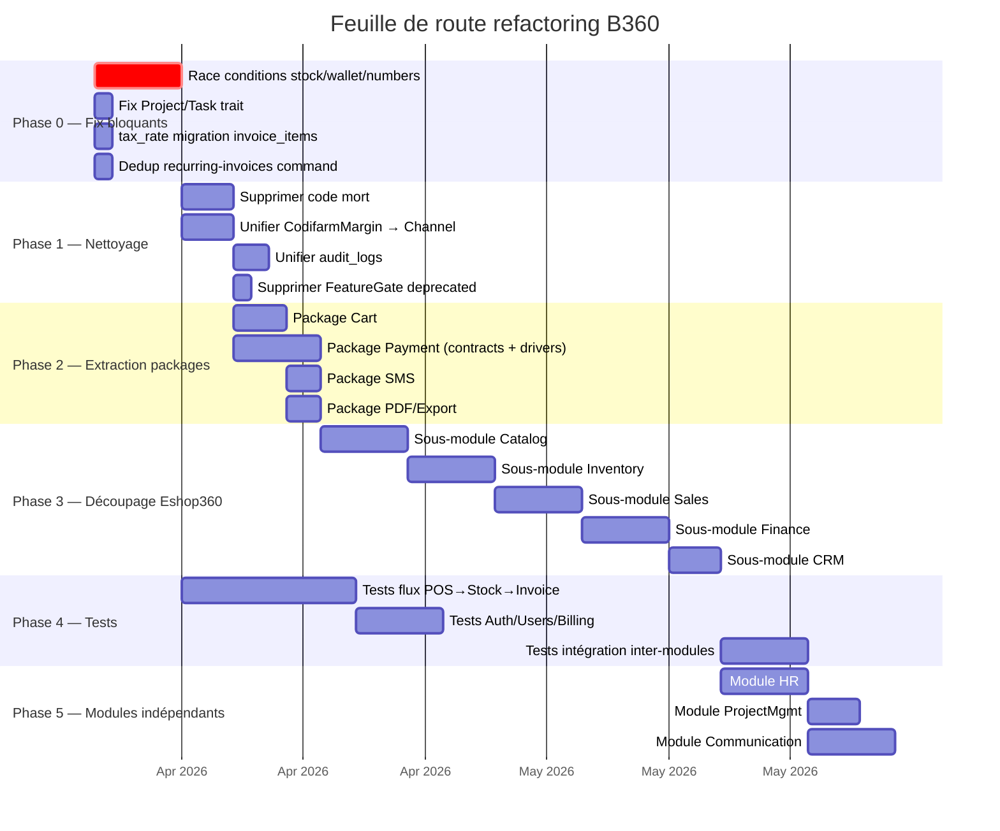

# Résumé stratégique — B360 + Eshop360

> ⚠️ **Archive historique (pré-R-101).** Certains constats ont été résolus depuis ; lire d'abord `docs/context/PROJECT_DIGEST.md`, `docs/memory/OPEN_RISKS.md`, `docs/memory/RECENT_DECISIONS.md` et les ADR pertinents. Voir aussi [`DOCUMENTATION_INDEX.md`](../DOCUMENTATION_INDEX.md) pour la taxonomy.

> **Date :** 2026-04-04
> **Audience :** CTO, Lead Dev, Architecte — vision actionnable pour piloter l'évolution du produit.

---

## 1. État réel de l'application

### 1.1 Maturité

| Composant | Maturité | Commentaire |
|-----------|----------|------------|
| **Socle plateforme** (Core, Auth, Users, Instances, Billing, Settings) | **Production mature** | Architecture solide, multi-tenancy fonctionnelle, hooks extensibles, middleware stack bien ordonné |
| **Modules support** (Lang, Currency, Dashboard, Demo, ModuleManager, Installer) | **Production stable** | Simples, efficaces, peu de dettes |
| **Eshop360 — POS/Stocks/Rapports/Canaux** | **Production early** | Fonctionnel mais avec des risques de concurrence non traités |
| **Eshop360 — Facturation/Devis** | **Beta fragile** | Incohérences schéma, champs manquants |
| **Eshop360 — RH/Projets/Communication** | **Alpha/cassé** | Trait manquant, fonctionnalités greffées sans cohérence |
| **InventoryX** | **Non démarré** | Squelette vide |

**Verdict global : Production early-stage avec des zones critiques à stabiliser avant scale-up.**

### 1.2 Cohérence documentation ↔ code

| Aspect | Score | Détail |
|--------|-------|--------|
| Architecture globale | **85%** | Bien documentée dans les audits existants |
| Eshop360 fonctionnalités | **70%** | Les audits eshop/ identifient correctement les niveaux mais pas tous les détails techniques |
| Incohérences connues | **75%** | Les audits listent les problèmes majeurs mais pas les race conditions |
| Routes/API | **60%** | Pas de documentation API formelle |
| Tests | **50%** | Tests existants mais couverture inégale et non documentée systématiquement |

**Estimation globale : ~70% de cohérence documentation/code.**

### 1.3 Niveau de modularité réel

| Critère | Score | Justification |
|---------|-------|---------------|
| **Isolation** | ★★★☆☆ (3/5) | Bonne isolation plateforme (hooks, middleware), mais Eshop360 est un monolithe de 83 modèles |
| **Couplage** | ★★★☆☆ (3/5) | Core→modules bien découplé via hooks, mais Eshop360 a des couplages internes forts (Order→Stock→Margin→HR) |
| **Réutilisabilité** | ★★☆☆☆ (2/5) | Cart, SMS, Payment, PDF sont réutilisables en théorie mais enfouis dans Eshop360 |
| **Testabilité** | ★★☆☆☆ (2/5) | 396 tests passants mais couverture très inégale, pas de tests pour les race conditions |
| **Extensibilité** | ★★★★☆ (4/5) | Le système de hooks est élégant et permet l'ajout de modules sans toucher au Core |

**Score moyen : 2.8/5 — Architecture modulaire bien pensée mais compromise par le monolithe Eshop360.**

---

## 2. Forces de l'architecture actuelle

### Points positifs majeurs

1. **Système de Hooks élégant** — Le `HookRegistry` avec DTOs typés (MenuItem, DashboardWidget, SettingsGroup, PermissionGroup, BillableFeature, PaymentGatewayDefinition, DemoDataProvider) permet un découplage propre entre modules. Les modules s'enregistrent sans connaître les autres.

2. **Multi-tenancy robuste** — Triple mécanisme d'isolation :
   - `BelongsToInstance` trait (GlobalScope automatique)
   - `BelongsToChannel` trait (isolation canal)
   - `ScopedByUserAssignment` trait (isolation ressource)

3. **Middleware stack bien pensé** — Ordre défensif : EnsureInstalled → InstanceMiddleware → BindInstanceFromRoute → SetSpatieTeamContext → Auth → EnsureInstanceMember → Module middleware. Chaque couche a un rôle clair.

4. **Contrats de paiement bien définis** — `PaymentGatewayInterface`, `PaymentRequest`, `PaymentResponse`, `PaymentStatus`, `RefundResult`, `WebhookResult` dans le module Billing. Architecture extensible.

5. **Système de pricing sophistiqué** — La hiérarchie product → PGHT → channel price avec override manuel est bien conçue pour le modèle distribution. Le recalcul automatique des prix canaux est un atout.

6. **Feature flags intégrés** — `FeatureRegistry` + `EnsureFeature` middleware permettent un vrai modèle SaaS freemium/premium sans code conditionnel dans les contrôleurs.

---

## 3. Faiblesses critiques — Top 5

### #1 : Eshop360 est un monolithe (83 modèles, 128 migrations)

**Symptôme :** Un seul module contient 100% de la logique métier. Il mélange e-commerce (POS, stocks, facturation), CRM (clients, wallet), finance (comptes, P&L), RH (employés, salaires, pointage), communication (SMS, email), support (tickets) et gestion de projets.

**Impact :** Impossible de livrer un module sans risquer de casser un autre domaine. Impossible de tester en isolation. Impossible d'activer/désactiver des sous-fonctionnalités.

**Recommandation :** Découpage en 8-10 sous-modules avec interfaces contractuelles entre eux.

### #2 : Race conditions non traitées en production

**Symptôme :** `StockService::adjustStock()` n'utilise pas de verrouillage pessimiste (`lockForUpdate()`). `generateOrderNumber()` et `generateInvoiceNumber()` ont un TOCTOU. `creditWallet()` peut double-payer des dues.

**Impact :** Sous charge réelle (POS multi-caissiers, commandes en ligne simultanées), corruption de stock, doublons de numéros, double-paiements.

**Recommandation :** Priorité P0 — ajouter `lockForUpdate()`, contraintes UNIQUE + retry, pessimistic locking.

### #3 : Facturation fragile

**Symptôme :** Incohérence `invoice_number` vs `reference`, `tax_rate` absent de `invoice_items`, conversion quotation→invoice fragile (champs manquants possibles).

**Impact :** Factures historiques non recalculables si les taux changent, exports/PDF cassés sur les champs manquants.

**Recommandation :** Migration urgente pour `tax_rate` sur `invoice_items`, harmonisation nommage, validation robuste sur la conversion.

### #4 : Code mort et confusion architecturale

**Symptôme :** `CustomAuthController`, modèles `Personne*`, `AdminDashboard` Livewire, `InventoryX`, `RecaptchaV3` non câblée, `reserved_quantity` non utilisée, double commande recurring-invoices, `FeatureGate` deprecated maintenu.

**Impact :** Développeurs désorientés, maintenance de code inutile, risque d'utiliser du code mort par erreur.

**Recommandation :** Sprint de nettoyage dédié (2-3 jours).

### #5 : Couverture de tests insuffisante pour un produit SaaS

**Symptôme :** 396 tests passants mais Auth, Users, Dashboard, Instances, ModuleManager n'ont pas de tests dédiés. Aucun test pour les race conditions, les flux critiques (POS→Stock→Invoice→Margin), ni les edge cases financiers.

**Impact :** Chaque modification est un risque de régression non détecté. Impossible de refactorer sereinement.

**Recommandation :** Plan de tests progressif : P0 (flux critiques POS/stock/paiement), P1 (auth/users/billing), P2 (rapports, communication).

---

## 4. Capacité à évoluer

### Estimation de l'effort pour modularité complète

| Phase | Action | Effort | Prérequis |
|-------|--------|--------|-----------|
| **Phase 0** | Fix bloquants (race conditions, Project/Task, tax_rate) | **1 semaine** | Aucun |
| **Phase 1** | Nettoyage code mort + unification (audit logs, margins, feature flags) | **1 semaine** | Phase 0 |
| **Phase 2** | Extraction services génériques (Cart, Payment, SMS, PDF, Export) en packages | **2 semaines** | Phase 1 |
| **Phase 3** | Découpage Eshop360 en sous-modules (Catalog, Inventory, Sales, Finance, CRM) | **3-4 semaines** | Phase 2 |
| **Phase 4** | Tests comprehensive (flux critiques + intégration) | **2 semaines** (en continu) | Toutes phases |
| **Phase 5** | Extraction HR, ProjectMgmt, Communication en modules indépendants | **2 semaines** | Phase 3 |

**Effort total estimé : 2-3 mois pour une modularité complète.**
**Effort minimal pour production stable : 2-3 semaines (Phases 0-1).**

---

## 5. Recommandations stratégiques

### Principes directeurs

1. **Ne pas ajouter de nouveau module métier tant qu'Eshop360 n'est pas stabilisé.** Chaque nouveau module augmente la surface de risque.
2. **Fixer les race conditions AVANT le go-live en charge.** Un environnement de développement/test ne révèle pas ces problèmes.
3. **Le pricing est un avantage concurrentiel — le protéger.** Le système PGHT→Channel est bien conçu ; le consolider en supprimant le legacy Codifarm.
4. **Investir dans les tests est un investissement, pas un coût.** Sans tests, le refactoring est impossible.

### Décision clé : refondre ou découper ?

| Option | Avantage | Risque | Recommandation |
|--------|----------|--------|----------------|
| **A. Stabiliser puis découper** | Risque maîtrisé, livraison progressive | Plus lent, dette technique temporairement acceptée | **Recommandé** |
| **B. Réécrire Eshop360 from scratch** | Clean slate, architecture idéale | Perte du code fonctionnel existant, 6+ mois | Non recommandé |
| **C. Continuer tel quel** | Pas d'effort immédiat | Dette exponentielle, bugs production prévisibles | Non viable |

---

## 6. Feuille de route suggérée

### Priorités absolues (avant toute nouvelle fonctionnalité)

| Priorité | Action | Justification | Statut (2026-04-04) |
|----------|--------|---------------|---------------------|
| **P0** | `lockForUpdate()` dans StockService | Stock corrompu = business cassé | ✅ CORRIGÉ |
| **P0** | UNIQUE constraint + retry sur order/invoice numbers | Doublons = problème légal | ✅ CORRIGÉ |
| **P0** | Fix trait Project/Task | Crash runtime | ✅ CORRIGÉ (déjà présent) |
| **P1** | Migration `tax_rate` invoice_items | Intégrité fiscale | ✅ CORRIGÉ (migration créée) |
| **P1** | Pessimistic locking wallet auto-pay | Double-paiement | ✅ CORRIGÉ (lockForUpdate dans FinanceService) |
| **P1** | Supprimer double recurring-invoices | Double facturation | ✅ CORRIGÉ (GenerateRecurringInvoices supprimée) |
| **P1** | Commission idempotence | Double commission | ✅ CORRIGÉ (guard exists + UNIQUE constraint) |
| **P1** | Webhook déduplication | Double traitement | ✅ CORRIGÉ (deduplication_key) |
| **P2** | Nettoyage code mort (FeatureGate) | Clarté | ✅ CORRIGÉ (singleton supprimé) |
| **P2** | Unification margins (Codifarm → Channel) | Simplification | ✅ CORRIGÉ (migration 2026-03-16) |
| **P2** | Unification audit_logs | Simplification | ✅ CORRIGÉ (AuditService → Core table) |

---

## 7. Indicateurs de suivi

| KPI | Cible Phase 0 | Cible Phase 3 | Cible Phase 5 |
|-----|---------------|---------------|---------------|
| Race conditions connues | 0 | 0 | 0 |
| Tests passants | 396+ | 600+ | 800+ |
| Couverture modules critiques | POS+Stock testés | Sales+Finance+CRM testés | Tous modules |
| Taille max module (modèles) | 83 (Eshop360) | < 25 | < 20 |
| Code mort identifié | Listé | Supprimé | 0 |
| Systèmes dupliqués | 4 (margins, features, audit, commands) | 1 (audit en transition) | 0 |
| Documentation API | 0% | 50% | 100% |
