# Cartographie Exhaustive de CCC360

**Date :** 2026-04-04
**Objectif :** Inventaire complet des fonctionnalites matures de CCC360 pour decision d'extraction vers B360.

---

## 1. Inventaire des domaines fonctionnels

CCC360 est une plateforme de centre de contacts / CRM construite en Laravel 12 (PHP 8.2+) avec une architecture Domain-Driven Design. Le projet contient 9 domaines, 99 modeles, 50+ services, 70+ controleurs et 127 fichiers de tests.

### Vue d'ensemble

| Domaine | Emplacement | Modeles | Controllers | Services | Tests | Description |
|---------|-------------|---------|-------------|----------|-------|-------------|
| **Demands** | `app/Domains/Demands/` | 37 | 13 | 14 | 35+ | Systeme de ticketing complet (coeur metier) |
| **Contacts** | `app/Domains/Contacts/` | 2 | 2 | 2 | 6 | Gestion entreprises et contacts |
| **Genesys** | `app/Domains/Genesys/` | 5 | 3 | 9 | 13 | Integration telephonie Genesys Cloud |
| **Mailbox** | `app/Domains/Mailbox/` | 7 | 4 | 7 | 7 | Integration email Microsoft Graph |
| **Pointage** | `app/Domains/Pointage/` | 11+ | 12 | 8 | 16+ | Gestion du temps et presences |
| **Qualite** | `app/Domains/Qualite/` | 9 | 5 | 3 | 11+ | Management qualite QSE |
| **Reference** | `app/Domains/Reference/` | 8 | 6 | 5 | 20+ | Donnees de reference (categories, typologies) |
| **Guide** | `app/Domains/Guide/` | 5 | 2 | 1 | 4 | Guides utilisateur et onboarding |
| **Kb** | `app/Domains/Kb/` | 3 | 2 | 1 | 4 | Base de connaissances |

### Description detaillee par domaine

#### 1.1 Demands (Ticketing)

Le coeur fonctionnel de CCC360. Systeme complet de gestion de tickets avec :
- Creation, suivi et cloture de demandes multi-canal
- Workflows configurables (machine a etats)
- SLA avec pause/reprise et escalade automatique
- Assignation par groupes et regles automatiques
- Champs dynamiques (formulaires personnalises par typologie)
- Approbations multi-niveaux
- Enquetes satisfaction client (CSAT)
- Modeles de reponse
- Kanban, exports Excel, tableaux de bord
- Calendrier et relances

**Dependances internes :** Contacts (contact_id, company_id), Reference (typology, channel, sector, category, priority), Genesys (genesys_id optionnel), Qualite (qse_demand_id optionnel)

#### 1.2 Contacts

Gestion CRM des entreprises et contacts :
- CRUD entreprises avec metadonnees (email, phone, adresse)
- CRUD contacts lies a une entreprise
- Contacts externes (Genesys)
- Exports Excel
- Observer de protection (empeche suppression si des demandes existent)

**Dependances internes :** Reference (category_id sur contacts)

#### 1.3 Genesys (HORS PERIMETRE EXTRACTION)

Integration avec Genesys Cloud pour la telephonie :
- Synchronisation contacts externes
- Creation de demandes depuis les interactions
- Pop-up CTI (ecran agent)
- Webhooks temps reel
- Support multi-division

**Note :** Exclu du perimetre d'extraction car trop specifique au metier centre d'appels.

#### 1.4 Mailbox

Integration email via Microsoft Graph API :
- Configuration boites mail OAuth
- Regles de redirection (pattern matching sur expediteur, sujet, corps)
- Conversion automatique email -> ticket
- Threading de conversations
- Bridge de correlation (lien reponse agent <-> ticket)
- Monitoring sante et statistiques de traitement
- Support IMAP pour capture de reponses agents

**Dependances internes :** Demands (creation de tickets), Genesys (dispatch optionnel)

#### 1.5 Pointage (Attendance)

Gestion complete du temps de travail :
- Check-in/check-out avec statuts configurables
- Shifts et groupes de shifts
- Demandes de changement de shift (workflow approbation)
- Justificatifs d'absence avec upload
- Detection automatique d'anomalies
- Controles de presence (notification, QR code, clic)
- Validations manager quotidiennes
- Exclusions (jours feries, conges)
- Statistiques et exports
- Auto-pointage a la connexion

**Dependances internes :** Organisation (organisation_id), Projets (project_id)

#### 1.6 Qualite (QSE)

Gestion qualite, securite, environnement :
- Declarations (incidents, non-conformites, risques)
- Signalements configurable (types d'alerte)
- Suivi des etats d'avancement
- Plans d'amelioration avec actions correctives
- Parties interessees (PIP)
- Historique complet des suivis
- Composants Livewire temps reel
- Liaison optionnelle avec les demandes (qse_demand_id)

**Dependances internes :** Organisation, Projets, Demands (optionnel)

#### 1.7 Reference

Donnees de reference partagees :
- Categories (avec hierarchie parent/enfant)
- Canaux de communication (Phone, Email, Chat, etc.)
- Secteurs d'activite
- Typologies et sous-typologies
- Modes de paiement
- Priorites (avec parametres SLA par defaut)
- Statuts de demande (avec workflow flags : is_closed, is_final, is_waiting_customer)

**Dependances internes :** Aucune (module de base)

#### 1.8 Guide

Onboarding et aide en ligne :
- Categories de guides
- Articles d'aide (full-text search, WYSIWYG)
- Tours guides interactifs (selecteurs CSS, positionnement)
- Progression utilisateur (tours, articles, onboarding)

**Dependances internes :** Aucune

#### 1.9 Kb (Knowledge Base)

Base de connaissances :
- Categories KB
- Articles (markdown/HTML, full-text search, excerpts)
- Suivi des vues (avec feedback "etait-ce utile ?")
- Liaison optionnelle typologies et demandes
- Filtrage par role

**Dependances internes :** Reference (typology_id optionnel), Demands (demand_id optionnel sur vues)

---

## 2. Fonctionnalites matures

Criteres de maturite : tests existants, utilisation en production, documentation, peu de bugs connus.

| Fonctionnalite | Module | Entites principales | Dependances techniques | Maturite (1-5) | Utilisation |
|----------------|--------|---------------------|----------------------|----------------|-------------|
| CRUD Demandes + workflow | Demands | Demand, DemandStatus, DemandHistory | Spatie Permission, SoftDeletes | 5 | Coeur metier, usage quotidien |
| SLA (calcul, pause, violations) | Demands | SlaParameter, SlaViolation | Scheduler (15min) | 4 | Actif, monitoring continu |
| Assignation auto + groupes | Demands | AssignmentGroup, AssignmentRule, AssignmentHistory | Regles JSON | 4 | Utilise par tous les agents |
| Champs dynamiques | Demands | CustomForm, CustomField, CustomFormField | Relations polymorphes | 4 | Configure par typologie |
| Workflows configurables | Demands | Workflow, WorkflowState, WorkflowTransition | Machine a etats | 4 | Plusieurs workflows actifs |
| Commentaires + pieces jointes | Demands | DemandComment, DemandAttachment, CommentAttachment | Storage disk | 5 | Chaque ticket |
| Approbations | Demands | ApprovalRequest | Workflow integration | 3 | Optionnel, certains flux |
| CSAT (satisfaction client) | Demands | CsatSurvey | Tokens publics, scheduler | 4 | Post-cloture automatique |
| Modeles de reponse | Demands | ResponseTemplate, TemplateAllowedGroups | Variables dynamiques | 4 | Utilise par agents |
| Tags et relances | Demands | DemandTag, DemandFollowUp | Scheduler (30min) | 4 | Quotidien |
| Gestion entreprises/contacts | Contacts | Company, Contact | SoftDeletes, Observers | 5 | Reference pour tickets |
| Export Excel (contacts, stats) | Contacts/Exports | CompaniesExport, ContactsExport | Maatwebsite Excel | 4 | Hebdomadaire |
| Donnees de reference CRUD | Reference | Category, Channel, Sector, Typology, Priority | Cache invalidation | 5 | Administration |
| Pointage check-in/out | Pointage | Pointage, PointageStatut | Scheduler (5min) | 4 | Quotidien |
| Shifts et groupes | Pointage | Shift, ShiftGroup, ShiftChangeRequest | Pivot tables | 4 | Planification |
| Detection anomalies | Pointage | AttendanceAnomaly | Cron quotidien | 3 | Supervision |
| Validations manager | Pointage | AttendanceValidation | Cron quotidien | 4 | Quotidien |
| Absences et justificatifs | Pointage | JustificatifAbsence | File upload | 4 | Sur evenement |
| QR Code presence | Pointage | QrToken, AttendanceCheck | Tokens temporaires | 3 | Mobile |
| Declarations QSE | Qualite | Declaration, Signalement | Livewire, Observers | 4 | Sur evenement |
| Plans amelioration | Qualite | AmeliorationAction | Livewire inline edit | 4 | Suivi mensuel |
| Parties interessees | Qualite | PartieInteressee | JSON fields | 3 | Reference |
| Articles KB | Kb | KbArticle, KbCategory, KbArticleView | Full-text search | 4 | Consultation quotidienne |
| Tours guides | Guide | GuideTour, GuideTourStep, GuideUserProgress | CSS selectors | 3 | Onboarding |
| Articles aide | Guide | GuideArticle, GuideCategory | Full-text search | 4 | Consultation |
| Email -> Ticket | Mailbox | Mailbox, MailConversation, ConversationMessage | Microsoft Graph OAuth | 4 | Automatique continu |
| Regles redirection | Mailbox | RedirectionRule | Pattern matching | 4 | Configurable |
| Bridge email | Mailbox | ConversationBridge, BridgeMailboxConfig | SMTP/IMAP | 3 | Integration Genesys |
| Monitoring mailbox | Mailbox | MailboxLog, ProcessingStat | Aggregation scheduler | 3 | Supervision |
| Integration Genesys | Genesys | GenesysExternalContact, GenesysDemandInteraction | API REST, Webhooks | 4 | **HORS PERIMETRE** |

---

## 3. Modele de donnees detaille

### 3.1 Diagramme ER global (Mermaid)

```mermaid
erDiagram
    %% === CORE ===
    users ||--o{ demands : "created_by / assignee"
    users ||--o{ demand_comments : "user_id"
    users ||--o{ demand_histories : "actor_id"
    users ||--o{ pointages : "user_id"
    users ||--o{ declarations : "created_by"
    users ||--o{ assignment_group_members : "user_id"
    organisations ||--o{ demands : "organisation_id"
    organisations ||--o{ declarations : "organisation_id"
    organisations ||--o{ mailboxes : "organisation_id"

    %% === DEMANDS ===
    demands ||--o{ demand_comments : "demand_id"
    demands ||--o{ demand_attachments : "demand_id"
    demands ||--o{ demand_histories : "demand_id"
    demands ||--o{ demand_follow_ups : "demand_id"
    demands ||--o{ demand_info_requests : "demand_id"
    demands ||--o{ demand_custom_values : "demand_id"
    demands ||--o{ approval_requests : "demand_id"
    demands ||--o{ csat_surveys : "demand_id"
    demands ||--o{ sla_violations : "demand_id"
    demands ||--o{ assignment_history : "demand_id"
    demands }o--|| demand_statuses : "status_id"
    demands }o--|| priorities : "priority_id"
    demands }o--|| typologies : "typology_id"
    demands }o--|| sub_typologies : "sub_typology_id"
    demands }o--|| channels : "channel_id"
    demands }o--|| sectors : "sector_id"
    demands }o--|| categories : "category_id"
    demands }o--|| companies : "company_id"
    demands }o--|| contacts : "contact_id"
    demands }o--|| assignment_groups : "assignee_group_id"

    demand_comments ||--o{ comment_attachments : "comment_id"

    %% === CONTACTS ===
    companies ||--o{ contacts : "company_id"
    contacts }o--|| categories : "category_id"

    %% === REFERENCE ===
    typologies ||--o{ sub_typologies : "typology_id"
    categories ||--o{ typologies : "category_id (indirect)"

    %% === WORKFLOW ===
    workflows ||--o{ workflow_states : "workflow_id"
    workflows ||--o{ workflow_transitions : "workflow_id"
    workflow_transitions }o--|| workflow_states : "from_state_id"
    workflow_transitions }o--|| workflow_states : "to_state_id"
    workflow_states }o--|| demand_statuses : "status_id"
    workflows }o--|| typologies : "typology_id"

    %% === ASSIGNMENT ===
    assignment_groups ||--o{ assignment_group_members : "assignment_group_id"
    assignment_groups ||--o{ assignment_rules : "assignment_group_id"
    assignment_rules }o--|| typologies : "typology_id"

    %% === CUSTOM FIELDS ===
    custom_forms ||--o{ custom_form_fields : "custom_form_id"
    custom_fields ||--o{ custom_form_fields : "custom_field_id"
    custom_fields ||--o{ demand_custom_values : "custom_field_id"
    custom_forms }o--|| typologies : "typology_id"

    %% === SLA ===
    sla_parameters }o--|| typologies : "typology_id"
    sla_parameters }o--|| companies : "company_id"

    %% === POINTAGE ===
    pointages }o--|| pointage_statuts : "statut_id"
    pointages }o--|| projects : "project_id"
    shift_groups ||--o{ shifts : "shift_group_id"
    shift_groups ||--o{ shift_group_user : "shift_group_id"
    attendance_checks }o--|| shifts : "shift_id"

    %% === QUALITE ===
    declarations }o--|| signalements : "signalement_id"
    declarations ||--o{ suivis : "declaration_id"
    declarations ||--o{ amelioration_actions : "declaration_id"
    suivis ||--o{ historique_suivis : "suivi_id"
    suivis }o--|| etats_avancements : "etat_avancement_id"

    %% === KB ===
    kb_categories ||--o{ kb_articles : "category_id"
    kb_articles ||--o{ kb_article_views : "kb_article_id"

    %% === GUIDE ===
    guide_categories ||--o{ guide_articles : "category_id"
    guide_tours ||--o{ guide_tour_steps : "tour_id"

    %% === MAILBOX ===
    mailboxes ||--o{ mailbox_redirection_rules : "mailbox_id"
    mailboxes ||--o{ mailbox_logs : "mailbox_id"
    mailboxes ||--o{ mail_conversations : "source_mailbox_id"
    mail_conversations ||--o{ conversation_messages : "conversation_id"
    mail_conversations ||--o{ conversation_bridges : "conversation_id"
    mail_conversations }o--|| demands : "demand_id"
```

### 3.2 Tables par domaine avec colonnes cles

#### Demands (16 tables)

| Table | Colonnes cles | Index | FK |
|-------|---------------|-------|----|
| `demands` | ticket_number (UNIQUE), status_id, priority_id, typology_id, channel_id, sector_id, category_id, company_id, contact_id, assignee_user_id, assignee_group_id, organisation_id, description, sla_paused, closed_at, tracking_token | 17 index | 15 FK |
| `demand_statuses` | code (UNIQUE), name, color, order, is_default, is_closed, is_final, is_waiting_customer, is_system | 3 index | 0 FK |
| `demand_comments` | demand_id, user_id, comment (longtext), is_internal | 2 index | 2 FK (cascade) |
| `demand_attachments` | demand_id, uploaded_by, original_name, stored_name, path, mime_type, size | 2 index | 2 FK |
| `demand_histories` | demand_id, actor_id, action, from_status, to_status, comment, meta (json) | 5 index | 2 FK |
| `demand_tags` | name (UNIQUE), color, is_active + pivot `demand_tag` | 1 index | 1 FK |
| `demand_follow_ups` | demand_id, type (enum), scheduled_at, assignee_user_id, status (enum), done_at | 2 index | 4 FK |
| `demand_info_requests` | demand_id, target_type (enum), channel (enum), message, due_at, status (enum) | 2 index | 2 FK |
| `demand_custom_values` | demand_id + custom_field_id (UNIQUE), value_text, value_json | 2 index | 2 FK |
| `approval_requests` | demand_id, type, status, requested_by, approver_id, approver_group_id, sla_hours, due_at | 4 index | 4 FK |
| `csat_surveys` | demand_id, contact_id, email, token (UNIQUE), rating, status, sent_at, expires_at | 2 index | 2 FK |
| `response_templates` | name, content, typology_id, channel, variables (json), usage_count + pivot `template_allowed_groups` | 3 index | 3 FK |
| `ticket_counters` | period (UNIQUE), last_number | 1 index | 0 FK |

#### Workflow & Assignment (6 tables)

| Table | Colonnes cles | Contraintes |
|-------|---------------|-------------|
| `workflows` | name, typology_id + sub_typology_id + deleted_at (UNIQUE), is_default | FK typologies |
| `workflow_states` | workflow_id + status_id (UNIQUE), order, is_initial, is_terminal, settings (json) | FK workflows, demand_statuses |
| `workflow_transitions` | workflow_id + from_state_id + to_state_id (UNIQUE), conditions (json), requires_comment, requires_approval | FK workflows, workflow_states |
| `assignment_groups` | name (UNIQUE), is_active | SoftDeletes |
| `assignment_group_members` | group_id + user_id (UNIQUE), assignment_level, is_manager | FK groups, users |
| `assignment_rules` | typology_id + sub_typology_id (UNIQUE), group_id, auto_assign | FK typologies, groups |
| `assignment_history` | demand_id, previous/new user/group, changed_by, source, metadata (json) | FK demands, users, groups |

#### Custom Fields (3 tables)

| Table | Colonnes cles | Contraintes |
|-------|---------------|-------------|
| `custom_forms` | name, typology_id + sub_typology_id (UNIQUE), is_active | FK typologies |
| `custom_fields` | label, name (UNIQUE), type, options (json) | — |
| `custom_form_fields` | form_id + field_id (UNIQUE), sort_order, is_required | FK forms, fields |

#### SLA (2 tables)

| Table | Colonnes cles | Contraintes |
|-------|---------------|-------------|
| `sla_parameters` | typology_id + sub_typology_id + company_id + priority_level (UNIQUE), first_response_time, resolution_time, business_hours_only, auto_escalation_enabled | FK typologies, companies |
| `sla_violations` | demand_id, violation_type, breach_level, expected_time, actual_time, violation_percent | FK demands, sla_parameters |

#### Contacts (2 tables + 1 Genesys)

| Table | Colonnes cles | Contraintes |
|-------|---------------|-------------|
| `companies` | name, email, phone, is_active | SoftDeletes, created_by/updated_by |
| `contacts` | full_name, email, phone, company_id, category_id, genesys_id | SoftDeletes, FK companies |
| `genesys_external_contacts` | organisation_id + genesys_external_contact_id (UNIQUE), contact_id | FK contacts, organisations |

#### Pointage/Attendance (9 tables)

| Table | Colonnes cles | Contraintes |
|-------|---------------|-------------|
| `pointage_statuts` | code (UNIQUE), libelle, couleur, est_productif, est_defaut | SoftDeletes |
| `shift_groups` | organisation_id + name + deleted_at (UNIQUE), project_id, is_active | FK organisations, projects |
| `shifts` | shift_group_id + nom + deleted_at (UNIQUE), heure_debut, heure_fin, pause_minutes | FK shift_groups |
| `shift_group_user` | user_id + shift_group_id + effective_date (UNIQUE), shift_id, is_active | FK shift_groups, users, shifts |
| `shift_change_requests` | user_id, shift_group_id, from/to_shift_id, effective_date, status (enum) | FK users, shift_groups, shifts |
| `pointages` | user_id, statut_id, project_id, debut, fin, duree_minutes, source | FK users, pointage_statuts, projects |
| `justificatifs_absence` | user_id, date_debut, date_fin, type_absence, statut (enum), fichier_path | FK users, SoftDeletes |
| `attendance_checks` | user_id, shift_id, scheduled_at, method (enum), status (enum), lat/lng | FK users, shifts |
| `attendance_validations` | user_id + date (UNIQUE), validated_by, status (enum), worked_minutes, presence_score | FK users |
| `attendance_anomalies` | user_id, date, type, severity, status (enum), metadata (json) | FK users |

#### Qualite/QSE (6 tables)

| Table | Colonnes cles | Contraintes |
|-------|---------------|-------------|
| `signalements` | code (UNIQUE), name, color, is_active | Reference statique |
| `etats_avancements` | code (UNIQUE), name, pourcentage, color | Reference statique |
| `parties_interessees` | organisation_id, designation, categorie, importance_strategique, domaine_qse (json) | FK organisations, SoftDeletes |
| `declarations` | organisation_id, numero_ticket (UNIQUE), signalement_id, emetteur, statut, qse_demand_id | FK signalements, projects, users, organisations |
| `suivis` | declaration_id, etat_avancement_id, commentaire, prpa | FK declarations, etats_avancements |
| `historique_suivis` | suivi_id, declaration_id, etat_avancement_id, action, changed_by | FK suivis, declarations |
| `amelioration_actions` | organisation_id, declaration_id, action_corrective, echeance, statut_action | FK declarations, projects, users |

#### KB (3 tables)

| Table | Colonnes cles | Index |
|-------|---------------|-------|
| `kb_categories` | slug (UNIQUE), name, icon, ordre, is_active | — |
| `kb_articles` | slug (UNIQUE), title, content, category_id, is_published, views_count, keywords (json) | FULLTEXT(title, content, excerpt) |
| `kb_article_views` | kb_article_id, user_id, demand_id, was_helpful, viewed_at | FK articles, users, demands |

#### Guide (4 tables)

| Table | Colonnes cles | Index |
|-------|---------------|-------|
| `guide_categories` | slug (UNIQUE), name, icon, ordre | — |
| `guide_articles` | category_id + slug (UNIQUE), title, content, roles (json), is_published | FULLTEXT(title, excerpt, content) |
| `guide_tours` | slug (UNIQUE), title, route_pattern, roles (json), auto_start | — |
| `guide_tour_steps` | tour_id, title, description, selector, position (enum) | FK tours |
| `guide_user_progress` | user_id + type + reference_id (UNIQUE), completed_at | FK users |

#### Mailbox (7 tables + 2 bridge)

| Table | Colonnes cles | Contraintes |
|-------|---------------|-------------|
| `mailboxes` | email (UNIQUE), organisation_id, oauth_connected, is_active, consecutive_failures | FK organisations, Encrypted tokens |
| `mailbox_redirection_rules` | mailbox_id, priority, sender/subject/body_pattern, action (enum), create_demand_config (json) | FK mailboxes |
| `mailbox_logs` | mailbox_id, type (enum), level (enum), message_id, success | FK mailboxes |
| `mail_conversations` | correlation_key (UNIQUE), organisation_id, source_mailbox_id, customer_email, demand_id, status | FK mailboxes, demands |
| `conversation_messages` | conversation_id, channel, direction, message_role, from/to_email, body_html, status | FK conversations |
| `conversation_bridges` | conversation_id, dispatch_correlation_key, bridge_status | FK conversations |
| `bridge_mailbox_configs` | organisation_id, smtp/imap credentials (encrypted), genesys_target_email | FK organisations |
| `email_logs` | message_id (UNIQUE), mailbox_id, sender_email, status, conversation_id | FK mailboxes |
| `processing_stats` | period_type + period_start + mailbox_id + rule_id (UNIQUE), total_received/matched/failed | FK mailboxes |

#### Tables partagees vs specifiques

| Type | Tables |
|------|--------|
| **Partagees (socle)** | users, organisations, organisation_settings, app_settings, roles, permissions, projects |
| **Partagees (reference)** | categories, channels, sectors, typologies, sub_typologies, payment_methods, priorities, demand_statuses |
| **Specifiques Demands** | demands, demand_comments, demand_attachments, demand_histories, demand_tags, demand_follow_ups, demand_info_requests, demand_custom_values, approval_requests, csat_surveys, response_templates, ticket_counters |
| **Specifiques Workflow** | workflows, workflow_states, workflow_transitions |
| **Specifiques Assignment** | assignment_groups, assignment_group_members, assignment_rules, assignment_history |
| **Specifiques Custom Fields** | custom_forms, custom_fields, custom_form_fields |
| **Specifiques SLA** | sla_parameters, sla_violations |
| **Specifiques Contacts** | companies, contacts, genesys_external_contacts |
| **Specifiques Pointage** | pointages, pointage_statuts, shifts, shift_groups, shift_group_user, shift_change_requests, justificatifs_absence, attendance_checks, attendance_validations, attendance_anomalies, pointage_exclusions, qr_tokens |
| **Specifiques Qualite** | declarations, signalements, etats_avancements, parties_interessees, suivis, historique_suivis, amelioration_actions, declaration_attachments |
| **Specifiques KB** | kb_categories, kb_articles, kb_article_views |
| **Specifiques Guide** | guide_categories, guide_articles, guide_tours, guide_tour_steps, guide_user_progress |
| **Specifiques Mailbox** | mailboxes, mailbox_redirection_rules, mailbox_logs, mail_conversations, conversation_messages, conversation_bridges, bridge_mailbox_configs, email_logs, processing_stats |

---

## 4. Points d'entree techniques

### 4.1 Routes Web (150+ routes)

| Prefix | Middleware | Controllers | Description |
|--------|-----------|-------------|-------------|
| `/login`, `/forgot-password` | guest | LoginController, ForgotPasswordController | Auth publique |
| `/survey/{token}`, `/tracking/{token}` | — | CsatPublicController, PublicTrackingController | Liens publics |
| `/dashboard` | auth, active | DashboardController | Dashboard + AJAX KPI |
| `/profile` | auth, active | ProfileController | Profil, avatar, preferences |
| `/admin` | auth, can:admin.access | UserController, RoleController, PermissionController, OrganisationController, AuditController | Administration |
| `/demands` | auth, active | 13 controllers Demands | Ticketing complet |
| `/reference` | auth, active | 6 controllers Reference | Donnees de reference |
| `/settings` | auth, permission:settings.manage | SettingsController, AssignmentGroupController, CustomFieldController | Configuration |
| `/pointage` | auth, active | 12 controllers Pointage | Attendance |
| `/qualite` | auth, active, qse.enabled | 5 controllers Qualite | QSE |
| `/supervision` | auth, active | SupervisionController | Supervision agents |
| `/guide`, `/kb` | auth, active | GuideController, KbController | Aide en ligne |
| `/admin/mailbox` | auth, can:admin.access | MailboxController, MailboxRuleController, MailboxOAuthController | Config email |
| `/contacts` | auth, active | CompanyController, ContactController | CRM |
| `/genesys` | auth, genesys.enabled | GenesysIntegrationController | **HORS PERIMETRE** |

### 4.2 Routes API (40+ endpoints)

| Prefix | Auth | Description |
|--------|------|-------------|
| `/api/v1/assignment/*` | sanctum | Groupes, membres, regles, stats |
| `/api/v1/custom-forms/*` | sanctum | Formulaires par typologie, champs |
| `/api/v1/typologies/*` | sanctum | Typologies actives, sous-typologies |
| `/api/v1/settings/*` | sanctum | Lecture/ecriture parametres |
| `/api/v1/contacts/*` | sanctum | Recherche contacts |
| `/api/v1/companies/*` | sanctum | Recherche entreprises |
| `/api/v1/reference/*` | sanctum | Channels, sectors, categories actifs |
| `/api/v1/users/*` | sanctum | Users actifs, avec groupes |
| `/api/v1/cache/*` | sanctum, permission:settings.manage | Purge cache |
| `/integrations/genesys/*` | sanctum, genesys.enabled, genesys.ip | **HORS PERIMETRE** |

### 4.3 Events emis et consommes

| Event | Emetteur | Donnees | Listeners |
|-------|----------|---------|-----------|
| `Illuminate\Auth\Events\Login` | Laravel Auth | User | `AutoStartPointageOnLogin` (auto-pointage) |
| `DemandCreatedFromGenesys` | GenesysDemandService | Demand, conversationId, agentName | **HORS PERIMETRE** |

### 4.4 Jobs planifies

| Job | Queue | Frequence | Description |
|-----|-------|-----------|-------------|
| `AutoCloseResolvedDemands` | default | Hourly | Cloture auto des demandes resolues |
| `ProcessMailbox` | mailbox | Every 5 min | Sync boites mail Office 365 |
| `SendCsatSurvey` | notifications | On event | Envoi enquetes satisfaction |
| `CheckEscalationTriggers` | — (command) | Every 15 min | Verification regles d'escalade |
| `CheckFollowUpReminders` | — (command) | Every 30 min | Relances de suivi |
| `PointageAutoClose` | — (command) | Every 5 min | Cloture auto pointages |
| `CsatReminders` | — (command) | Hourly | Rappels enquetes |
| `PresenceGenerateChecks` | — (command) | Every 15 min | Generation controles presence |
| `ValidationGenerate` | — (command) | Daily 23:30 | Feuilles validation quotidiennes |
| `AnomalyDetect` | — (command) | Daily 01:00 | Detection anomalies pointage |
| `ApplyShiftChanges` | — (command) | Daily 00:01 | Application changements shifts |
| `SupervisionSnapshot` | — (command) | Monthly 1st 02:00 | Snapshot performance agents |
| `EmailAggregateStats` | — (command) | Hourly/Daily/Weekly/Monthly | Aggregation stats email |
| `MailboxCheckBridgeReplies` | — (command) | Every minute | Poll IMAP reponses agents |
| `MailboxCleanupConversations` | — (command) | Daily 03:00 | Archivage conversations |

### 4.5 Notifications

| Notification | Channels | Trigger |
|-------------|----------|---------|
| `DemandNotification` | mail, database, broadcast (Reverb), webpush | 10+ events (created, assigned, status_changed, escalated, sla_breached...) |
| `CsatSurveyNotification` | mail | Post-cloture ticket |
| `PointageNotification` | mail, database, broadcast, webpush | forced, absence validated/rejected |
| `DailyStatsSummary` | mail | Daily 08:00 |
| `MailboxHealthDegraded` | mail | Sante mailbox degradee |
| `MailboxProcessingFailed` | mail | Echec traitement |
| `ResetPasswordNotification` | mail | Reset mot de passe |

### 4.6 Livewire Components

| Component | Module | Description |
|-----------|--------|-------------|
| `ContactInteractions` | Genesys | Historique interactions (**HORS PERIMETRE**) |
| `DeclarationTable` | Qualite | Table declarations avec filtres |
| `AmeliorationTable` | Qualite | Actions correctives inline edit |
| `PipTable` | Qualite | Parties interessees CRUD |
| `SuiviTable` | Qualite | Suivi avancement |
| `TraitementTable` | Qualite | Traitements QSE |

### 4.7 Exports Excel

| Export | Module | Contenu |
|--------|--------|---------|
| `CompaniesExport` | Contacts | Liste entreprises avec stats |
| `ContactsExport` | Contacts | Liste contacts avec styling |
| `CategoriesExport` | Reference | Categories |
| `StatisticsExport` | Global | Multi-sheets dynamiques |

### 4.8 Policies (autorisation)

| Policy | Modele | Permissions cles |
|--------|--------|------------------|
| `DemandPolicy` | Demand | view_all/view_own, create, update_all/update_own, delete, assign, escalate, close, reopen |
| `PointagePolicy` | Pointage | view_own/view_team, create, force, admin, reports |
| `ReferencePolicy` | Category/Channel/etc. | viewAny (all), create, update (not locked), delete (not system) |
| `GenesysPolicy` | Genesys | **HORS PERIMETRE** |

---

## 5. Dependances vers le socle

### 5.1 Ce qui fait office de "Core" dans CCC360

| Composant CCC360 | Equivalent B360 | Action necessaire |
|-------------------|------------------|-------------------|
| `BelongsToOrganisation` trait | `BelongsToInstance` trait (Core) | Remplacer |
| `Organisation` model | `App\Instances\Instance` | Remplacer |
| `organisation_id` colonne | `instance_id` colonne | Renommer dans migrations |
| `ResolveDoContext` middleware | `BindInstanceFromRoute` + `EnsureInstanceResolved` (Core) | Supprimer, deja couvert |
| `DoContext` service | `CurrentInstance` service (Core) | Remplacer appels |
| `App\Models\User` | `App\Models\User` | Compatible (meme namespace) |
| Spatie laravel-permission (teams=org) | Spatie laravel-permission (teams=instance) | Compatible |
| `PermissionService` / `RoleService` | `Core\Services\RolePermissionManager` | Remplacer |
| `AppSetting` model | `Setting` model (Settings module) | Migrer cles |
| `EnsureUserIsActive` middleware | `EnsureInstanceMembershipActive` (Core) | Deja couvert |
| `EnsureQseEnabled` middleware | `FeatureRegistry` + `billing.feature:quality-management` | Remplacer |
| `EnsureSupervisionEnabled` middleware | `FeatureRegistry` + `billing.feature:xxx` | Remplacer |
| Layout `app.blade.php` | `Dashboard::master.blade.php` | Adapter @extends |
| Livewire (app/Livewire/) | Modules/{Module}/Livewire/ | Deplacer |
| `config/demands.php` | `Modules/Ticketing/Config/config.php` | Par module |

### 5.2 Packages partages

| Package | Version CCC360 | Disponible B360 | Action |
|---------|---------------|-----------------|--------|
| laravel/framework | ^12.0 | ^12.0 | Compatible |
| spatie/laravel-permission | ^6.24 | ^6.24 | Compatible |
| laravel/sanctum | ^4.3 | Non present | Ajouter si API necessaire |
| laravel/reverb | ^1.7 | Non present | Ajouter si broadcast necessaire |
| livewire/livewire | ^4.1 | Non present | Ajouter pour Qualite/Mailbox |
| maatwebsite/excel | ^3.1 | Non present | Ajouter pour exports |
| barryvdh/laravel-dompdf | ^3.1 | Non present | Ajouter si PDF necessaire |
| minishlink/web-push | ^10.0 | Non present | Ajouter si push notifications |
| yajra/laravel-datatables | ^12.6 | Non present | Ajouter si datatables server-side |

---

## 6. Points sensibles

### 6.1 Code legacy et couplage cache

| Point sensible | Localisation | Impact | Mitigation |
|---------------|--------------|--------|-----------|
| Genesys IDs sur `demands` et `contacts` | `demands.genesys_id`, `contacts.genesys_id` | Colonnes inutiles sans Genesys | Ne pas migrer ces colonnes |
| `qse_demand_id` sur demands | `demands.qse_demand_id` FK → declarations | Couplage circulaire Demands ↔ Qualite | Rendre optionnel, nullable, pas de FK hard |
| `DemandObserver` complexe | `app/Observers/DemandObserver.php` | Logique metier dans observer | Extraire vers services/actions |
| Colonnes metier specifiques sur demands | `deposit_date`, `withdrawal_station`, `sap_account`, `card_manager_*` | Specifiques au domaine CCC360 (Total Energies) | Ne pas migrer, utiliser CustomFields a la place |
| `bridge_mailbox_configs` (SMTP/IMAP) | Mailbox domain | Specifique integration Genesys | Simplifier ou exclure bridge Genesys |
| Tables en francais (Pointage) | `pointages`, `pointage_statuts`, `justificatifs_absence` | Incoherence linguistique | Renommer en anglais lors de l'extraction |
| 144 migrations sequentielles | `database/migrations/` | Impossible a copier tel quel | Ecrire de nouvelles migrations propres |
| `DoContext` global | Services divers | Couplage cache a l'organisation | Remplacer par injection `CurrentInstance` |
| Observers avec effets de bord | Reference observers (cache), Contact/Company observers | Logique metier dans observers | Adapter au pattern B360 |
| `AppSetting` vs `config()` | Partout | Double source de configuration | Migrer vers `setting()` de B360 Settings module |

### 6.2 Migrations non reversibles potentielles

| Migration | Risque |
|-----------|--------|
| Renommage `eshop_customers` → `contacts` (CRM) | Irreversible sans backup — migration critique |
| Enrichissement `audit_logs` (Core) | Additive, reversible |
| Suppression `eshop_support_tickets` (Ticketing) | Irreversible — sauvegarder avant |

### 6.3 Donnees specifiques CCC360 a ne PAS migrer

- Colonnes `genesys_*` sur demands et contacts
- Colonnes metier `deposit_date`, `withdrawal_station`, `sap_account`, `card_manager_*` sur demands
- Table `genesys_external_contacts`, `genesys_sync_states`, `genesys_interaction_histories`, `genesys_demand_interactions`, `genesys_integration_logs`
- Configuration `config/genesys.php`
- Bridge mailbox configs (specifiques Genesys)
