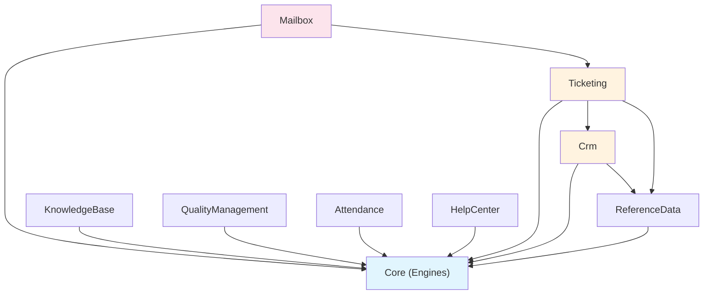

# Fonctionnalites Candidates a l'Extraction

**Date :** 2026-04-04
**Source :** Cartographie exhaustive CCC360
**Cible :** B360 (modules nwidart)

---

## 1. Matrice de decision : Extraire / Adapter / Ignorer

### Legende

- **Reutilisabilite (1-5)** : valeur ajoutee pour B360
- **Effort** : S (< 1 semaine), M (1-2 semaines), L (2-3 semaines), XL (3-4 semaines)
- **Risque regression** : impact sur B360 existant
- **Decision** : EXTRAIRE (tel quel), ADAPTER (reecriture partielle), IGNORER

### Domaine Demands (Ticketing)

| Fonctionnalite | Reutilisabilite | Effort | Risque | Decision | Justification |
|----------------|-----------------|--------|--------|----------|---------------|
| CRUD Demandes + statuts | 5 | L | Faible | ADAPTER | Renommer demands→tickets, supprimer colonnes metier CCC360 (deposit_date, sap_account, card_manager_*, genesys_*) |
| Workflow engine (etats, transitions) | 5 | L | Faible | ADAPTER | Generaliser : extraire dans Core/Engines/Workflow comme service polymorphe reutilisable |
| SLA (calcul, pause, violations, escalade) | 5 | M | Faible | ADAPTER | Generaliser : extraire dans Core/Engines/Sla comme service polymorphe |
| Assignation auto (groupes, regles, historique) | 5 | M | Faible | ADAPTER | Generaliser : extraire dans Core/Engines/Assignment |
| Champs dynamiques (forms, fields, values) | 5 | M | Faible | ADAPTER | Generaliser : polymorphe entity_type/entity_id au lieu de demand_id |
| Commentaires + pieces jointes | 5 | S | Faible | EXTRAIRE | Renommer demand_comments→ticket_comments, quasi direct |
| Historique des modifications | 4 | S | Faible | ADAPTER | Absorber dans Core/Engines/Audit (enrichir audit_logs existant) |
| Approbations multi-niveaux | 3 | S | Faible | EXTRAIRE | Module Ticketing, feature optionnelle |
| CSAT (enquetes satisfaction) | 4 | S | Faible | EXTRAIRE | Tokens publics, renommer demand_id→ticket_id |
| Modeles de reponse | 4 | S | Faible | EXTRAIRE | Renommer, adapter namespace |
| Tags | 4 | S | Faible | EXTRAIRE | Renommer pivot demand_tag→ticket_tag |
| Relances (follow-ups) | 4 | S | Faible | EXTRAIRE | Renommer, adapter namespace |
| Demandes d'info | 3 | S | Faible | EXTRAIRE | Renommer |
| Export Excel (demandes) | 4 | S | Faible | EXTRAIRE | Adapter au nouveau modele Ticket |
| Kanban view | 4 | S | Faible | EXTRAIRE | Adapter les vues |
| Analytics (typologies, teams, projets) | 4 | M | Faible | ADAPTER | Adapter aux modeles B360 |
| Calendrier | 3 | S | Faible | EXTRAIRE | Feature optionnelle |
| Colonnes metier CCC360 (deposit_date, sap_account, card_manager_*) | 0 | — | — | IGNORER | Specifique Total Energies, pas generique. Utiliser CustomFields a la place |
| Colonnes Genesys (genesys_id, genesys_interaction_id, genesys_division_id) | 0 | — | — | IGNORER | Specifique Genesys, hors perimetre |

### Domaine Contacts

| Fonctionnalite | Reutilisabilite | Effort | Risque | Decision | Justification |
|----------------|-----------------|--------|--------|----------|---------------|
| CRUD Entreprises | 5 | S | Faible | EXTRAIRE | Nouveau modele Company, n'existe pas dans Eshop360 |
| CRUD Contacts | 5 | M | **Eleve** | ADAPTER | **Unification avec eshop_customers** — migration de renommage |
| Groupes de contacts | 4 | S | Moyen | ADAPTER | Renommer eshop_customer_groups→contact_groups |
| Contacts externes | 3 | S | Faible | ADAPTER | Absorber dans Contact avec flag is_external |
| Transactions contacts | 4 | S | Moyen | ADAPTER | Renommer eshop_customer_transactions→contact_transactions |
| Export Excel contacts | 4 | S | Faible | EXTRAIRE | Adapter au nouveau modele |
| Observer protection suppression | 4 | S | Faible | EXTRAIRE | Pattern utile |
| Genesys external contacts | 0 | — | — | IGNORER | Specifique Genesys |

### Domaine Reference

| Fonctionnalite | Reutilisabilite | Effort | Risque | Decision | Justification |
|----------------|-----------------|--------|--------|----------|---------------|
| Categories | 5 | S | Faible | EXTRAIRE | Table propre, pas de collision avec eshop_categories |
| Canaux (channels) | 5 | S | Faible | EXTRAIRE | Nouveau, utile pour ticketing multi-canal |
| Secteurs | 4 | S | Faible | EXTRAIRE | Utile pour CRM |
| Typologies + sous-typologies | 5 | S | Faible | EXTRAIRE | Fondamental pour le ticketing |
| Priorites (avec SLA defaults) | 5 | S | Faible | EXTRAIRE | Lie au SlaEngine |
| Modes de paiement | 2 | S | Faible | IGNORER | Existe deja dans Eshop360, pas de valeur ajoutee |
| Statuts de demande | 5 | S | Faible | ADAPTER | Renommer demand_statuses→ticket_statuses, adapter flags |
| Cache invalidation (observers) | 4 | S | Faible | EXTRAIRE | Pattern utile |

### Domaine Pointage (Attendance)

| Fonctionnalite | Reutilisabilite | Effort | Risque | Decision | Justification |
|----------------|-----------------|--------|--------|----------|---------------|
| Check-in/check-out | 5 | M | Faible | ADAPTER | Renommer pointages→attendances, francais→anglais |
| Statuts de pointage | 4 | S | Faible | ADAPTER | Renommer pointage_statuts→attendance_statuses |
| Shifts et groupes | 5 | M | Faible | ADAPTER | Renommer, adapter namespace |
| Demandes changement shift | 4 | S | Faible | ADAPTER | Renommer |
| Absences et justificatifs | 5 | S | Faible | ADAPTER | Renommer justificatifs_absence→absence_justifications |
| Controles de presence | 4 | S | Faible | ADAPTER | Renommer, adapter namespace |
| QR Code check-in | 3 | S | Faible | EXTRAIRE | Feature mobile utile |
| Validations manager | 4 | M | Faible | ADAPTER | Renommer |
| Detection anomalies | 4 | S | Faible | ADAPTER | Renommer |
| Exclusions (jours feries) | 4 | S | Faible | ADAPTER | Renommer pointage_exclusions→attendance_exclusions |
| Auto-pointage login | 3 | S | Faible | EXTRAIRE | Listener sur Login event |
| Statistiques pointage | 4 | M | Faible | ADAPTER | Adapter au nouveau schema |
| 5 commandes planifiees | 4 | S | Faible | ADAPTER | Deplacer dans le module |

### Domaine Qualite (QSE)

| Fonctionnalite | Reutilisabilite | Effort | Risque | Decision | Justification |
|----------------|-----------------|--------|--------|----------|---------------|
| Declarations QSE | 4 | M | Faible | ADAPTER | Implementer HasWorkflow, adapter namespace |
| Signalements (types) | 4 | S | Faible | EXTRAIRE | Reference statique |
| Etats d'avancement | 4 | S | Faible | EXTRAIRE | Reference statique |
| Plans amelioration | 4 | M | Faible | ADAPTER | Adapter namespace |
| Parties interessees (PIP) | 3 | S | Faible | EXTRAIRE | Feature specifique QSE |
| Suivi + historique | 4 | S | Faible | ADAPTER | Adapter namespace |
| Livewire components (6) | 4 | M | Faible | ADAPTER | Deplacer dans module, adapter layout |
| Liaison demands↔declarations | 3 | S | Faible | ADAPTER | Optionnel, FK nullable |
| Pièces jointes declarations | 4 | S | Faible | EXTRAIRE | Pattern standard |

### Domaine KB (Knowledge Base)

| Fonctionnalite | Reutilisabilite | Effort | Risque | Decision | Justification |
|----------------|-----------------|--------|--------|----------|---------------|
| Categories KB | 5 | S | Faible | EXTRAIRE | Direct |
| Articles KB (full-text search) | 5 | S | Faible | EXTRAIRE | Direct, index FULLTEXT |
| Suivi des vues + feedback | 4 | S | Faible | EXTRAIRE | Analytics utile |
| Filtrage par role | 4 | S | Faible | EXTRAIRE | JSON roles field |

### Domaine Guide (HelpCenter)

| Fonctionnalite | Reutilisabilite | Effort | Risque | Decision | Justification |
|----------------|-----------------|--------|--------|----------|---------------|
| Categories de guides | 5 | S | Faible | EXTRAIRE | Direct |
| Articles d'aide (full-text) | 5 | S | Faible | EXTRAIRE | Direct |
| Tours guides interactifs | 4 | S | Faible | ADAPTER | Remplacer tour_completions de Core |
| Progression utilisateur | 4 | S | Faible | ADAPTER | Renommer guide_user_progress→user_tour_progress |

### Domaine Mailbox

| Fonctionnalite | Reutilisabilite | Effort | Risque | Decision | Justification |
|----------------|-----------------|--------|--------|----------|---------------|
| Configuration boites mail OAuth | 4 | M | Faible | ADAPTER | Supprimer references Genesys |
| Regles de redirection | 4 | S | Faible | EXTRAIRE | Pattern matching generique |
| Email → Ticket | 5 | M | Faible | ADAPTER | Dependre de Ticketing au lieu de Demands |
| Conversations + messages | 4 | M | Faible | ADAPTER | Supprimer champs Genesys |
| Bridge Genesys (SMTP/IMAP) | 1 | — | — | IGNORER | Specifique integration Genesys |
| `bridge_mailbox_configs` table | 1 | — | — | IGNORER | Specifique Genesys |
| `conversation_bridges` table | 1 | — | — | IGNORER | Specifique Genesys |
| Monitoring + stats | 4 | S | Faible | EXTRAIRE | Utile pour supervision |
| Logs mailbox | 4 | S | Faible | EXTRAIRE | Audit |

### Domaine Genesys (HORS PERIMETRE)

| Fonctionnalite | Decision | Justification |
|----------------|----------|---------------|
| Tous (5 modeles, 9 services, 3 controllers) | IGNORER | Trop specifique centre d'appels |

### Resume des decisions

| Decision | Nombre fonctionnalites | % |
|----------|----------------------|---|
| EXTRAIRE | 32 | 37% |
| ADAPTER | 40 | 46% |
| IGNORER | 15 | 17% |

---

## 2. Proposition de decoupage en modules B360

### 2.1 Foundation (enrichissement Core)

**Pas un module autonome** — ajouts dans `Modules/Core/Engines/`

| Engine | Perimetre | Source CCC360 | Dependances Core |
|--------|-----------|---------------|------------------|
| **WorkflowEngine** | Workflows, etats, transitions, guards | `DemandWorkflowService`, `Workflow*` models | BelongsToInstance |
| **CustomFieldEngine** | Formulaires dynamiques, champs, valeurs | `CustomForm*` models, `CustomFormResolver` | BelongsToInstance |
| **SlaEngine** | Politiques SLA, calcul, violations, escalade | `SlaCalculatorService`, `EscalationService`, `SlaParameter` | BelongsToInstance, Scheduler |
| **AssignmentEngine** | Groupes, membres, regles, auto-assignation, historique | `DemandAssignmentService`, `BulkAssignmentService`, `AssignmentGroup*` | BelongsToInstance |
| **AuditTrail** | Enrichissement audit_logs (champ par champ, old/new value) | `DemandHistoryLogger`, `DemandHistory` | audit_logs existant |

**Dependances entre engines :** Aucune (independants).

**Tables nouvelles :** `workflows`, `workflow_states`, `workflow_transitions`, `custom_forms`, `custom_fields`, `custom_form_fields`, `custom_field_values`, `sla_policies`, `sla_violations`, `assignment_groups`, `assignment_group_members`, `assignment_rules`, `assignment_histories` + enrichissement `audit_logs`

### 2.2 Module ReferenceData

| Attribut | Valeur |
|----------|--------|
| **Nom** | `Modules/ReferenceData` |
| **Perimetre** | Categories, Channels, Sectors, Typologies, SubTypologies, Priorities |
| **Dep. Core** | BelongsToInstance, HookRegistry (menu, settings) |
| **Dep. autres modules** | Aucune |
| **Tables** | `categories`, `channels`, `sectors`, `typologies`, `sub_typologies`, `priorities` |
| **Feature billable** | `reference-data` (tous les plans) |
| **Collision tables** | Aucune (`eshop_categories` est un nom different) |

### 2.3 Module Crm

| Attribut | Valeur |
|----------|--------|
| **Nom** | `Modules/Crm` |
| **Perimetre** | Companies, Contacts, ContactGroups, ContactTransactions, ContactDues, ContactMerge |
| **Dep. Core** | BelongsToInstance, HookRegistry |
| **Dep. autres modules** | ReferenceData (sectors, categories) |
| **Tables** | `companies` (nouveau), `contacts` (renomme de eshop_customers), `contact_groups` (renomme), `contact_transactions` (renomme), `contact_dues` (renomme) |
| **Feature billable** | `crm` (Standard+) |
| **Collision tables** | **OUI** — renommage `eshop_customers` → `contacts`, `eshop_customer_groups` → `contact_groups` |

**Impact Eshop360 :**
- `Modules\Eshop360\Models\EshopCustomer` → remplace par `Modules\Crm\Models\Contact`
- `Modules\Eshop360\Models\EshopCustomerGroup` → remplace par `Modules\Crm\Models\ContactGroup`
- Tous les controleurs Eshop360 referençant ces modeles doivent etre mis a jour
- Migration conditionnelle (`Schema::hasTable('eshop_customers')`)

### 2.4 Module Ticketing

| Attribut | Valeur |
|----------|--------|
| **Nom** | `Modules/Ticketing` |
| **Perimetre** | Tickets (ex-Demands), Comments, Attachments, Tags, FollowUps, InfoRequests, Approvals, CSAT, ResponseTemplates, Analytics, Kanban, Export |
| **Dep. Core** | BelongsToInstance, HookRegistry, **5 Engines** (Workflow, CustomField, SLA, Assignment, AuditTrail) |
| **Dep. autres modules** | Crm (contact_id, company_id), ReferenceData (typology, channel, sector, category, priority) |
| **Tables** | `tickets`, `ticket_comments`, `ticket_attachments`, `comment_attachments`, `ticket_tags`, `ticket_ticket_tag`, `ticket_follow_ups`, `ticket_info_requests`, `approval_requests`, `csat_surveys`, `response_templates`, `template_allowed_groups`, `ticket_counters` |
| **Feature billable** | `ticketing` (Professional+) |
| **Collision tables** | `eshop_support_tickets` remplace par ce module |

### 2.5 Module KnowledgeBase

| Attribut | Valeur |
|----------|--------|
| **Nom** | `Modules/KnowledgeBase` |
| **Perimetre** | KbCategories, KbArticles (full-text search), ArticleViews, feedback |
| **Dep. Core** | BelongsToInstance, HookRegistry |
| **Dep. autres modules** | Aucune (lien optionnel Ticketing pour article views) |
| **Tables** | `kb_categories`, `kb_articles`, `kb_article_views` |
| **Feature billable** | `knowledge-base` (Standard+) |
| **Collision tables** | Aucune |

### 2.6 Module QualityManagement

| Attribut | Valeur |
|----------|--------|
| **Nom** | `Modules/QualityManagement` |
| **Perimetre** | Declarations, Signalements, ImprovementActions, FollowUps, InterestedParties, QualityIndicators, Livewire components |
| **Dep. Core** | BelongsToInstance, HookRegistry, **WorkflowEngine**, **AuditTrail** |
| **Dep. autres modules** | Aucune (lien optionnel Ticketing via qse_demand_id) |
| **Tables** | `declarations`, `declaration_attachments`, `signalements`, `etats_avancements`, `parties_interessees`, `suivis`, `historique_suivis`, `improvement_actions` |
| **Feature billable** | `quality-management` (Enterprise) |
| **Collision tables** | Aucune |
| **Note** | Tables QSE gardent les noms francais pour coherence interne du domaine. A renommer si politique d'anglicisation |

### 2.7 Module Attendance

| Attribut | Valeur |
|----------|--------|
| **Nom** | `Modules/Attendance` |
| **Perimetre** | Attendances, Shifts, ShiftGroups, ShiftChanges, Absences, PresenceChecks, QrCodes, Validations, Anomalies, Exclusions, Stats, 5 commandes planifiees |
| **Dep. Core** | BelongsToInstance, HookRegistry |
| **Dep. autres modules** | Aucune |
| **Tables** | `attendances`, `attendance_statuses`, `shifts`, `shift_groups`, `shift_group_user`, `shift_change_requests`, `absence_justifications`, `attendance_checks`, `attendance_validations`, `attendance_anomalies`, `attendance_exclusions`, `qr_tokens` |
| **Feature billable** | `attendance` (Professional+) |
| **Collision tables** | Aucune |
| **Note** | Toutes les tables renommees du francais vers l'anglais |

### 2.8 Module HelpCenter

| Attribut | Valeur |
|----------|--------|
| **Nom** | `Modules/HelpCenter` |
| **Perimetre** | GuideCategories, GuideArticles, GuidedTours, GuidedTourSteps, UserTourProgress |
| **Dep. Core** | BelongsToInstance, HookRegistry |
| **Dep. autres modules** | Aucune |
| **Tables** | `guide_categories`, `guide_articles`, `guided_tours`, `guided_tour_steps`, `user_tour_progress` |
| **Feature billable** | `help-center` (tous les plans) |
| **Collision tables** | `tour_completions` de Core remplacee par `user_tour_progress` |

### 2.9 Module Mailbox

| Attribut | Valeur |
|----------|--------|
| **Nom** | `Modules/Mailbox` |
| **Perimetre** | Mailboxes (OAuth Microsoft), RedirectionRules, MailConversations, ConversationMessages, EmailLogs, MailboxLogs, ProcessingStats, MailToTicket |
| **Dep. Core** | BelongsToInstance, HookRegistry |
| **Dep. autres modules** | **Ticketing** (hard dependency — MailToTicketService cree des tickets) |
| **Tables** | `mailboxes`, `mailbox_redirection_rules`, `mailbox_logs`, `mail_conversations`, `conversation_messages`, `email_logs`, `processing_stats` |
| **Exclues** | `conversation_bridges`, `bridge_mailbox_configs` (specifiques Genesys) |
| **Feature billable** | `mailbox-integration` (Enterprise) |
| **Collision tables** | Aucune |

### 2.10 Graphe de dependances (aucun cycle)



---

## 3. Strategie d'adaptation technique

### 3.1 Remplacement du socle

**Multi-tenancy :**
```php
// CCC360 (avant)
use App\Traits\BelongsToOrganisation;
class Demand extends Model {
    use BelongsToOrganisation;
}
// DoContext::id() pour obtenir l'organisation courante

// B360 (apres)
use Modules\Core\Database\Traits\BelongsToInstance;
class Ticket extends Model {
    use BelongsToInstance;
}
// CurrentInstance::idOrFail() pour obtenir l'instance courante
```

**Auth / RBAC :**
```php
// CCC360 (avant)
$user->hasPermissionTo('demands.create');
// Organisation-scoped via Spatie teams

// B360 (apres) — AUCUN CHANGEMENT
$user->hasPermissionTo('ticketing.create');
// Instance-scoped via Spatie teams (meme mecanisme, team = instance_id)
```

**Configuration :**
```php
// CCC360 (avant)
AppSetting::getValue('demands.closure.auto_close_delay_minutes', 1440);

// B360 (apres)
setting('ticketing.auto_close_delay_minutes', 1440);
// Via Settings module helper function
```

### 3.2 Renommage des namespaces

| Pattern CCC360 | Pattern B360 |
|----------------|--------------|
| `App\Domains\{Domain}\Models\*` | `Modules\{Module}\Models\*` |
| `App\Domains\{Domain}\Services\*` | `Modules\{Module}\Services\*` |
| `App\Domains\{Domain}\Http\Controllers\*` | `Modules\{Module}\Http\Controllers\*` |
| `App\Domains\{Domain}\Http\Requests\*` | `Modules\{Module}\Http\Requests\*` |
| `App\Domains\{Domain}\Policies\*` | `Modules\{Module}\Policies\*` |
| `App\Domains\{Domain}\Observers\*` | `Modules\{Module}\Observers\*` |
| `App\Domains\{Domain}\Jobs\*` | `Modules\{Module}\Jobs\*` |
| `App\Domains\{Domain}\Events\*` | `Modules\{Module}\Events\*` |
| `App\Domains\{Domain}\Exports\*` | `Modules\{Module}\Exports\*` |
| `App\Livewire\{Domain}\*` | `Modules\{Module}\Livewire\*` |

### 3.3 Gestion des migrations

**Principe :** Nouvelles migrations propres, pas de copie.

**Convention :**
```
Modules/{Module}/Database/Migrations/
  2026_04_xx_000001_create_{table}_table.php
  2026_04_xx_000002_create_{table2}_table.php
  ...
```

**Migrations d'unification (CRM) — conditionnelles :**
```php
public function up(): void
{
    // Renomme seulement si eshop_customers existe et contacts n'existe pas
    if (Schema::hasTable('eshop_customers') && !Schema::hasTable('contacts')) {
        Schema::rename('eshop_customers', 'contacts');
        Schema::table('contacts', function (Blueprint $table) {
            $table->foreignId('company_id')->nullable()->constrained()->nullOnDelete()->after('id');
            $table->boolean('is_external')->default(false)->after('company_id');
        });
    }
}

public function down(): void
{
    if (Schema::hasTable('contacts') && !Schema::hasTable('eshop_customers')) {
        Schema::table('contacts', function (Blueprint $table) {
            $table->dropConstrainedForeignId('company_id');
            $table->dropColumn('is_external');
        });
        Schema::rename('contacts', 'eshop_customers');
    }
}
```

### 3.4 Configuration et feature flags

**Enregistrement d'un module comme feature billable :**
```php
// Dans Modules/Ticketing/Providers/TicketingHooksProvider.php
public function boot(): void
{
    $registry = app(HookRegistry::class);

    $registry->addFeature(new BillableFeature(
        id: 'ticketing',
        name: 'Ticketing System',
        description: 'Complete ticket management with SLA, workflows, and assignments',
        plan_tier: 'professional',
    ));

    $registry->addMenu(new MenuItem(
        id: 'ticketing',
        label: 'Ticketing',
        icon: 'ti-ticket',
        route: 'ticketing.index',
        position: 30,
    ));

    $registry->addSettingsGroup(new SettingsGroup(
        id: 'ticketing',
        label: 'Ticketing Settings',
        view: 'ticketing::settings.index',
    ));
}
```

**Protection des routes :**
```php
// Dans Modules/Ticketing/Routes/web.php
Route::middleware(['billing.feature:ticketing'])->prefix('ticketing')->group(function () {
    Route::get('/', [TicketController::class, 'index'])->name('ticketing.index');
    // ...
});
```

---

## 4. Plan de migration par phases

### Phase 0 : Foundation (semaines 1-2)

**Objectif :** Enrichir Core avec les 5 engines. Aucun impact sur les modules existants.

**Livraison :**
- `Modules/Core/Engines/Workflow/` — contrats, modeles, service, trait, migrations, tests
- `Modules/Core/Engines/CustomField/` — idem
- `Modules/Core/Engines/Sla/` — idem
- `Modules/Core/Engines/Assignment/` — idem
- `Modules/Core/Engines/Audit/` — enrichissement audit_logs, trait, tests

**Critere GO/NO-GO :**
- `php artisan test --filter=Engine` : tous les tests passent
- `php artisan test` (suite complete B360) : aucune regression (396+ tests, 0 failure)
- Les 5 engines sont enregistres dans le container IoC via `CoreServiceProvider`

### Phase 1 : Modules simples (semaines 3-4)

**Objectif :** 3 modules independants, parallelisables.

| Module | Equipe | Prerequis | Livraison |
|--------|--------|-----------|-----------|
| ReferenceData | Dev A | Phase 0 | CRUD categories, channels, sectors, typologies, priorities. 6 tables. Routes `/i/{slug}/admin/reference/*` |
| KnowledgeBase | Dev B | Phase 0 | CRUD categories KB, articles full-text, vues. 3 tables. Routes `/i/{slug}/kb/*` |
| HelpCenter | Dev C | Phase 0 | CRUD guides, tours, progression. 5 tables. Routes `/i/{slug}/help/*`. Migration renommage `tour_completions` |

**Critere GO/NO-GO :**
- Chaque module s'active/desactive via `FeatureRegistry`
- La desactivation ne casse aucun autre module
- Tests specifiques par module + suite complete B360 passent

### Phase 2 : CRM + Ticketing (semaines 5-8)

**Objectif :** Coeur metier avec unification Eshop360. **Sequentiel obligatoire.**

| Semaine | Module | Livraison | Point de controle |
|---------|--------|-----------|-------------------|
| 5-6 | CRM | Companies, Contacts (unifie), ContactGroups. Migration `eshop_customers` → `contacts`. Mise a jour imports Eshop360. | Suite tests Eshop360 passe (396 tests, 0 failure) |
| 7-8 | Ticketing | Tickets (13 tables), integration des 5 engines, comments, attachments, tags, followups, approvals, CSAT, templates, analytics. | Creation ticket, workflow complet, SLA, CSAT fonctionnels |

**Risque principal :** L'unification CRM/Eshop360 est la migration la plus risquee du projet. Prevoir un rollback plan (migration `down()` testee).

### Phase 3 : Modules avances (semaines 9-12)

**Objectif :** Modules complexes et dependants.

| Semaine | Module | Livraison | Parallelisable |
|---------|--------|-----------|----------------|
| 9-10 | QualityManagement | Declarations (HasWorkflow), signalements, ameliorations, suivis, Livewire. 8 tables. | Oui (avec Attendance) |
| 9-11 | Attendance | Attendances, shifts, absences, anomalies, validations, QR, 5 commandes cron. 12 tables. | Oui (avec Quality) |
| 11-12 | Mailbox | Mailboxes OAuth, regles, conversations, MailToTicket. 7 tables (hors bridge Genesys). | Apres Phase 2 (depend Ticketing) |

**Critere GO/NO-GO final :**
- Suite complete B360 : 0 regression
- Chaque module activable/desactivable independamment
- Mailbox cree des tickets via TicketService
- Tous les 8 modules enregistres dans `FeatureRegistry`

### Timeline visuelle

```
Sem.  1   2   3   4   5   6   7   8   9  10  11  12
      |---|---|---|---|---|---|---|---|---|---|---|---|
P0    ████████                                        Foundation (5 engines)
      |---|---|
P1            ████████                                RefData + KB + HelpCenter (parallele)
              |---|---|
P2                    ████████████████                CRM (sem 5-6) → Ticketing (sem 7-8)
                      |-------|-------|
P3                                    ████████████    Quality + Attendance || Mailbox
                                      |-------|---|
      |---|---|---|---|---|---|---|---|---|---|---|---|
CI    ▼   ▼   ▼   ▼   ▼   ▼   ▼   ▼   ▼   ▼   ▼   ▼  Non-regression continue
```

### Packages a ajouter a B360 (composer.json)

| Package | Requis par | Phase |
|---------|-----------|-------|
| `livewire/livewire` ^4.1 | QualityManagement (Livewire components) | Phase 3 |
| `maatwebsite/excel` ^3.1 | Ticketing, CRM, ReferenceData (exports) | Phase 1 |
| `laravel/sanctum` ^4.3 | API endpoints (si API necessaire) | Phase 1 |
| `yajra/laravel-datatables-oracle` ^12.6 | Ticketing, Attendance (server-side tables) | Phase 2 |
| `minishlink/web-push` ^10.0 | Ticketing (push notifications, optionnel) | Phase 2 |
| `laravel/reverb` ^1.7 | Ticketing (broadcast temps reel, optionnel) | Phase 2 |
